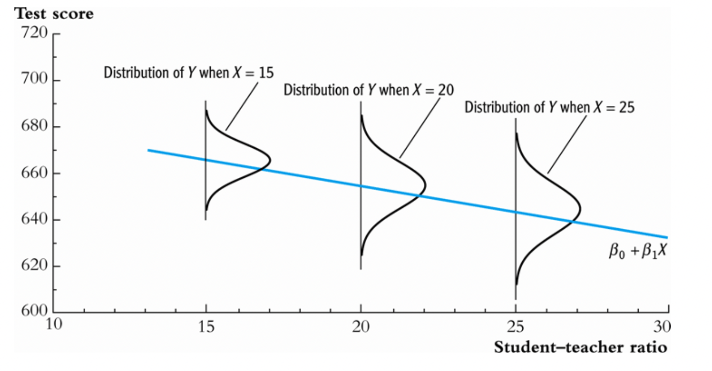

### Heteroskedasticity (Violation of Assumption 5)

I'd like to quickly review what happens when we break assumption 5 (homoskedasticity which means equal spread) and what it means.

We'll go over this in more detail in 2 weeks - but, here is a quick moment on it.

Last class we went into detail about how our standard errors are calculated and issues with multicollinearity - ths isn't a violation of any of the assumptions that we've outline.

For a brief moment, let me remind you about Heteroskedasticity. This occurs when Assumption 5 is violated - when the variances differ. 



What does heteroskedasticity mean? \vspace{-0.5em}

1. Estimates for $\beta_0, \beta_1, \dots, \beta_k$  are still unbiased. 
2. Estimates for $\beta_0, \beta_1, \dots, \beta_k$  are no longer efficient.  You can get better estimates (with smaller MSE).
3. Inference is in trouble. Given heteroskedasticity, the homoskedasticity only standard errors are wrong, so the t-stats/p-values are wrong and the CI's are wrong too.

What to do? How do I find heteroskedasticity? \vspace{-0.5em}

- Graphical tools, examine the scatter plot check if variance is increasing or decreasing. Often it's very obvious (think age-earnings regressions).
- Don't care. Always make inference robust.
- Test formally (Breusch-Pagan test or White test) and then use FGLS. 


In simple OLS, $E[Y|X] = \beta_0 + \beta_1 X$, the homoskedasticity only variance is  \vspace{-1em}

\begin{equation}
\text{Var}(\hat{\beta}_1) = \frac{\sigma_u^2}{\sum_i (X_i-\bar{X})^2}
\end{equation}

Recall, that the sampling variance of our estimator depends on:
- the error variance (of which it is directly proportional)
- the sample size N
- the regressor variance of which it is inversely proportional

You've seen this written as:
\begin{equation}
\text{Var}(\hat{\beta}_1) = \frac{\sigma^2}{SST_j(1-R^2_j)}
\end{equation}

The asymptotic variance under **heteroskedasticity** is \vspace{-1em}

\begin{equation}
\text{Var}(\hat{\beta}_1) = \frac{\sum_i \sigma_u^2 \omega_i (X_i-\bar{X})^2}{[\sum_i (X_i-\bar{X})^2]^2}
\end{equation}

The White heteroskedasticity consistent (HC) estimator is \vspace{-1em}

\begin{equation}
\widehat{\text{Var}}(\hat{\beta}_1) = \frac{\sum_i \hat{u}_i^2 (X_i-\bar{X})^2}{[\sum_i (X_i-\bar{X})^2]^2}
\end{equation}

The usual t-tests and F-tests using the HC covariance estimator are only asymptotically valid. 

Let's see an example.

```{r}
library(wooldridge)
library(dplyr)
library(ggplot2)

# pulling wooldridge data
data('saving')

# Only use positive values of saving, which are smaller than income
saving <- saving %>% filter(
         inc < 20000,
         sav < inc)

ggplot(saving, aes(x = inc, y = sav)) +
  geom_point() +
  geom_smooth(method = "lm", se = FALSE) +
  labs(x = "Annual income", y = "Annual savings")
```

Let's estimate a simple model:

```{r}
savingsmodel <- lm(sav ~ inc, data = saving)

summary(savingsmodel)
```
Now, let's compare to robust standard errors

```{r}
library("lmtest")
library("sandwich")

# Robust t test
coeftest(savingsmodel, vcov = vcovHC(savingsmodel, type = "HC0"))
```

### MLE Estimation
I made you read a part of Hayashi's book on MLE and I'd like to return to it for a moment.

The PDF (probability distribution function) of $Y_i$ given $X_i$ is known *except* for only three parameters, $\beta_0, \beta_1, \sigma^2_u$:

\begin{equation}
f_{Y_i|X_i}(y) = \frac{1}{\sqrt{2\pi\sigma^2_u}}exp(-\frac{1}{2\sigma^2_u}(Y_i - \beta_0 + \beta_1X_i)^2)
\end{equation}

With the assumption of normality, we can use maximum liklihood estimation.

The basic idea is that we choose parameter estimates to maximize  a measure of the likeliness of the sample outcomes - this is called the liklihood function.  ML estimators of $\beta_0$ and $\beta_1$ are those values that $\hat{\beta_0}$ and $\hat{\beta_1}$ can best describe the full distribution of the data.

The liklihood function is the joint probability function of $Y_1$ conditional on $X_1$.  

Now, it's *way* easier to deal with the log of some function - which we call a logliklihood function, where all we do is replace the hypothetical values and take the logs. Think about that exp function in the pdg. If we take the log of an exponential - that makes the form easier to deal with (recall $y = b^x = log_b(y) = x$)

Fortunately, ML estimators is equivalent to maximizing the loglikelihood function.

You essentially set the derivatives of the logliklihood function equal to zero and solve for first-order conditions. This doesn't provide a closed form formulate, and usually we use numerical methods that guess a number, solve for it and then take the second derivative to see if the slope is positive or negative and once it's close to zero, you've found a solution.  Hence, MLE has successive iterations.

What is nice about using MLE is that the variance is unbiased!  When we use OLS - the variance is not unbiased. No where did we make that a requirement with our as
sumption (indeed, $\beta_1$ is unbiased).  So, MLE is incredibly *efficient* and our issue with multi-collinearity dissappears. 

The properties of MLE are asymptotic - they are approximate in real-world samples - and as N gets larger, we know it will approximate to the true value.

This is a different *estimation* method. The model can be the same for OLS and MLE, but the estimation method is different. OLS minimized the sum of squares. MLE maximizes the liklihood funciton.

As a result, there is not $R^2$ in MLE. Instead, we use log-liklihood ratios - and that is basically an F-test! 

So, here we are full-circle. The logliklihood ratio is:

$(\frac{SSR_u}{SSR_R})^{-n/2}$

where we compare our restricted model to our unrestricted model.

So, you may ask, why the heck are we talking about this? Well, for one estimation method is different from model. But, also, MLE is exactly what we do in the case if probit and logit models where the dependent variable is binary. If we have time, we'll come back to this. 

In addition, this points out how estimation models that may have the same assumptions can have different properties - particularly, MLE is efficient because we can accurately estimate the variance of our estimator. 

Why don't we just use this all the time? Because the assumption of normality is too strict and we rarely it in the data wild. 

### Large Sample Asymptotics

We've reviewed assumptions that ensures OLS is BlUE under finite-sample theory - when you use a sample of a given size. The Gauss-Markov assumptions hold for a dataset of *any* size. 

We're going to talk about what happens with large-samples - we will make assumptions about the stochastic process that generates the sample.

What we're asking is - how do estimators and test statistics change as the sample size grows to infinity?


#### Consistency

As we get more data, we can expect the sampling distribution of $\hat{\beta_j}$ to become more tightly centered around $\beta_j$


To prove consistency, we need to use the LLN - which holds under random sampling. In Simple OLS:

\begin{equation}
\hat{\beta_1} = \beta_1 + \frac{n^{-1}\sum^n_{i=1}(x_i-\bar{x_i})u_i}{n^{-1}\sum^n_{i=1}(x_i-\bar{x_i})^2}
\end{equation}

We apply LLN and the numerator converges to the covariance (recall ) and the denominator converges to the variance  (recall $var(Y) = E[(Y-\mu_Y)^2])$

\begin{equation}
plim(\hat{\beta_1}) = \beta_1 + \frac{Cov(x_1,u)}{Var(x_1)}
\end{equation}

Because of Assumption 4, $E(u|x_1) = 0$ and that for Assumption 3 $(Var(x_1))>0$:

\begin{equation}
plim(\hat{\beta_1}) = \beta_1 + \frac{0}{Var(x_1)}
\end{equation}

Which is just equal to $\beta_1$

Previously we used Assumption 4 to show unbiasedness, but with consistency, we can think about how the zero correlation is also justified.

What happens is $x_i$ and $u$ are correlated?

\begin{equation}
plim(\hat{\beta_1}) = \beta_1 + \frac{Cov(x_1,u)}{Var(x_1)}
\end{equation}

$plim(\hat{\beta_1}) >\beta_1$ if $Cov(x_1,u)>0$
$plim(\hat{\beta_1}) <\beta_1$ if $Cov(x_1,u)<0$

Similar to OVB, we can that inconsistency of OLS has similar effects as OVB and relies on the correlation between the the variable X and the error term and the sign of the estimator

|     | $Corr(x_1,x_2)>0$ | $Corr(x_1,x_2)<0$ |
|-----|-------------------|--------------------|
| $\beta_2 >0$| $plim(\tilde{\beta_1})>\beta_1$ | $plim(\tilde{\beta_1})< \beta_1$ | 
| $\beta_2 <0$| $plim(\tilde{\beta_1})<\beta_1$ | $plim(\tilde{\beta_1})> \beta_1$ | 

But, if  $x_1$ and $x_2$ are uncorrelated then$\tilde{\beta_1}$ is consistent for $\beta_1$, even if $\beta_2 \neq 0$.

#### Asymptotic Normality and Large Sample Inference

Consistency is important, but it's not enough for statistical inference.

Our CLM assumptions (and in particular, normality) allow use to derive exact t and F distributions for our t and f statistics.

Let's take an example from the apple dataset - the variable ecolbs is clearly not normal.

```{r}

data('apple')

ggplot(apple, aes(x=ecolbs)) +   geom_histogram()


```
Or let's take the example in the 401k data of the percentage of employees at a firm participates in in a 401k pension plan

```{r}
data('401kpart') 

ggplot(k401k, aes(x=prate)) + geom_histogram()

```

We don't abandon statistical inference - at least if our sample size is reasonably large.

With asymptotic normality of OLS, the standardized version of $\hat{\beta_j}$ is asymptotically standard normal:

\begin{equation}
\frac{\hat{\beta_j}-\beta_j}{sd(\hat{\beta_j})} \overset{\text{a}}{\sim} Normal(0,1)
\end{equation}

and this convergence holds when we replace $sd(\hat{\beta_j})$ with $se(\hat{\beta_j})$

This means that we can "relax" the assumption of normality with caveate that testing is *approximate* with large samples.  

We never know how large n has to be for approximation to work - it depends how far the population distribution is from normal - but, generally, above a few hundred makes the approximation good.  This is often just assumed by applied researchers.


Note: that when we use CLT, it does not impact our error term. The distribution of u is either normal or not.

What CLT does is it worked on the standardized sample averages from almost any population.


```{r}
data('econmath')

summary(lm(log(score) ~ colgpa +actmth +acteng, data=econmath))

```


