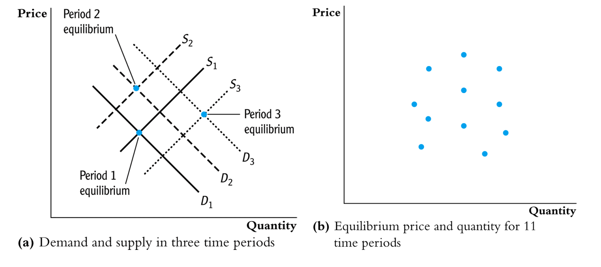

One big problem that we often face in regression analysis is **endogeneity**. That pesky violation of assumption 4.  An endogenous variable is one that is correlated with $u_i$. There are *multiple* ways of which endogeneity may be present, here are just a few:

* Omitted variables
* Measurement error (errors in regressors)
* Reverse or simultaneous causality (one effects the other)
* Selective sampling 
* Poor proxy variables


**Generalized Method of Moments** is a general approach to solving this issue. In fact, OLS is a special case of GMM - and almost every estimator is a special case of GMM.

It is of no surprise then, that the standard IV estimator is a special case of a generalized method of moments (GMM) estimator. We're going to go into detail about IVs (and hopefully relate them back to GMM).

The method requires that a certain number of moment conditions be specified for the model. These moment conditions are functions of the model parameters and the data. The GMM method then minimizes a certain norm of the sample averages of the moment conditions, and can therefore be thought of as a special case of minimum-distance estimation.

Recall that we can define moments for random variables. A collection of moments uniquely determines the distribution. 

For example, we define moments for a normal distribution which is that the expected value of a random variable is equal to the mean (the first moment), the second moment is the variance, the skewness (third moment) is equal to 0 (ie symmetric) and the kurtosis is equal to 4 (fourth moment). All of these moments determine the normal distribution.

Moments of any population can be re-created in their sample moments. As usual, we don't know the true population moments, but we use the sample to recreate a sample equivalent. 

For example, the first moment that $E[X] = \mu$ we re-create with $\frac{1}{N}\sum^N_{i=1}x_i=\hat{\mu}$ 

In the second moment, $Var(X)=\sigma^2$ is re-created with a sample equivalent $\frac{1}{N}\sum^N_{i=1}(x_i-\hat{\mu})^2=\hat{\sigma}^2$

Here, we have two moments and two unknowns and we can find exact solutions to our estimators of our parameters (OLS!). This is plain old Method of Moments where the number of moment condition equals the number of parameters

However, we've got two other moments that define our distribution:
The third moment, $E[(x-\mu)^3]=\sigma^3$ and its sample analog of  $\frac{1}{N}\sum^N_{i=1}(x_i-\hat{\mu})^3=\hat{\sigma}^3$ and the fourth moment, $E[(x-\mu)^4]=\sigma^4$ and its sample analog $\frac{1}{N}\sum^N_{i=1}(x_i-\hat{\mu})^4=\hat{\sigma}^4$

In OLS, we make some assumptions about them - in particular, normality.  But, we can estimate OLS using a GMM approach. If we don't put particular assumptions on these moments, we have 4 equations and 2 unknowns (M (moment conditions) > k (number of parameters)) - this is the issue of GMM - there aren't exact solutions. This situation is called overidentification and it's solvable. 

GMM of OLS is when we choose a solution for $\hat{\beta}$ to solve the moment condition $\frac{1}{N}\sum^N_{i=1}[x_i(y – bx_i)] = 0$ with the zero conditional mean assumption. 

Given certain assumptions, we can define moment conditions on our sample to them to help us choose an estimator (as above). We'll choose estimators of our population parameters of interest to solve some condition.

 In models for which there are more moment conditions than model parameters, GMM estimation provides a straightforward way to test the specification of the proposed model. This is an important feature that is unique to GMM estimation -> this is essentially the point of GMM, a way to solve for our population parameters of interest when our model is over identified.

## IV

**instrumental variables** estimation allows a RHS variable to be correlated with the unobservables.

**IVs are outside variables, neither X nor Y, which are related with X, but not with Y except through X. We will denote them Z.**

They work by identifying part of the variation in X that is exogenous, because it can be explained by the variation in Z, which is unrelated to u (the error term).

The two step least squares estimation provides steps that outline this relationship.

**EXAMPLE:** Effects of Class Size on Student Performance 

 Consider a model in the population: 

\begin{equation*}s c o r e =\beta _{0} +\beta _{1} c l a s s i z e +u
\end{equation*}

where we think $c l a s s i z e$ is endogenous: 

\begin{equation*}C o v (c l a s s i z e, u) \neq 0.
\end{equation*}

 We could try to proxy for the omitted variables in $u$, perhaps using family background and socioeconomic variables. But we may not be able to sufficiently capture everything in $u$ that affects $s c o r e$. 

 Collecting panel data on students can be helpful but is more difficult to get. Plus, $c l a s s i z e$ may not change much over time. (Better funded schools tend to have smaller class sizes)
 
 We can solve this endogeneity problem if we can collect data on a variable, $z$, that satisfies two restrictions. 

\begin{equation*}y =\beta _{0} +\beta _{1} x +u
\end{equation*}

1. $z$ is \textbf{exogenous} to the equation: 

\begin{equation*}C o v (z ,u) =0
\end{equation*}

2. $z$ is \textbf{relevant} for explaining $x$: 

\begin{equation*}C o v (z ,x) \neq 0
\end{equation*}\par\pagebreak\relax 


**Why we can't directly test $C o v (z ,u) =0$**

 It may be tempting to devise a test based on the sample correlation between $z_{i}$ and $\hat{u}_{i}$, where $\hat{u}_{i}$ are the residuals obtained from a regression of $y_{i}$ on $x_{i}$. 
 
The problem with this test is that if $x$ is endogeneous, $\hat{u}_{i}$ are inconsistent estimates of the population regression errors $u_{i}$. 
  
Thus, we learn nothing by studying the correlation between $z$ and $\hat{u}$ 

Another mistake would be to regress $y_{i} =\beta _{0} +\beta _{1} x_{i} +\beta _{2} z_{i} +u_{i}$ and test $\beta _{2} =0$ to see if $z_{i}$ satisfies the exogeneity requirement. 

 This will also not work since the estimated coefficients from this regression will be inconsistent due to the endogeneity of $x$  

\textbf{A valid instrument $z$ needs to satisfy $C o v (z ,u) =0$ and $C o v (z ,x) \neq 0$} 

An important difference between these two requirements: We cannot test (1), but we can determine (usually with high confidence) whether (2) is true. 

 How can we use a variable $z$ satisfying these two requirements? 

 Take the covariance of $z$ with both sides of the equation 

\begin{equation*}y =\beta _{0} +\beta _{1} x +u
\end{equation*} to get 

\begin{equation*}C o v (z ,y) =\beta _{1} C o v (z ,x) +C o v (z ,u)\text{.}
\end{equation*}\par\pagebreak\relax 

 Now use $C o v (z ,u) =0$ (exogeneity) to get 

\begin{equation*}C o v (z ,y) =\beta _{1} C o v (z ,x)\text{.}
\end{equation*} Next, use $C o v (z ,x) \neq 0$ (relevance) to get 

\begin{equation*}\beta _{1} =\frac{C o v (z ,y)}{C o v (z ,x)}
\end{equation*}

 We have written $\beta _{1}$ as *two population moments* in observable variables.

Note: The Wald Estimator described in MHE is essentially the same estimator as above, but with a binary instrumental variable. 

 Given a random sample $\{(y_{i} ,x_{i} ,z_{i}) :i =1 ,\ldots  ,n\}$, use the sample covariances to estimate the population covariances. (Method of moments estimation). 

 This gives the IV estimator of $\beta _{1}$. 

\begin{equation*}\hat{\beta }_{1 ,I V} =\frac{n^{ -1} \sum _{i =1}^{n}(z_{i} -\bar{z}) (y_{i} -\bar{y})}{n^{ -1} \sum _{i =1}^{n}(z_{i} -\bar{z}) (x_{i} -\bar{x})}
\end{equation*}

IV estimator is *consistent*, but not unbiased. 

An estimator is **consistent** if, as the sample size increases, the estimates (produced by the estimator) "converge" to the true value of the parameter being estimated. To be slightly more precise - consistency means that, as the sample size increases, the sampling distribution of the estimator becomes increasingly concentrated at the true parameter value.

An estimator is **unbiased** if, on average, it hits the true parameter value. That is, the mean of the sampling distribution of the estimator is equal to the true parameter value.

The two are not equivalent: Unbiasedness is a statement about the expected value of the sampling distribution of the estimator. Consistency is a statement about "where the sampling distribution of the estimator is going" as the sample size increases.


Bias can be large if the correlation between  $z$ and $x$ is ``small.'' This is something to check for to get a general sense of the size of the bias - this problem is known as a weak instrument (more on this in a moment)

 Also good news - no restrictions on the nature of $x_{i}$ or $z_{i}$. For example, each could be binary, or just one of them.
 

### How do we consistently estimate $\beta_1$?

There are a few ways to do this (and we actually already covered one method above, but let's just review it again)

1. 2SLS: By literally applying two-stages of OLS, with an artificial regressor in the second stage.

2. IV: By a direct method of moments approach (shown previously).

3. ILS: By an indirect least squares approach (which is less general).

But, the most common approach is the Two Staged Least Squares (TSLS) way.

### 1. 2sls 
1. (First stage) Estimate by OLS the new (“reduced form”) equation

In expectation form
\begin{equation}
X_i = E(X_i | Z_i) + v_i
\end{equation}

In error form:
\begin{equation}
= \pi_0 + \pi_1Z_i + v_i
\end{equation}

and calculate predicted values for Xi :
\begin{equation}
\hat{X_i} = \hat{\pi_0} + \hat{\pi_1}Z_i
\end{equation}

Because $Z_i$ is by assumption uncorrelated with $u_i$, also $\pi_0 + \pi_1Z_i$ is uncorrelated with
$u_i$. We don’t know $π_0$ and $π_1$, but the regression of $X_i$ on $Z_i$ satisfies Ass. 1, hence
the OLS estimates \hat{\pi_0} and \hat{\pi_1} are consistent (unbiased in large samples). The purpose
of the predicted values \hat{X_i} is to isolate a part of $X_i$ that is independent of $u_i$.

2. (Second stage) Replace $X_i$ in the equation of interest by $\hat{X_i} = \hat{\pi_0} + \hat{\pi_1}Z_i$:

\begin{equation}
Y_i = \beta_0 + \beta_1\hat{X_i}+\check{w_o}
\end{equation}
and estimate this modified equation by OLS. The regressor $\hat{X_i}$ is uncorrelated with both
$u_i$ and $\hat{v_i} = X_i − \hat{X_i}$, hence also with the error term $\check{w_i} = u_i + \beta_1\hat{v_i}$. Hence Ass. 1 holds here, so the OLS estimate of $\beta_1$ is consistent.

Algebraically: 

OLS Stage 1:

\begin{equation}
\hat{\pi_1} = \frac{s_{XZ}}{s^2_Z}
\end{equation}

OLS Stage 2:

\begin{equation}
\hat{\beta_1}^{2SLS} = \frac{s_{\hat{X}Y}}{s^2_\hat{X}}
\end{equation}

(s is the standard deviation)

Working out $s_{\hat{X}Y}$ and $s^2_{\hat{X}}$ with the help of equation $\hat{X_i}=\hat{\pi_0}+\hat{\pi_1}Z_i$,

\begin{equation}
\hat{\beta_1}^{2SLS} = \frac{s_{\hat{X}Y}}{s^2_\hat{X}} =  \frac{\hat{\pi_1}s_{YZ}}{\hat{\pi}^2_1s^2_Z} = \frac{s_{YZ}}{\hat{\pi_1}s^2_Z}
\end{equation}

Then substituting out $\hat{\pi_1}$ using $\hat{\pi_1} = s_{XZ}/s^2_Z$:
\begin{equation}
\hat{\beta_1}^{2SLS} = \frac{s_{YZ}}{\hat{\pi_1}s^2_Z} = \frac{s_{YZ}}{s_{XZ}}
\end{equation}

### 2. Direct IV (MM)
Another perspective is direct IV estimation - and this is method of moments! (Ok, this is reiterated from earlier)

1. From the simple regression equation in error form
\begin{equation}
Y_i = \beta_0 + \beta_1X_i+u_i
\end{equation}

we can derive the covariance

$$Cov(Y_i,Z_i) = Cov(\beta_0 + \beta_1X_i + u_i, Z_i)$$
$$= Cov(Y_i,Z_i) = Cov(\beta_0,Z_i) + Cov(\beta_1X_i,z_i) + Cov(u_i, Z_i)$$
With the assumption that the instrument(s) Z are exogenous, then $E(u_i,Z_i) = 0$, so we get:

$$ =  0 +\beta_1Cov(X_i,Z_i)+0$$
Solve this for $\beta_1$ to find
$$\beta_1 = \frac{Cov(Y_i,Z_i)}{Cov(X_i,Z_i)} $$

And here, there are two population moments derived from our instrument. Each of these moments correspond to a sample moment

In other words, the method of moments estimator simply replaces the population covariances with the corresponding sample covariances $s_{YZ}, s_{XZ}$ :
$$\beta_1^{IV} = \frac{s_{YZ}}{s_{XZ}} $$
And this is the precise estimator as the 2sls estimator we saw earlier!

The GMM part of this is that we chose an estimator for $\beta$ that solves for $\beta = \hat{\beta}$ given some assumptions about our relationship of the instrument to the error term and the variable we are instrumenting and....

1. By the Weak Law of Large Numbers (WLLN), sample covariances converge in probability to population covariances. From this, it can be shown that $\hat{\beta}^{IV}_1$ converges in probability to $\beta_1$, establishing the consistency of the IV estimator:

\begin{equation}
\hat{\beta}^{IV}_1 =\frac{s_{YZ}}{s_{XZ}} \rightarrow \frac{Cov(Y_i,Z_i)}{Cov(X_i, Z_i)} = \beta_1
\end{equation}

**The relevance condition guarantees that the denominator does not converge to zero. The exogeneity condition is necessary to obtain.**

2. By the Central Limit Theorem (CLT), the sampling distribution of $\hat{\beta}^{IV}_1$  will be roughly bell-shaped (approximately Normal) in large samples, with mean $\beta_1$ and a variance somewhat more complicated than that of an OLS estimator:

This gives us the desirable:
\begin{equation}
\hat{\beta}^{IV}_1 \sim \mathcal{N}(\beta_1, Var(\hat{\beta}^{IV}_1))
\end{equation}

Which is why we can make inference! 

The formula for the sampling variance of $\hat{\beta}^{IV}_1$ depends on whether or not we make the homoskedasticity assumption:

$$Var(\hat{\beta}^{IV}_1) = \frac{1}{N}\frac{Var[(Z_i - \mu_Z)u_i]}{[Cov(Z_i,X_i)]^2} $$
$$ = \frac{1}{N}\frac{\sigma^2_u}{\sigma^2_X(\rho_{ZX})^2}$$ assuming homoskedasticity

If we want our preferred statistical software to use the appropriate formula, we need to use a special-purpose command to take into account heteroskedasticity.

From this point onwards, *large-sample* inference can proceed in the usual way. But first, we need a consistent estimate of the variance, which we will denote $Var(\hat{\beta}^{IV}_1)$. It is obtained, as usual (and as mentioned earlier), by substituting sample variances and covariances or correlations for the population counterparts.

Define the standard error (SE) of $\hat{\beta}^{IV}_1$as the square root of the consistent variance estimator $\hat{Var}(\hat{\beta}^{IV}_1)$:
$$SE(\hat{\beta}^{IV}_1 ) = \sqrt{\hat{Var}(\hat{\beta}^{IV}_1)} $$

Hypothesis test of $H_0: \beta_1 = \beta_1^h$

$$t = \frac{\hat{\beta}^{IV}_1 - \beta_1^h}{SE(\hat{\beta}^{IV}_1)} \sim \mathcal{N}(0,1) $$
Confidence Interval (in this case 95%) is the same as always:
$$\beta_1 \in[\hat{\beta}^{IV}_1 \pm 1.96 \times SE(\hat{\beta}^{IV}_1)] $$ 

In other words, same old t-tests.

### 3. ILS: Indirect Least Squares

Recall the first stage of 2SLS, where we estimated the so-called reduced-form equation relating $X_i$ to $Z_i$ :
$$X_i = π_0 + π_1Z_i + v_i$$

We now derive the analogous reduced-form equation for Yi :
  where
$$Y_i= β_0+β_1X_i+u_i $$
$$= β_0 +β_1(π_0 +π_1Z_i +v_i)+u_i$$
$$= (β_0 + β_1π_0) + β_1π_1Z_i + (β_1v_i + u_i)$$
where:
$$= γ_0+γ_1Z_i+w_i$$
$$γ_0 ≡ β_0+β_1π_0, γ_1 ≡ β_1π$$
$$w_i ≡ β_1v_i+u_i$$

Here is an interpretation. A unit shock in $Z_i$, which is exogenous, results in corresponding shocks to $X_i$ of $π_1$, and to $Y_i$ of $γ_1$. But an exogenous change in $X_i$ of $π_1$ units must also lead to a change in $Y_i$ of $β_1 × π_1$ units. Hence $γ_1 = β_1π_1$

Since $Z_i$ has been assumed exogenous, it must be uncorrelated with all three error terms $u_i$, $v_i$ and $w_i$. Therefore both reduced-form equations above (the first for $X_i$ and the second for $Y_i$) can be estimated by OLS. Let us write $\hat{\pi}_OLS$ for the 1 OLS estimator of $π_1$, and $\hat{\gamma}_{OLS}$ for the OLS estimator of $γ_1$. 

Thanks to the exogeneity of $Z_i$, both are consistent estimators.

The clue is now to realize that we can exploit the algebraic relationship between the three slope coefficients ($γ_1 = β_1π_1$) to estimate $β_1$ :
$β_1 = \frac{γ_1}{π_1}$

The Indirect Least Squares (ILS) estimator of $β_1$ is the ratio of the OLS estimators of $γ_1$ and $π_1$, thus:

$$ \beta^{ILS}_1 = \frac{\gamma^{OLS}_1}{\pi^{OLS}_1}= \frac{s_{YZ}/s^2_{z}}{s_{XZ}/s^2_{z}}=\frac{s_{YZ}}{s_{XZ}}=\hat{\beta}^{IV}_1$$
We can similarly estimate $β_0$ from

$$\beta_0 = \gamma_0-\frac{\pi_0\gamma_1}{\pi_1}$$

#### Weak Instruments

Interpretation: At least one instrument explains a substantial part of the variation in $X_{1i}$, beyond that explained by the control variables.

Consequences: If instruments are weak, the sampling distribution of 2SLS/IV and its t-statistic are not (at all) normal any more, even for very large sample sizes. On the contrary, if instruments are weak,

* the 2SLS/IV estimator is biased
* the sampling distribution is skewed
* the usual inferences (SE, hypothesis tests, CI’s) are misleading

Consequences of weak instruments (simple case)
Recall the IV estimator is
$$ \beta^{IV}_1 =\frac{s_{YX}}{s_{XZ}} $$

When the instrumental variable is completely uncorrelated with u, the bias in the IV estimator is zero.  However, consider what happens if $Cov (X,Z) = s_{XZ}$ is very close to zero: the denominator is nearly zero.  So does $\hat{\beta^{IV}_1}$ unfortunately. Tiny sample variation in the denominator $Cov (X,Z) = s_{XZ}$ close to zero induce vast changes in $\beta_1^{IV}$. Its sampling distribution, and that of a corresponding t-statistic, is no longer well approximated by the Normal approximation. Not only the shape changes, even the location of the distribution shifts.

When it has even a very small correlation with u, the size of the ratio depends on the size of the denominator, which could be very small when the correlation between the instrumental variable and the endogenous variable is small. 

Another issue with weak instruments is the variance.  The variance of the IV estimator can be large. Under homoskedasticity of $u$, 

\begin{equation*}V a r (\hat{\beta }_{1 ,I V}) \approx \frac{\sigma _{u}^{2}}{n \sigma _{x}^{2} \rho _{x ,z}^{2}}
\end{equation*}with $\sigma _{u}^{2} =V a r (u)$, $\sigma _{x}^{2} =V a r (x)$ and $\rho _{x ,z} =C o r r (x ,z)$. 

 Comparable formula for OLS (when OLS is consistent): 

\begin{equation*}V a r (\hat{\beta }_{1 ,O L S}) \approx \frac{\sigma _{u}^{2}}{n \sigma _{x}^{2}}
\end{equation*}\par\pagebreak\relax 

 So, as a rough rule of thumb, the standard error of the IV estimator is about 

\begin{equation*}\frac{1}{r_{x z}}
\end{equation*}larger than that for OLS, where $r_{x z}$ is the sample correlation between $x_{i}$ and $z_{i}$. 

We can think of this factor as the cost of doing IV when we could be doing OLS. (If OLS is inconsistent, the variance comparison makes
little sense.) 

 Often $r_{x z}$ is small, so IV standard error is ``large.'' A large $n$ can help offset.

And we always have the issue of heteroskedasticity - this can still be solved with our robust standard errors (sandwhich estimator) and conduct large-sample inference using $t$ statistics and confidence intervals. 

So, you may ask, why bother with IV if it could still be biased with a weak instrument (when we have weak correlation between z and u)?  Because, OLS may have an even larger bias than IV with a weak instrument. So, we're going to try to get rid of this weak instrument, and we can do so with some testing.

 To even proceed with IV, we need to first demonstrate that $z_{i}$ helps to predict $x_{i}$ (and in the direction suggested by economics or common sense). Easiest way is to just regress $x_{i}$ on $z_{i}$ and do a robust $t$ test. 

 There is a stream of research on so-called ``weak instruments'' says that, in this simple case, the $t$ statistic from this regression should be at least $3.2 \approx \sqrt{10}$-- much higher than just a rejection at the standard 5\% level.
 
And an even more recent paper by [Lee et. al. (2020)](https://arxiv.org/pdf/2010.05058) suggests that it should be at least a whopping 104 (which makes IV estimation less desirable - though, jury is still out on this)

One part of such literature finds weak instruments through f-tests on the first stage regression of the variable of interest.

Run the first-stage regression - we will denote $\pi$ as estimators in the first regression to designate that the estimator isn't the estimators of interest ($\beta$) and to be clear, we use W which are control variables in our original model (our $X_2$ etc), and Z is our instrumental variable as usual.   
$$X_{1i} = π_0 + π_1Z_{1i} + π_{2}W_{1i} + \dots + π_{M}W_{Li} + v_{1i}$$

If it were the case that the instruments $Z_{1i}$ were totally irrelevant, then all of their coefficients would be zero: $π_1 = 0$. The first-stage F-statistic is constructed as an F-test of this hypothesis, $H0 : π_1 = 0$ If you had multiple instruments, you would test this condition for all instrumental variables as a joint f-test.

* Weak instruments imply a small first-stage F-statistic.
* Unfortunately, barely rejecting H0 is insufficient to speak of “strong” instruments. There exist special tables with more useful reference values.
* Rule-of-thumb: If the first-stage F-statistic is < 10, then the set of instruments is weak

What to do if you have weak instruments?

* Get better instruments (Ha! Easier said than done...)
* If you have extra instruments, drop the weakest ones (dropping an irrelevant instrument
should increase the first-stage F)
* Get advice about more sophisticated kinds of IV analysis with weak instruments (such as Anderson-Rubin test statistics, Anderson-Rubin confidence intervals, LIML - a whole subfield)


### Where might instrumental variables come from?

Randomized eligibility can work well as an IV for participation in a program. So $x_{i} =1$ if person actually participates. $z_{i} =1$ if the person was made eligible. 

 In the Tennessee STAR program, some students were randomly made eligible for smaller class sizes. So $x_{i}$ can be the actual class size, $z_{i} =1$ if student $i$ was made eligible for a small class size.

 Caution: Just because a variable is randomized does not make it exogenous to a model. Economic agents can change their behavior!


 Example due to Angrist and Evans (1998, \textit{American Economic Review}). Weekly hours equation 

\begin{equation*}h o u r s =\beta _{0} +\beta _{1} k i d s +u
\end{equation*}for the population of women with at least two children (so $k i d s \geq 2$). One proposed IV is $s a m e s e x$, equal to one of the first two children have the same gender.

 Even if gender is exogenous, the family's budget constraint is subsequently affected. (Kids of the same gender can more easily share
a room, clothes, and toys.) 

 Following uses a (small!) subset of data from Angrist and Evans. Note how large the sample size is, yet IV estimator is barely statistically
significant.

Let's see this in action.

Here is the [description](http://fmwww.bc.edu/ec-p/data/wooldridge/labsup.des) of the dataset

```{r}
library(tidyverse)

labsup <- read.csv('/Users/mkaltenberg/Dropbox/Pace/ECO585/R notebooks/Data/labsup.csv')

selected_lab <-select(labsup, hours, samesex, kidcount)

summary(selected_lab)

```

Roughly 50% have both boys or both girls, as we should expect.


Run OLS
```{r}
summary(lm(hours ~ kidcount, data = labsup))
```

* So each child (above two) decreases weekly hours, on average, by 2.66.

 Now do IV. Need to first check that samesex is relevant for kids:
```{r}
summary(lm( kidcount ~ samesex, data = labsup))

```

* t statistic is above six, so okay to proceed (assuming samesex is exogenous!)

```{r}
library(AER)
library(ivpack)
# ivreg(function | instrument, data)
hours_iv <-ivreg(hours ~ kidcount| samesex, data = labsup)
robust.se(hours_iv)

```
More than twice as large in magnitude, but 95% CI actually contains zero (contrast for OLS).


Let's look at the correlation between our variable of interest and the instrument:

```{r}
cor(select(labsup,kidcount, samesex))
```
Correlation between kids and samesex is small - this may suggest a weak instrument.

If we want to get a size of the bias, particular in comparison to OLS, we can use the ratio of IV se to OLS se: $ 3.127/.111 = 28.17 $ 
and consider the ratio from rule-of-thumb: $= 1/0.0358 = 27.932961$

So, here is the cost of IV. How much potential bias are we willing to have? Well, depends on that correlation of z and u and the first stage F test gives us an idea of how much bias are we willing to have  - 10%, 20%?  That's the "cost" of doing IV. 

The F should be larger than 10 to ensure that the maximum bias in IV estimators to be less than 10 %. If you are willing to accept the maximum bias in IV estimators to be less than 20 %, the threshold is F-stat being larger than 5.

In the previous example, there is no way to test whether samesex is exogenous. We must assume it is in order to trust IV to be consistent.

In some cases, we can use other information to determine whether an IV is exogenous.

Let's use another example: estimating the Return to Schooling Using CARD.DTA 

A binary indicator, $nearc4_{i}$, equal to one if the man was near a four-year college in high school can be used as an IV. Would expect $x_{i} =e d u c_{i}$ and $z_{i} =n e a r c 4_{i}$ to be positively related.
 
```{r}
library(wooldridge)
data(card)

summary(select(card, educ, nearc4))
 
card_ols<- lm(educ ~ nearc4, card)
summary(card_ols)
#coeftest(card_ds, vcov = vcovHC(card_ols, type="HC0"))
```
educ and nearc4 are strongly enough related: being near a 4-year college increases educ by almost a year. t statistic is pretty large.

```{r, results='asis'}
library(stargazer)
card_iv <-ivreg(lwage ~ educ | nearc4 , data = card)
card_iv <- robust.se(card_iv)

card_ols <-lm(lwage ~ educ, data = card)

stargazer(card_ols, card_iv, type = "html",
           results = 'asis',message = FALSE, echo = FALSE, notes.append = FALSE, header = FALSE)
```

Note that the list of exogenous variables in the lwage equation is empty.

Estimated return to education seems too large. CI is wide, but lower bound is still 13.7%.

The difference in the estimator is very large - 18.8% versus 5.2%!

Why are OLS and IV so different in the Card case? A common explanation is that $e d u c$ is measured with error, so there is attenuation bias with OLS. (Seems implausible that measurement error could account for such a large difference.) Another explanation (considered later) is that the return to schooling is not constant and IV is picking up the effect for a certain subgroup.

Should not ignore the possibility that the instrument is somewhat endogenous. 


\begin{gather*}p l i m (\hat{\beta }_{1 ,O L S}) =\beta _{1} +\frac{\sigma _{u}}{\sigma _{x}} \cdot C o r r (x ,u) \\
p l i m (\hat{\beta }_{1 ,I V}) =\beta _{1} +\frac{\sigma _{u}}{\sigma _{x}} \cdot \frac{C o r r (z ,u)}{C o r r (z ,x)}\end{gather*}\par\pagebreak\relax 

So even if $C o r r (z ,u)$ is smaller than $C o r r (x ,u)$, the bias in IV can be much larger because $C o r r (z ,u)$ is blown up by 

\begin{equation*}\frac{1}{C o r r (z ,x)}
\end{equation*}

Having $C o r r (z ,x)$ on the order or $.10$ or smaller is not unusual. (In the Angrist and Evans example above the correlation was less than $.04$.) 

```{r}
cor(select(card, nearc4, educ))
```

 If we assume $u =I Q$, the ``bias'' terms are essentially the same: $.51$ for OLS\ and $.53$ for IV. So maybe there is measurement error in $e d u c$ or we need to control for more factors. 

The IV standard error is $.0261$ compared with $.0029$ for OLS, or a factor of 9. The rough rule-of-thumb for the ``blowing up'' factor
gives 

\begin{equation*}\frac{1}{\widehat{C o r r} (z ,x)} \approx \frac{1}{.1442} \approx 7
\end{equation*}

Sometimes a potential instrument is exogenous only when other factors are controlled for. Let $\mathbf{r}_{i}$ be another vector of regressors and consider 

\begin{equation*}y_{i} =\beta _{0} +\beta _{1} x_{i} +\mathbf{r}_{i} \mathbf{\gamma } +u_{i}
\end{equation*}(where the new error $u_{i}$ is really different from the old one because $\mathbf{r}_{i}$ has been taken out). Assume elements of $\mathbf{r}_{i}$ are exogenous and we still have an exogenous instrument $z_{i}$ for $x_{i}$: 


\begin{gather*}C o v (\mathbf{r}_{i} ,u_{i}) =\mathbf{0} \\
C o v (z_{i} ,u_{i}) =0\end{gather*}[and still $E (u_{i}) =0$].

Now, $z_{i}$ must be \textit{partially} correlated with $x_{i}$. Easiest to test with the regression 

\begin{equation*}x_{i}\text{on}z_{i} ,\text{}\mathbf{r}_{i}
\end{equation*}and reject the coefficient on $z_{i}$ is equal to zero. Called the **first-stage regression**. 

Card argues that, while $n e a r c 4$ is not uncorrelated with ability ($I Q$), it is after controlling for region of the U.S. (where the man lived at age 16). He also includes a race indicator, living in an SMSA (both currently and at age 16), and living in the south (currently). Experience is included as in the usual Mincer equation.

```{r}
card_ols_full <-lm(lwage ~ educ+nearc4+ exper+ expersq+ black+ smsa+ south+ smsa66+ reg662:reg669, data = card)

coeftest(card_ols_full, vcov = vcovHC(card_ols_full, type="HC1"))

```

So nearc4 is still partially correlated with educ and can be used as an IV. (Partial correlation not as strong as simple correlation.)
```{r, results='asis'}
card_iv_full <-ivreg(lwage ~ educ+ exper+ expersq+ black+ smsa+ south+ smsa66+ reg662:reg669 | nearc4 + exper+ expersq+ black+ smsa+ south+ smsa66+ reg662:reg669, data = card)

coeftest(card_iv_full, vcov = vcovHC(card_iv_full, type="HC1"))

stargazer(card_ols_full, card_iv_full, type = "html",
           results = 'asis',message = FALSE, echo = FALSE, notes.append = FALSE, header = FALSE)


```

Discrepancy is smaller now, but still large: 13.2% for IV, 7.5% for OLS.

# Simultaneous Causality Example
Simultaneous equation Model of Market Equilibrium

Research question: What is the extent of price sensitivity of the demand for butter?
(Historically, IV regression was first developed to estimate demand elasticities for agricultural goods like oil and butter.)

Variables Qi : Quantity of butter bought (tons)
Pi : Price of butter ($ per ton)
Data: observations on price and quantity of butter for different years.

We specify a typical double-log (“log-log”) relationship:

$lnQ_i = β_0 + β_1 ln P_i + u_i$
Interpretation: $β_1$ = price elasticity of butter (percentage change in quantity for a 1% change in price). Do you expect the OLS estimator of $β_1$ to be unbiased? 

The OLS regression of $lnQ_i$ on $ln P_i$ most likely suffers from simultaneous causality bias, since price and quantity are determined jointly by the interaction of demand and supply. Outside variables cause continuous shifts in demand and supply, producing data like those in the graph on the right.



Would a regression using these data produce the demand curve? Or the supply curve?

Or... neither? 

Let us try and think out of the box. What would we get if only the supply curve shifted, and the demand curve remained stable?


This is exactly what IV/2SLS set out to achieve: trace the demand curve by isolating shocks in price and quantity that arise from shifts in supply.

Let Z be a “supply shifter”, i.e., a variable that shifts supply but not demand; for example, Z =rainfall in dairy-producing regions. (Of course, this is specific to the butter case.) Is Z a valid instrument?

1. Is $Z_i$ relevant, i.e., is $Corr (Z_i, ln P_i) \neq  0$? Plausibly, in a dry country: insufficient rainfall ⇒ less grazing ⇒ less butter ⇒ higher prices.

2. Is $Z_i$ exogenous, i.e., is $Corr (Z_i, u_i) = 0$? Plausibly: whether it rains in dairy-producing regions shouldn’t affect the demand for butter.

How would 2SLS proceed?
  Stage 1: regress $ln P_i$ on $Z_i$, and get predicted values $\hat{lnP_i}$.

The idea is that \hat{lnP_i} isolates changes in ln Pi that arise from supply shifts. Such price variation is “exogenous” in the demand equation.
  
  Stage 2: regress $lnQ_i$ on $lnP_i$.
This regression should capture the effect on $lnQ_i$ of only those “exogenous” price changes, thereby tracing out the demand curve.

### More than 1 Instrument

In some cases, we may be lucky enough to find more than one instrument for one variable - and 2sls is the estimation method to use for this situation.

If your first stage F test is not above 10, often adding more instrumental variables *as long as they meet the two relevance conditions* will help you get to this goal.

1. (First stage) Estimate by OLS the new (“reduced form”) equation
$$X_i = E (X_i | Z_{1i}, Z_{2i}, W_i) + vi$$
$$= π_0 + π_1Z_{1i} + π_2Z_{2i} + π_3W_i + v_i $$
and calculate predicted values for $X_i$ :
$$\hat{X_i} = \hat{π_0} + \hat{π_1}Z_{1i} + \hat{π_2}Z_{2i} + \hat{π_3}W_i$$
Because $Z_{1i}, Z_{2i}$, and $W_i$ are by assumption all uncorrelated with $u_i$, also the conditional expectation $π_0+π_1Z_{1i}+π_2Z_{2i}+π_3W_i$ is uncorrelated with $u_i$. We don’t know the true $π$’s, but the regression of $X_i$ on $Z_{1i}, Z_{2i}$, and $W_i$ satisfies Ass. 1, hence the OLS estimates $\hat{π_0}, \hat{π_1}, \hat{π_2}, \hat{π_3}$ are consistent (unbiased in large samples). The purpose of the predicted values $\hat{X_i}$ is to isolate a part of $X_i$ that is independent of $u_i$.


2. (Second stage) Replace $X_i$ in the equation of interest by the OLS predicted values
$$Y_i = \beta_0 +\beta_1\hat{X_i}+\beta_2W_i +\check{w_i}$$

and estimate this modified equation by OLS. The regressors $\hat{X_i}$ as well as $W_i$ are uncorrelated with both $u_i$ and $\hat{v_i} = X_i− \hat{X_i}$, hence also with the error term $\check{w_i} = u_i+\beta_1\hat{v_i}$.

Hence Ass. 1 holds here, so the OLS estimate of $β_1$ is consistent.

3. (Stages 1&2 combined) In practice, you do not run two successive OLS regressions, mainly because this doesn’t produce accurate standard errors. Instead, you use a specialized set of formulas (or specific commands in regression software).

## The General IV Regression Model - multiple IVs

We will now introduce extensions for:

1. Multiple exogenous regressors $W_1, \dots ,W_L$ (included exogenous/control variables)
2. Multiple instrumental variables $Z_1, \dots ,Z_M$ (excluded exogenous variables)
3. Multiple endogenous regressors $X_1, \dots ,X_K$ (included endogenous variables)

We adapt the indexing of the coefficients accordingly:
$$Y_i = β_0 + β_1X_{1i} + \dots + β_KX_{K}i + β_{K+1}W_{1i} +\dots +\beta_{K+L}W_{Li} + ui$$
The fatal flaw of endogenous regressors is (again) that they are potentially correlated with the error term $u_i$. 

Included exogenous variables are typically called control variables if they are only indirectly relevant, but help to ensure that $Z_{1i},\dots ,Z_{Mi}$ are conditionally uncorrelated with $u_i$ (once the $W_{1i}, \dots ,W_{Li}$ are included).

###  Identification

Formally, a parameter is said to be identified if different parameter values imply different data distributions.

In IV regression, the issue hinges practically on the number of instruments (M) and the number of endogenous regressors (K). Intuitively, if there are fewer instruments than endogenous regressors, we won’t be able to estimate $\beta_1, \dots , \beta_K$ consistently. (Imagine, for instance, K = 1 and M = 0.)

The coefficients $β_1, \dots , β_K$ are said to be:

- overidentified if $M > K$ (there are extra instruments available)
- just-identified if $M = K$ (there are just enough instruments)
- underidentified if $M < K$ (there are too few instruments available)

If there are extra instruments available, you will see that you can test partly whether the instruments are valid. More precisely, you can test the supernumerary exogeneity restrictions (which are called “overidentifying restrictions”)

In this terminology, the order rule for identification may be expressed in the following way: the coefficients $β_1, \dots , β_K$ are

overidentified if $M + L > K + L$ (there are extra instruments available)
just-identified if $M + L = K + L$ (there are just enough instruments)
underidentified if $M + L < K + L$ (there are too few instruments available)


1. (First stage) Estimate by OLS the new (“reduced form”) equation for each of the X’s.

For $X_{1i}$ this would be
$$ X_{1i}= π_0 + π_1Z_{1i} + \dots + π_MZ_{Mi}+π_{M+1}W_{1i} + \dots + π_{M+L}W_{Li} + v_{1i} $$

Then calculate predicted values for all of the X’s, such as
$$ \hat{X}_{1i} = \hat{π}_0 + \hat{π}_1Z_{1i} + \dots + \hat{π}_MZ_{Mi} + \hat{π}_{M+1}W_{1i} + \dots + \hat{π}_{M+L}W_{Li} $$

Because all the conditioning variables (Z’s and W’s) are by assumption uncorrelated with $u_i$, also the conditional expectation $E(X_i | Z_{1i}, \dots ,Z_{Mi}, W_{1i}, \dots ,W_{Li})$ is uncorrelated
with $u_i$. We don’t know the true π’s, but the regression of $X_{1i}$ on all Z’s and W’s satisfies Ass. 1, hence the OLS estimates $\hat{π_0}, \hat{π_1}, \dots, \hat{π}_{M+L}$ are consistent (unbiased in large samples). The purpose of the predicted values $\hat{X}_{1i}$ is to isolate a part of $X_{1i}$ that is independent of ui. Repeat this “first stage” for each endogenous regressor.

2. (Second stage) Replace $X_{1i}$ in the equation of interest by $\hat{X}_{1i} = \hat{π}_0 + \hat{π}_1Z_{1i} + \dots + \hat{π}_MZ_{Mi} + \hat{π}_{M+1}W_{1i} + \dots + \hat{π}_{M+L}W_{Li}$, and similarly $X_{2i}$ by $\hat{X}_{2i}$, etc. for any remaining endogenous regressors. You end up with the modified equation
$$ Y_i = \beta_0 + \beta_1\hat{X}_{1i}  +\dots+\beta_K{\hat{X}}_{Ki} + \beta_{K+1}W_{1i}+\dots+\beta_{K+L}W_{Li}+\check{w}_i$$ 

Estimate this modified equation by OLS. The $\hat{X}_{ji}$ and $W_{li}$ regressors are all uncorrelated with both $u_i$ and $\hat{v}_{ji} = X_{ji}− \hat{X}_{ji}$, hence also with the error term $\check{w}_i = u_i+β_1\hat{v}_{1i}+\dots+ β_K\hat{v}_{Ki}$. Once again, Ass. 1 holds, so the OLS estimates of $β_1, \dots , β_K$ are consistent.

3. (Stages 1&2 combined) In practice, you do not run K+1 OLS regressions: this wouldn’t be very practical, and wouldn’t produce accurate standard errors. Instead, you use a specialized set of formulas (or specific commands in regression software).

We'd be remiss if we didn't go over our favorite part - the Assumptions!

### The Model Assumptions
The regression:
$Y_i = β_0 + β_1X_{1i} + \dots + β_KX_{Ki} + β_{1}W_{1i} +\dots  + β_{L}W_{Li} + ui$
and the data set can be written as
$\{(Y_i, X_{1i}, \dots ,X_{Ki}, W_{1i},\dots ,W_{Li}, Z_{1i}, \dots ,Z_{Mi}) , i = 1, \dots ,N\}$

##### Ass. 1 Exogeneity
The mean of ui conditional on $W1i, . . . ,WLi, Z1i, . . . ,ZMi$ is a constant,
namely zero:

$E(u_i | W_{1i}, \dots ,W_{Li}, Z_{1i}, \dots ,Z_{Mi}) = 0$  $∀i , i = 1, \dots ,N $

##### Ass. 2 Identification
(a) Non-redundancy: The exogenous regressors $W_{1i},\dots ,W_{Li}$, and instrumental variables
$Z_{1i}, \dots ,Z_{Mi}$, all vary and are not perfectly collinear.
(b) Order condition: M ≥ K
(c) Instrument relevance: The instrumental variables $Z_{1i}, \dots ,Z_{Mi}$, correlate “sufficiently
strongly” with the endogenous regressors $X_{1i},\dots ,X_{Ki}$.

##### Ass. 3 
The conditional variance of $u_i$ given $W_{1i}, \dots ,W_{Li}, Z_{1i}, \dots ,Z_{Mi}$ is an unknown positive constant (to be denoted $\sigma^2_u$):

$Var(u_i | W_{1i}, \dots ,W_{Li}, Z_{1i}, \dots ,Z_{Mi}) = \sigma^2_u$   $∀i , i = 1, \dots ,N $

This assumption can be replaced by the more general but more complicated assumption that all variables have (nonzero) finite 4th moments.

##### Ass. 4 Simple random sampling
The data set $\{(Y_i, X_{1i}, \dots ,X_{Ki}, W_{1i}, \dots ,W_{Li}, Z_{1i}, \dots ,Z_{Mi}) , i = 1, \dots ,N\}$
constitutes a random sample. In other words, the data points
$$(Y_i, X_{1i}, \dots ,X_{Ki}, W_{1i}, \dots ,W_{Li}, Z_{1i}, \dots ,Z_{Mi})$$
are i.i.d. or “independently and identically distributed” drawings from the same joint
population distribution.

### IV Validity (again)
Question: In this list of assumptions, where can you recognize the instrument validity conditions?

IV relevance: There is at least one instrumental variable explaining each endogenous regressor distinctly from the others. (At least one different instrument must enter the population counterpart of each first-stage regression.)

IV exogeneity: $E(u_i | Z_{1i}, \dots ,Z_{Mi}) = 0$     $∀i , i = 1, \dots ,N .$

It's the same conditions with one IV, but when you have multiple IVs, the condition holds for each IV. The bonus part is that you can have multiple IVs for one variable, but you CANNOT use one IV for multiple variables.

#### Inference
Under Ass. 1-4, inference can be conducted in the usual way. What we already covered previously. In particular, the 2SLS/IV coefficients and their t-statistics are approximately Normally distributed in large samples.

The same story:
However, it must be emphasized how crucial the IV validity conditions are for this general result to hold. These validity conditions may sound almost like “acts of faith”. Hence, we will now pay attention to the issue of their verification.

Unfortunately, the possibilities for verification of the IV validity conditions are limited and by no means straightforward.

### Checking for Instrument Validity with multiple IVs for one variable

##### Testing Instrument Exogeneity

Wait! You said you can't do this! Ok, so, that's true with one instrument, but you can test for exogneity when you have at least two instruments. The problem is that if you find evidence that it breaks the exogeneity assumption, you won't know which instrument is the violator (or if it's all of them)

* Instrument exogeneity requires that all the instruments are uncorrelated with the error term: $Corr (Z_{1i}, u_i) = Corr (Z_{2i}, u_i) = . . . = Corr (Z_{Mi}, u_i) = 0$
with m number of instruments

* What happens if some instruments are correlated with the error term? Then the first stage of 2SLS cannot isolate a component of $X_{ji}$ that is uncorrelated with $u_i$, so the corresponding predicted value $\hat{X}_{ji}$ is correlated with $u_i$, and 2SLS is inconsistent.

* If and only if there are “extra” IV’s, i.e., more instruments than endogenous regressors, then it is possible to test partially for instrument exogeneity.

Testing one overidentifying restriction with two instruments

* Consider again the simplest case:
$$Y_i = β_0 + β_1X_i + u_i $$

Suppose there are two valid instruments: $Z_{1i},Z_{2i}$. Then you could compute two separate IV estimates:

$$\hat{\beta_1}^{IV1} = \frac{S_{YZ_1}}{S_{XZ_1}}$$
$$\hat{\beta_1}^{IV2} = \frac{S_{YZ_2}}{S_{XZ_2}}$$

Intuitively, if these two IV estimates are very different from each other, then something must be wrong: one, or the other, or both of the instruments must be invalid.

There is a formal test to compare the two competing IV estimates in a statistically precise way: the J-test of overidentifying restrictions. But this only works because there are two possible instruments for a single endogenous regressor!

##### Counting overidentifying restrictions

* The count of overidentifying restrictions:
Degree of overidentification = M − K

* Testing overidentifying restrictions is only possible to the extent that M − K > 0, i.e.,
(a) there exist known overidentifying restrictions to be tested, i.e.,
(b) there are “extra” (supernumerary) instrumental variables available, i.e.,
(c) the number of Z’s exceeds the number of X’s.

###### J-test (Sargan Test)
The J-test of overidentifying restrictions.
The regression equation:
$$Yi = β_0 + β_1X_{1i} + . . . + β_KX_{Ki} + β_{2}W_{2i} + . . . + β_lW_{Li} + u_i$$
In addition, suppose we have instruments $Z_{1i}, \dots ,Z_{Mi}$ with $M > K$

The J-test recipe
1. First estimate the equation of interest using 2SLS/IV and all M instruments; compute the predicted values $\hat{Y}_i$ and the residuals

$$ \hat{u}_i = Y_i - \hat{Y}_i$$
$$ = Y_i -\hat{\beta}_0^{IV}-\hat{\beta}_1^{IV}X_{1i} -\hat{\beta}_2^{IV}X_{2i}- \dots -\hat{\beta}_K^{IV}X_{Ki}-\hat{\beta}_{2}^{IV}W_{2i}-\dots -\hat{\beta}_{l}^{IV}W_{li}$$

Note: The 2SLS/IV residuals must be constructed using the observed values of the
regressors $X_{1i}, \dots ,X_{Ki}$, not the first-stage predicted values $\hat{X}_{1i}, \dots ,\hat{X}_{Ki}$


2. Regress the residuals $\hat{u}_i$ on $Z_{1i}, \dots ,Z_{Mi},W_{2i}, . . . ,W_{li}$, i.e., on all available exogenous variables. In this regression, compute the F-statistic testing the null hypothesis that the coefficients of the instruments $Z_{1i}, \dots ,Z_{Mi}$ are all zero; denote this statistic $F_{M,N−M−L}$.

3. Calculate the J-statistic as
$$J ≡ M × F_{M,N−M−L}$$
Under the null hypothesis that all the instruments are exogenous, (chi-square distribution with M −K degrees of freedom in large samples).

Properties of the J statistic

* If M = K, then by definition J = 0. 
* Under the null hypothesis that all the instruments are exogenous, 

$$J \sim \chi^2_{M-K}$$ (chi-square distribution with M − K degrees of freedom in large samples).


Under the alternative hypothesis, some (or all) of the instruments are endogenous (correlated with $u_i$), and the J statistic will “diverge” from the χ2 M−K distribution; hence it will tend to be large, and the null hypothesis that all instruments are exogenous will be rejected. You must then make a difficult decision and jettison some (or all) of your instruments.


Implementation of the test is rather straight forward
```{r}

card_iv_full <-ivreg(lwage ~ educ+ exper+ expersq+ black+ smsa+ south+ smsa66+ reg662:reg669 | nearc4 + nearc2 + exper+ expersq+ black+ smsa+ south+ smsa66+ reg662:reg669, data = card)

#note that I used nearc4 and nearc2 as the two instrumental variables in this regression

summary(card_iv_full, diagnostics=TRUE)


```
The results under "sargan" is the J-test. 

Careful! We want to fail to reject the hypothesis (remember that the null is that they are exogenous, so if we fail to reject, it's likely that the regressors are exogenous)

In the above, we fail to reject the null, suggesting that these could be valid instruments (but, remember, if someone makes a reasonable argument as to why they may still be endogenous, that is enough to claim into question about the exclusion restriction).

There are other tests included here:
Weak instruments test: rejects the null, meaning that at least one instrument is strong

(Wu-)Hausman test for endogeneity: rejects the null that the variable of concern is uncorrelated with the error term

Sargan overidentifying restrictions: does not reject the null, meaning that the extra instruments are valid (are uncorrelated with the error term)

We discussed the last one, and the Wu-Hausman test we will discuss in panel data, but can be applicable here, too.  The weak instrument test is just the first stage F-test we discussed earlier.

#### Cragg-Donald Test

The test for weak instruments might be unreliable with more than one endogenous regressor, though, because there is indeed one  F-statistic for each endogenous regressor.

An alternative is the Cragg-Donald test based on the statistic:
$$F = \frac{N-K-W}{M}\frac{r_{K}}{1-r_{K}}$$
where  W  is the number of exogenous regressors,  K  is the number of endogenous regressors,  M  is the number of external instruments, and $r_{KM$  is the lowest canonical correlation (a measure of the correlation between the endogenous and the exogenous variables).Canonical correlations are a generalization of the usual concept of a correlation between two variables and attempt to describe the association between two sets of variables.

The Cragg-Donald statistic reduces to the usual weak instruments F-test when the number of endogenous variables is K = 1. Critical values for this test statistic have been tabulated by Stock and Yogo (2005), so that we can test the null hypothesis that the instruments are weak, against the alternative that they are not, for two particular consequences of weak instruments.


