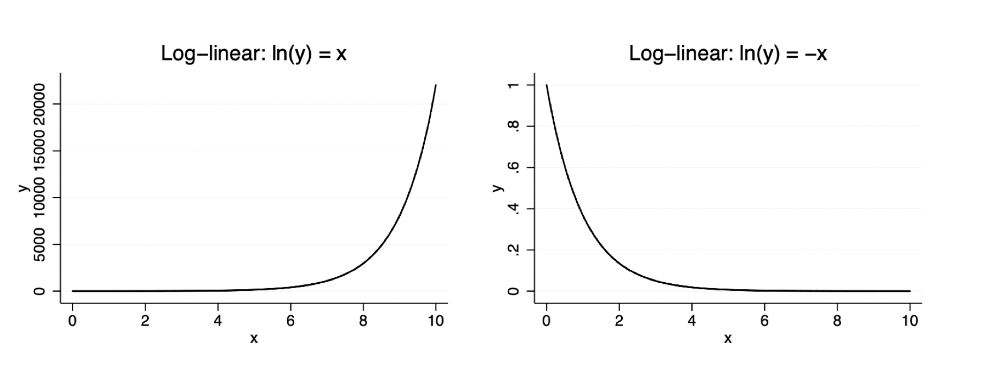
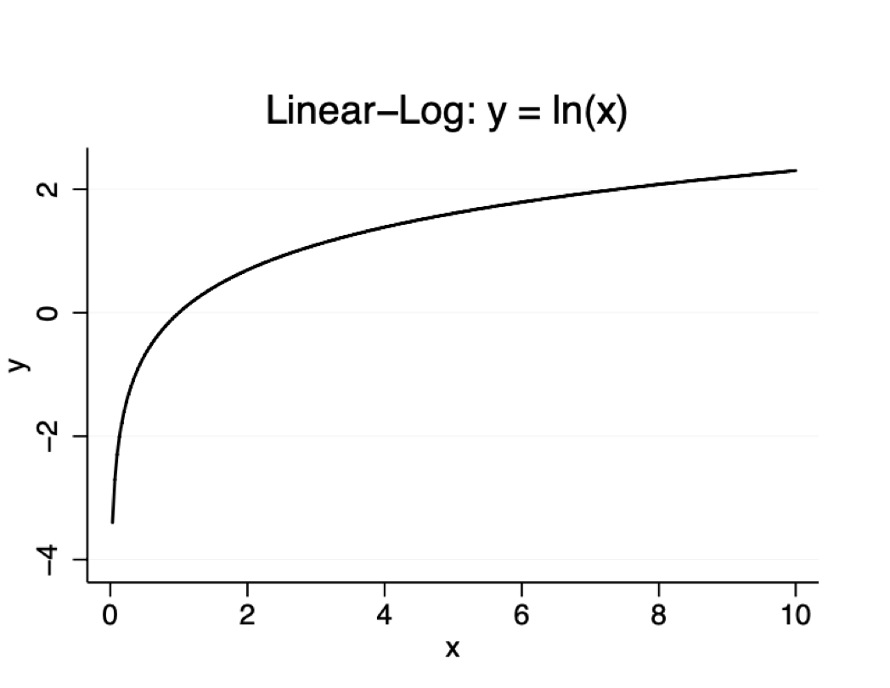
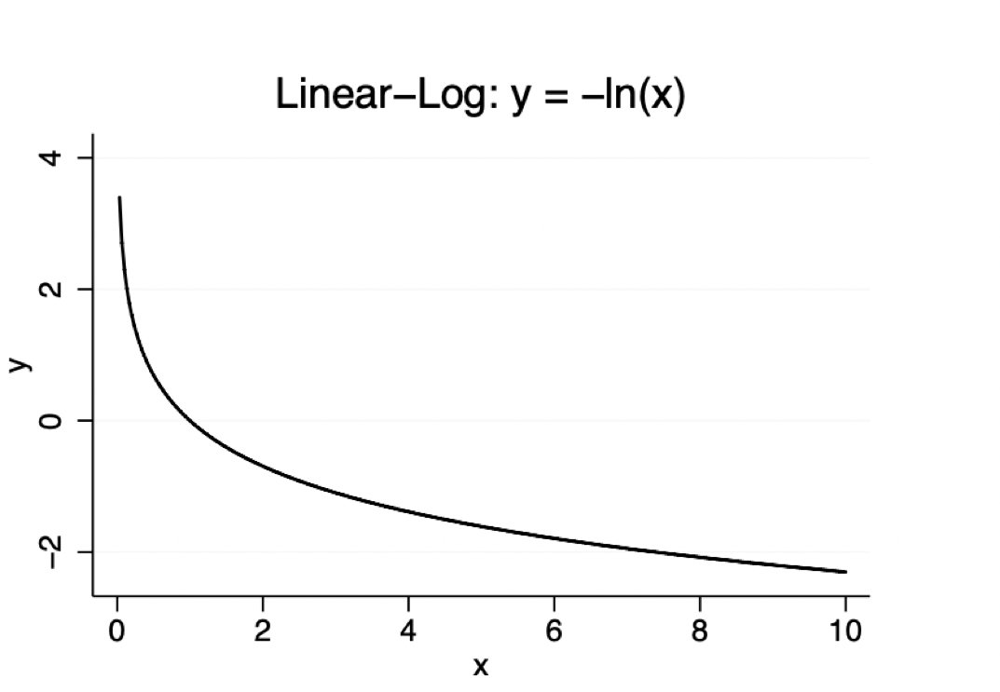
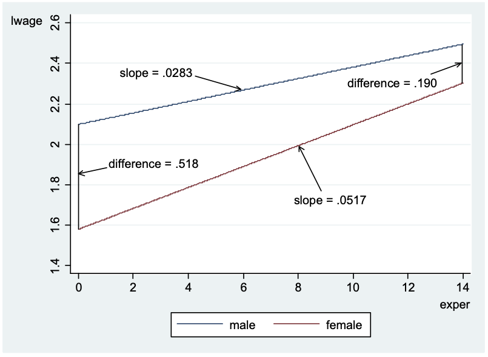

## Note on Units of measurement
We know from simple regression that change the units of measurement of the dependent variable or some of the independent variables cannot change the interpretation of the OLS regression line.

This means that if we rescale any of our variables, the coefficients have to change to keep the interpretation unchanged.

1. If we multiply the dependent variable y by a nonzero constant, say c, all of the coefficients – the intercept and the slopes – get multiplied by c. So do the fitted values and residuals. Nothing happens to the R-squared. Nothing happens to t statistics (except they change sign if c < 0) or F statistics.

2. If we multiply an independent variable $x_j$ by the nonzero constant c then the coefficient in $x_j$ gets divided by c. Nothing happens to fitted values, residuals, or R-squared. Nothing happens to t or F statistics, except the t statistic on the new $x_j$ variable changes sign if c < 0.

3. Suppose y > 0 and we initially use log(y) as the dependent variable. If we first multiply y by the constant c > 0 and then take the log, only the intercept in the regression will change. This is because log(c · y) = log(c) + log(y). As an example, suppose y is initially in thousands of dollars. Then 1, 000 · y is in dollars. Now log(1, 000 · y) = log(1, 000) + log(y) ≈ 6.91,
and so the intercept will increase by about 6.91. None of the slopes changes. The fitted values each increases by 6.91, but the residuals and R-squared do not change. Nothing happens to t or F statistics.

4. If we use $log(c · x_j)$ instead of $log(x_j)$, the intercept changes but the coefficient on $x_j$ does not; neither does the R-squared or any test statistics (except for those relating to the intercept).

## Using a Natural Log

### Reasons for Using the Natural Log

1. The coefficients have percentage change interpretations. Consequently, we can be ignorant of the units of measurement of any variable that appears in logarithmic form.

2. When y > 0, models with log(y) as the dependent variable often more closely satisfy the classical linear model assumptions. For example, the model has a better chance of being linear, homoskedasticity is more likely to hold, and normality is often much more plausible. (These are observations based on experience.)

3. In most cases, taking the log greatly reduces the variance of a variable, making OLS estimates less prone to outlier influence. 

#### Limitations of Using the Natural Log

1. If y ≥ 0 but y = 0 is possible, we cannot use log(y). Sometimes log(1 + y) is used, but interpretation of the coefficients is difficult, and log(1 + y) ≥ 0 if y ≥ 0.

2. It is harder to predict y when we have estimated a model for log(y). 

3. In cases where y is a fraction and close to zero for many observations, log($y_i$) can have more variability than $y_i$.

Consider unem, the unemployment rate. Because unemployment is a percent, changes are percentage point changes. So, unem going from 8 to 9 is a one percentage point increase, but it is a 12.5 percent increase from the starting value of 8. The logarithmic change is log(9) − log(8) ≈ .118, which means approximately 11.8% as the approximation to 12.5%. Usually we are more interested in the effect of a one percentage point change, but not always.

#### Some (Not-so-Hard) Rules on Using Logarithms

1. Logs are often used for dollar amounts that are always positive, as well as for variables such as population, especially when there is a lot of variation.

2. Logs are used less often for variables measured in years, such as schooling, age, and experience. We often want to know what the effect of increasing schooling by one year (not by a certain percentage).

3. Logs are used less infrequently for variables that are already percents or proportions.

### log-lin
 We can approximate percentage changes using the natural log 

Now let the dependent variable be $\log(bwght)$: 

\begin{equation}
\log(bwght) =\beta_{0} +\beta_{1}faminc +u
\end{equation}

Holding $u$ fixed, 

\begin{equation} 
\Delta \log(bwght) =\beta _{1}  \Delta faminc
\end{equation}


so, 
\begin{equation}\beta_{1} =\frac{ \Delta \log (bwght)}{ \Delta faminc}
\end{equation}

 Useful result from calculus: 

\begin{equation}100 \cdot  \Delta \log(bwght)  \approx  \%  \Delta faminc
\end{equation}

This means when $\log(bwght) =\beta _{0} +\beta _{1}faminc +u$, we have a simple interpretation of $\beta_{1}$: 

$100 \beta _{1}  \approx  \%  \Delta wage$ when $\Delta faminc =1$


Why, you ask, is this $100\times\beta_1$? Well, *technically* it's not actually 100%. It's a rule of thumb we use. We treat logs as an approximate percent change. 
If we set $\delta = 1$ for a unit change:

\begin{equation}E[lnY_0] = \beta_0 +\beta_1 X\end{equation}
\begin{equation}E[lnY_1] = \beta_0 +\beta_1(X+1)\end{equation}
\begin{equation}E[lnY_1]-E[lnY_0] = \beta_1(X+1) -\beta_1X\end{equation}
\begin{equation}E[lnY_1]-E[lnY_0] = \beta_1\end{equation}

When you multiply $\beta_1$ by 100, the approximation is $E[lnY_1]-E[lnY_0] \approx \frac{E[Y_1]-E[Y_0]}{E[Y_0]}$. 

For simplicity, let's just drop the expectations and treat it as if there is no variance in $Y_0$ and $Y_1$. Using log-rules, $lnY_0-lnY_1 = ln(\frac{Y_1}{Y_0}) = ln(\frac{Y_0}{Y_0} + \frac{Y_1-Y_0}{Y_0}) = ln(1+\frac{\Delta Y}{Y_0})$ This last part, $\frac{\Delta Y}{Y_0})$ is nothing else but the percent change in Y divided by 100.

So, we get    
\begin{equation}
ln(1+\frac{\Delta}{Y_1})=\beta
\end{equation}

We can exponentiate both sides and see the approximation:
$\frac{\Delta y}{y_1} = e^\beta-1 \approx \beta$ 

This approximation comes from a k-th order Taylor series expansion of $e^\beta$ around zero (technically, Maclaurin series):

\begin{equation}
e^\beta \approx P_k = 1 + \beta+ \frac{\beta^2}{2!}+ \frac{\beta^3}{3!}+ \dots
\end{equation}

We only use the linear approximation (and disregard the terms from the quadratic onward), it will be more accurate the smaller $\beta$ is. This is fine for small changes, but you may want to report $100*(e^\beta -1)$ instead:


Note: A Taylor series expansion of any function is an infinite polynomial approximation of that function about a certain point. The more higher order terms we use, the more closely we approximate the original function further away from the point.

Remember, we are looking at non-linear relationship, so here are two forms of log-lin visualized




```{r}
library("wooldridge", "stargazer", "tidyverse")
data(bwght)
loglin <- lm(log(bwght) ~ cigs+faminc, data = bwght)

#stata equivalent
# gen lnbwght = ln(bwght)
# reg lnbwght cigs faminc

sum_loglin <- summary(loglin)
sum_loglin

#stata equivalent
#eststo loglin: reg lnbwght cigs faminc
 
cigsbeta <- exp(loglin$coefficients[2])-1
cigsbeta
faminc <- exp(loglin$coefficients[3])-1
faminc
```
For every additional dollar of family income leads to an increase in the baby's birth weight by .08%  (0.0008*100)


#### Log-log
 We can use the log on both sides of the equation to get constant elasticity models. For example, if 

$$\log(bwght) =\beta _{0} +\beta _{1} \log(faminc) +u$$ then 

$$\beta_{1} \approx \frac{ \% \Delta bwght}{ \% \Delta faminc}$$

The elasticity is free of units of $bwght$ and $faminc$. 

We can also see this algebraically:

Take a small shift in X $$$$\log(bwght+ \Delta bwght) =\beta _{0} +\beta _{1} \log(faminc + \Delta faminc) +u$$ $$

then subtract $\log(bwght) =\beta _{0} +\beta _{1} \log(faminc) +u$ and you'll get:
$$\Delta bwght = \beta_1(\Delta lnfaminc) $$
Solve for $\beta_1$:
$$\beta_1 = \frac{\Delta lnbwght}{\Delta lnbwght} \approxeq \frac{\Delta bwght /bwght}{\Delta faminc/ faminc}$$
For a 1% unit increase (decrease) in X, we have $\Delta𝑋=0.01(−0.01)$, and we expect a $\beta_1\%$ increase (decrease) in Y


```{r}
loglog <- lm(log(bwght) ~ cigs+log(faminc), data = bwght)
sum_loglog <- summary(loglog)
sum_loglog
```

The estimated elasticity of bwght with respect to family income is about .016 or a 1% change in family income is associated with a .016% increase in birth weiht (To interpret this elasticity, we do not need to know $bwght$ is in ounces while $faminc$ is in thousands.) 

It could be better to think in larger terms (who wants a 1% increase in income?)- a 10 percent increase in family income leads to an increase in birth weight by 1.6%

$.016 (10) =1.6$ percent increase in family income. 

How do you interpret the coefficient of cigs?

For every additional cigarette smoked on average per day is associated with a .4 \%  increase in birthweight.

How do you interpret the intercept?

Well, it's trickier to interpret the log directly. The intercept is not measuring a change in values - so it's not a percent change (there is no difference in logs). It's much easier just to exponentiate the value. So, to interpret the intercept, we can exponentiate like so:

```{r}
exp(loglog$coefficients)
```
In this case, the intercept is 112.01 ounces.  Leaving it in log units is kind of strange, because what are log units? Much better to exponentiate it to convert it back to understandable units.

The log-on-log case represents a multiplicative relationship between the original variables. For instance
$$lny = \beta_0 +\beta_1lnx_1+\beta_2lnx_2+u_i$$

is equivalent to 
$$y = e^{\beta_0}x_1^{\beta_1}x_2^{\beta_2}e^{u}   $$
Very convenient! Think of a linearized Cobb-Douglas production function (macro)!


### lin-log
In a lin log model, 

$$bwght =\beta_{0} +\beta_{1} \log(faminc) +u$$
then 

$$\beta _{1} \approx \frac{ \Delta bwght}{ \Delta log(faminc)}$$

We can see this algebraically, too:

After a small shift in $\Delta$faminc in faminc:
$$bwght = \beta_0 + \beta_1ln(faminc +\Delta faminc)$$
Subtract this from our earlier regression, $bwght =\beta_{0} +\beta_{1} \log(faminc) +u$

and you get:

$$=\beta_1 \Delta lnfaminc$$
Solve for $\beta_1$
$$\beta_1 = \frac{\Delta bgwht}{\Delta lnfaminc} \approxeq \frac{\Delta bgwht}{\Delta faminc/faminc} = $$
For 1 % increase (decrease) in X, we have a $\Delta faminc =0.01(-0.01)$, and we expect a 0.01 $\beta_1$ increase (decrease) in Y

We can see the non-linear relationship for a log-lin with a positive ln(x) and negative ln(x):





```{r}
linlog <- lm(bwght ~ cigs+log(faminc), data = bwght)
sum_linlog <- summary(linlog)
sum_linlog
```

For every additional $1000 in family income, birth weight will increase by .018 % (1.8/100)

or rather, for every $10,000 increase in birth weight is associated with 18 ounces ((1.8/100)*1000)

Let's compare our estimates of the models


```{r, results='asis'}
library("stargazer")
linlin <- lm(bwght ~ cigs + faminc, data = bwght)
sum_linlin <- summary(linlin)

stargazer( loglog, loglin, linlog, linlin, type = "html",
           results = 'asis',message = FALSE, echo = FALSE, notes.append = FALSE, header = FALSE, single.row = TRUE)


```
What can we compare? 

The SER (standard error of the regression) is in the dependent units. This means that we can compare the fit of the models lin-log and lin-log models, but  *not* any of the models that have the log in the dependent variables.

In addition, the $R$-squared is not directly comparable. The total variation (SSTs) in $bweight_{i}$ and $l bweight_{i}$ that we must explain are completely different. 


A handy reminder of interpreting coefficients is:

|    Model  |Dep. Var | Indep. Var | $\beta_1$|
|-----------|---------|------------|----------|
|Lin-Lin| y       |x           |$\Delta y=\beta_1 \Delta x$
| Lin-Log | y       |log(x)      |$\Delta y=(\beta_1/100\%) \Delta x$
| Log-Lin |log(y)   |x           |$\%\Delta y=(100\beta_1) \Delta x$  technically should be $100 * (e^\beta-1) \Delta x$
|  Log-Log  |log(y)   |log(x)      |$\Delta \%y=\beta_1\Delta x$

The possibility of using the natural log to get non-linear relationships between $y$ and $x$ raises a question: What do we mean now by ``linear'' regression? 

The answer is that the model is linear in the \textit{parameters}, $\beta _{0}$ and $\beta _{1}$. We can use any transformations of the dependent and independent to get interesting interpretations for the parameters. 

####  Standardized coefficients
Confusingly, a beta coefficient is a standardized coefficient. We use beta hat to denote our OLS estimate. For the sake of this course, we will continue using the term standardized coefficient when we standardize y and each $x_j$ by subtracting its mean and dividing by its sample standard deviation.

This can be useful when some of the $x_j$ or y have units that are not easily understood. So, for example, we might not have a good sense for how important is an increase in a test score by one point. Using logs gives us percentage effects, but we do not always want to do that.

It is often useful to ask the following question, which allows us to see how important an effect is relative to the population: “How many standard deviations will y change when $x_j$ increases by one standard deviation?”

When you standardize, there is no beta coefficient for the intercept because the intercept is zero when all variables have zero sample averages.

```{r}
library("dplyr")

data(attend)
# If you want to standardize your own values, you can do so as such. I am standardizing GPA and ACT in this case and creating a NEW dataframe. This will replace the existing columns - so be aware of that in this method!
attendstd <- attend %>% mutate_at(c('priGPA', 'ACT'), ~(scale(.) %>% as.vector))


attend_std <- lm(stndfnl ~ missed+priGPA+ACT, data = attendstd)

summary(attend_std)


```

The coefficient on priGPA is larger than on ACT by almost a factor of five. But does this mean priGPA has the more important effect?

An increase in one sd of priGPA increases final by about .219 sds while a one sd increase in ACT increases final by about .294 sds, which is a larger movement in the distribution of final exam scores.

## Quadratic/Polynomial Functions
Using the log of an independent variable is one way to get a diminishing effect. But sometimes it is not flexible enough.

Models with quadratics can deliver increasing or decreasing effects. Plus, they contain the constant effect as a special case, which can be easily tested.

Models also allow for a turning point, which is sometimes of interest. (For example, what is the optimal number of students at a high school for high school performance?)

Consider the model

$$y = β_0 + β_1x_1 + β_2x_1^2 + u$$

There is only a single explanatory variable, x, but two regressors, $x_1, x_2$.

The slope of y with respect to x depends on $\beta_1$ and $\beta_2$, and the value of x: $ \frac{dy}{dx} = \beta_1 + 2\beta_2x$ holding u fixed 

Estimation is straightforward. We just define a new variable, $x^2$, and include it along with x as a regressor.

Having estimated the coefficients we write
$$ \hat{y} = \hat{\beta_0}+\hat{\beta_1}x+\hat{\beta_2}x^2 $$

$$
\frac{\Delta{\hat{y}}}{\Delta X} \approx \hat{\beta_1}+\hat{\beta_2}2X
$$

Cases

1. If $\hat{\beta_1} > 0$ and $\hat{\beta_2} < 0$, the slope is initially positive, but it decreases as x increases. The function has a hump shape and turns at the value

$$  \displaystyle\left\lvert x^* = {\frac{\hat{\beta_1}}{2 \hat{\beta_2}}} \right\rvert $$

the maximum of the function. After the value x∗, the slope is negative.

```{r}
library(tidyverse)
quadratic <- function(x){x-x^2}

#plot it
ggplot(data.frame(x = c(-15,15)), aes(x = x)) +
  stat_function(fun = quadratic) + xlim(c(-15, 15)) 
```


2. If $\hat{\beta_1} < 0$  and $\hat{\beta_2} > 0$, the slope is initially negative, but it increases (gets less negative) as x increases. The function has a U shape and turns at the x∗ given above. But now x∗ is the minimum of the function. Once $x > x∗$, the
slope is positive.
```{r}
quadratic <- function(x){-x+x^2}

#plot it
ggplot(data.frame(x = c(-15,15)), aes(x = x)) +
  stat_function(fun = quadratic) + xlim(c(-15, 15)) 


#curve(-x+x^2 , from=1, to=10, n=300, xlab="xvalue", ylab="yvalue", 
 #            col="blue", lwd=2, main=expression(hat(beta[1])<0 ~ "," ~hat(beta[2])>0))
```

In Cases 1 and 2, we should ask: Does the turning point makes sense? If it does not make sense for the slope to change signs, does the sign change happen only at an extreme value of x?

3. If $\hat{\beta_1} > 0$  and $\hat{\beta_2} > 0$, the slope ($\hat{\beta_1}+2\hat{\beta_2}x$) is always positive and increases with x. The turning point occurs at a negative value of x. (In practice, less common than Case 1.)

```{r}
library(tidyverse)


curve(  x+x^2 , from=1, to=10, n=300, xlab="xvalue", ylab="yvalue", 
             col="blue", lwd=2, main=expression(hat(beta[1])>0 ~ "," ~hat(beta[2])>0))
```
4. If $\hat{\beta_1} < 0$  and $\hat{\beta_2} < 0$, the slope is always negative and becomes more negative (increases in absolute value) as x in creases. The turning point is negative.

Adding additional explanatory variables changes nothing of the calculations, except for giving a ceteris paribus interpretation.

```{r}

#plot it
curve(  -x-x^2 , from=1, to=10, n=300, xlab="xvalue", ylab="yvalue", 
             col="blue", lwd=2, main=expression(hat(beta[1])<0 ~ "," ~hat(beta[2])<0))
```


```{r}
data(wage1)
wage1$exper2 <- wage1$exper^2
wage_square <- lm(log(wage) ~educ + exper + exper2 , data = wage1)
summary(wage_square)

```

The estimated return to education is 9.0%. The model assumes this is
the same for all years of experience and education.

By contrast, each year of experience is worth less than the preceding year. The slope is, using calculus – just take the derivative with respect to exper – is
\begin{equation}
\frac{\Delta \hat{lwage}}{\Delta exper} \approx .041 − 2(.0007)exper = .041 − .0014exper
\end{equation}

Can think of 12.7% (the $\beta_0$) as approximately the return to the first year of experience – essentially starting off in the workforce. The return in going from 10 to 11 is about
$.041 − .0396*10 = -.355$
or 2.7%.


We could be more precise and not use a calculus approximation: $[.041(11) − .0007(11)^2] − [.041(10) − .0007(10)^2] \approx 2.63$, which is reasonably close.

Because the quadratic model is more complicated to interpret and explain, we should make sure there is good statistical evidence for keeping $x_2$ (exper2) in the equation.

So, we test the null that the equation is linear in exper against the alternative that it is quadratic:
\begin{equation}
H_0 = \beta_{exper2} = 0
\end{equation}
\begin{equation}
H_A = \beta_{exper2} \neq 0
\end{equation}

Important: $β_{exper}$ is not restricted. So we use a t test on exper2.

The t in this example is -6.164 with two-sided p-value = .0001, so we reject H0 at the 5% level. It seems a good idea to keep exper2 in the equation.

However, if we want to test if experience has an effect on wages:
This would be
\begin{equation}
H_0: \beta_{exper} = 0, \beta_{exper^2} = 0
\end{equation}
We would use an F test. But usually, if the quadratic term is insignificant, we go back to a linear model.
 
 We can also find the "peak" or "trough" by setting our FOC (first order conditions) to 0 and solving for X.
 
 
 $0 = .041 − 2(.0007)exper$
 
 $exper = .041/.0014 = 29.29$
 
 After working for 29.29 years, the marginal increase of salary begins to decline. 
 
 
 With calculus, we can also say something about whether the effect is going to marginally increase or marginally decrease.  We just take the second derivative of our marginal effects equation and see if the result is positive or negative. This basically tells us if after the peak or trough, does the value go up or down.  And we can see that the second derivative of exper is negative.
  

But, even more simply, we can just look at the sign of the squared term. A positive term will tell us that the marginal effect increases, while a negative term will tell us that the marginal effect decreases.
 
 Let's graphically visualize these results:
```{r}

library(wooldridge)
#install.packages("margins")
library(margins)


lm(log(wage) ~educ + stats::poly(exper, 2) , data = wage1)
# we have to use the poly function to get the correct marginal effects graph

wage_square <- lm(log(wage) ~educ + exper + I(exper^2) , data = wage1)

summary(wage_square)
cplot(wage_square, "exper")

# We can take the average of the marginal effect with:
summary(margins(wage_square, variables = "exper"))

#we can also extract the marginal effect in a table:
dydx(wage1, wage_square, variable = "exper")

#at specific values
summary(margins(wage_square, at = list(exper = c(10, 15, 20, 25, 30, 35, 40)), variables = "exper"))

mean(wage1$exper)

```

Recall that if you have multiple variables that are highly correlated that your inference will change. Well, that's no different here - you can imagine that $x$ and $x^2$ are highly correlated

To see if experience has a *statistically significant effect* on wages, we must conduct an f test on all of the terms associated with experience.

Let's do that f-test

```{r}
library(car)


linearHypothesis(wage_square, c("exper=0", "I(exper^2)=0"))

```
Indeed, experience has a statistically significant effect. We reject the null at the 1% level.


We can also see how the linear vs. quadratic fit changes
```{r}
data(wage1)

#Let's graph the simple regression line differences

library(tidyverse)
ggplot(wage1, aes(x=exper, y=wage))+
  geom_point() +
  stat_smooth(aes(y = wage),method = "lm", formula = y ~ x , color= "red") +
  stat_smooth(aes(y=wage), method = "lm", formula = y ~ x + I(x^2)) 


#We can add controls and look at the differences in the regression
wage_lin <- lm(wage ~educ + exper, data = wage1)
wage_quad <- lm(wage ~educ + exper +I(exper^2), data = wage1)


```

## Interaction Terms

The quadratic is not very different from interaction terms in mechanical terms, you just have to be careful of interpretation and testing - because the two terms depend on one another.

Suppose we have two explanatory variables and start with the usual model: 

$$y = β_0 + β_1x_1 + β_2x_2 + u$$

The partial effect of $x_1$ on y is $β_1$ and the PE of $x_2$ on y is $β_2$. Even if we add quadratics, the model has a potentially important restriction: the partial effect of $x_1$ never depends on $x_2$, and vice versa.

Sometimes it is natural to think the partial effect of one variable, say education, could depend on the level of another variable, say intelligence.

Let's add an interaction term:

$y=β_0 +β_1x_1 +β_2x_2 +β_3x_1x_2 +u$

Holding $x_2$ (and u) fixed, the partial effect of $x_1$ on y is:

\begin{equation}
\frac{\Delta y}{\Delta x_1} =\beta_1 + \beta_3x_2
\end{equation}

so that the effect of $x_1$ depends on $x_2$ unless $\beta_3 = 0$:
\begin{equation}
\frac{\Delta y}{\Delta x_2} =\beta_2 + \beta_3x_1
\end{equation}

The null hypothesis $H_0 : β_3 = 0$ is the same as saying the partial effects are constant. It should be tested. If it cannot be rejected at a small significance level (smaller than 5%), it is not worth complicating the model.

It is easy to get confused in models with interactions. From

\begin{equation}
\frac{\Delta y}{\Delta x_1} =\beta_1 + \beta_3x_2
\end{equation}

we see that $β_1$ is now the PE of $x_1$ on y when $x_2$ =0. But $x_2 =0$ may be very far from a legitimate, or at least interesting, part of the population. A similar comment holds for $β_1$.

Two interesting parameters are the PEs evaluated at the mean of the other variable:

\begin{equation}
\gamma_1 = \beta_1 +\beta_3 \mu_2
\end{equation}

\begin{equation}
\gamma_2 = \beta_2 +\beta_3 \mu_1
\end{equation}

We will estimate these as:

\begin{equation}
\hat{\gamma_1} = \hat{\beta_1} +\hat{\beta_3} \bar{x}_2
\end{equation}

\begin{equation}
\hat{\gamma_2} = \hat{\beta_2} +\hat{\beta_3} \bar{x}_1
\end{equation}

where $\bar{x}_2$ and $\bar{x}_1$ are the sample averages and the $\hat{\beta_2}$ are the OLS estimates.

It is often easier to let a regression compute $\hat{\gamma_1}$ and $\hat{\gamma_2}$, and to get appropriate standard errors. We can write in the population
\begin{equation}
y = \alpha_0 + \gamma_1 x_1 +  \gamma_2 x_2 + \beta_3(x_1 - \mu_1) (x_2 - \mu_2) +u
\end{equation}

In other words, we subtract the means before creating the interactions.
The regression we run is

$y_i$ on $x_{i1}$, $(x_{i1} - \bar{x_1})(x_{i2} - \bar{x_2}), i  = 1, \dots,n$


The intercept changes, too, but this is not important. The coefficient on the interaction does not change.

Let's see it:

First model the interaction is educ*IQ

```{r}
wage_lin <- lm(log(wage) ~educ + IQ  , data = wage2)
summary(wage_lin)

wage_int <- lm(log(wage) ~educ + IQ + educ*IQ , data = wage2)
summary(wage_int)
```
Now, let's see the regression with mean adjusted values.

```{r, results='asis'}

#Generate mean values for each variable
data(wage2)

mean_educ = mean(wage2$educ)

summary(wage2$IQ)
mean_iq = mean(wage2$IQ)

#create a new variable using mutate that is the mean adjusted value for educ and IQ
wage2 <-mutate(wage2, mean_educ_adj  = educ-mean_educ, mean_iq_adj = IQ-mean_iq)

#run the regression with the mean adjusted regression
wage_int_meanadj <- lm(log(wage) ~educ + IQ + mean_educ_adj*mean_iq_adj  , data = wage2)


library("stargazer")
stargazer(wage_int_meanadj, wage_int, type = "html", 
          results = 'asis',message = FALSE, echo = FALSE, notes.append = FALSE, header = FALSE, single.row = TRUE)


```

You can see that the interaction term is the same between the mean centered and uncentered regressions.

The interaction term is not statistically significant. And similarly, we can see that when centering has been done, these estimates are much closer to the regression without interactions (0.0391199,  0.0058631 compared to  0.0386104, 0.0059052 )

The positive coefficient on the interaction means that the return to education is higher for people with higher ability.

The estimated partial effect of educ is 
$0.0386+0.0001*IQ$
If someone has an IQ that is 10 above the mean, the return to education is:
$0.0386+0.0001(10-101.28) = .0294$ or 2.94%

If someone has an IQ that is 10 below the mean, the return to education is:
$0.0386+0.0001(-10-101.28) = .0274$ or 2.74%

If we can believe these estimates, schooling is worth more for those with higher intelligence.

## Dummy Variables

Dummy variables are essentially, differences in means (and this will be VERY important for Diff-Diff) regressions.

Say, we are interested in the gender wage gap, and we estimate a simple regression:

\begin{equation}
wage = \beta_0 +\gamma_0female +u
\end{equation}

Where $E(u|female = 1)$ and therefore,

\begin{equation}
E(wage|female) = \beta_0 + \gamma_0 female
\end{equation}

There are only two values for female, 0 and 1.

\begin{equation}
E(wage|female = 0) =  \beta_0 
\end{equation}

\begin{equation}
E(wage|female = 1) = \beta_0 + \gamma_0 female
\end{equation}

We can then write,

\begin{equation}
\gamma_0 = E(wage|female = 1) - E(wage|female = 0)
\end{equation}

And that's just the difference in wage between women and men.

So $\gamma_0$ is not a slope. It's just a difference in average outcomes between two groups.

The population relationship is mimicked in the simple regression estimates.

\begin{equation}
\hat{\beta_0}= \bar{wage_m}
\end{equation}
\begin{equation}
\hat{\beta_0} + \hat{\gamma_0}= \bar{wage_f}
\end{equation}
\begin{equation}
\hat{\gamma_0}= \bar{wage_f}-\bar{wage_m}
\end{equation}

where $\bar{wage_m}$ is the average wage for men in the sample and $\bar{wage_f}$ is the average wage for women in the sample. 

```{r}
data(wage1)

summary(lm(wage ~ female, data = wage1))
```
The estimated effect is large, women earn about $2.5 less than men.

The simple regression is a comparison of means. Where we are testing

$H_0: \mu_f = \mu_m$

where μf is the population average wage for women and μm is the population average wage for men. The t statistic and confidence interval are directly reported.

We can see the value is 8.279 and strongly reject the null.

The estimate $\hat{\gamma_0} = −2.5$ does not control for factors that should affect wage, such as workforce experience and schooling. If women have, on average, less experience and less college, that could explain the difference in average wages.

If we just control for experience, the model written in expected value form is
$E(wage|female,exper)=β_0 +δ_0female+β_1exper$

where now $δ_0$ measures the gender difference when we hold fixed exper.

Another way to write $δ_0$:
\begin{equation}
δ_0 =E(wage|female,exper_0)−E(wage|male,exper_0)
\end{equation}
where $exper_0$ is any level of experience that is the same for the woman and man.

```{r}
data(wage1)

summary(lm(wage ~ female+exper, data = wage1))
```

There is still a difference of about $2.27, which is smaller than when exper is not controlled for, but still very large and very statistically significant.

This model imposes a common slope on exper for men and women (.50)  - Only the intercepts differ


We can add additional controls, as well.  

```{r}
summary(lm(wage ~ female+educ+exper+married, data = wage1))
```

Let's say you estimate:

\begin{equation}
wage = \beta_0 + \beta_1 male
\end{equation}

What is the expected sign (given that you know information from the prior regression)?


Note: as you may recall, if you put female and male into the same regression, you will have a dummy variable trap.

#### Dummy variables with Multiple Categories

Suppose in the wage example we have two qualitative variables, gender and maritial status. Call these female and married.

We can define four exhaustive and mutually exclusive groups. These are married males (marrmale), married females (marrfem), single males (singmale), and single females (singfem).

Note that we can define each of these dummy variables in terms of female and married:

\begin{equation}
marrmale = married (1-female)
\end{equation}

\begin{equation}
marrfem = married * female
\end{equation}

\begin{equation}
singmale = (1-married)(1-female)
\end{equation}

\begin{equation}
singfem = (1-married)female
\end{equation}

We can allow each of the four groups to have a different intercept by choosing a base group and then including dummies for the other three groups. 

So, if we choose single males as the base group, we include marrmale,
marrfem, and singfem in the regression. 

The coefficients on these variabels are relative to single men.

With lwage as the dependent variable, we can give them a percentage change interpretation.

```{r}
wage1 <-mutate(wage1, marrmale = married*(1-female),   marrfem = married*female, singmale = (1-married)*(1-female), singfem = (1-married)*female)

summary(lm(log(wage) ~ marrmale +marrfem +singfem +educ +stats::poly(exper,2) + stats::poly(tenure,2), data = wage1))

summary(lm(log(wage) ~ female+married+ female*married +educ +stats::poly(exper,2) + stats::poly(tenure,2), data = wage1))
```
What if we want to compare married women and single women? 

Just plug in the correct set of zeros and ones.
slope for married women = .63 − .198 (.432) slope for single women = .63 − .11 (.52) difference = −.198 − (−.110) = −.088
so married women earn about 8.8% less than single women (controlling for other factors).

We cannot tell from the previous output whether this difference is statistically significant (you can calculate this knowing that the difference between two variances is the sum of the variance, thus $\sqrt{se_{marrfem} + se_{singfem}}$

No matter which group we choose as the base group, we include only three of the four dummy variables. If we include all four we fall into the dummy variable trap.

Incidentally, in this data set, gender, marrital status, education, experience, and tenure explain about 45% (using $R^2$) of the variation in lwage.


#### Incorporating ordinal variables

Let's take an example using the dataset beauty which includes a ranking of physical attractiveness of each man or woman, on a scale of 1 to 5, with 5 being “strikingly beautiful or handsome.” This is a subset of the data used in Hamermesh and Biddle (1994, American Economic Review).

As we move up the scale from 1 to 5, why should a one-unit increase mean the same amount of “beauty”?

The “looks” variable is what we call an ordinal variable: we know that the order of outcomes conveys information (5 is better than 4, and 2 is better than 1) but we do not know that the difference between 5 and 4 is the same as 2 and 1.

Let's take a look at the data

```{r}
data(beauty)
table(beauty$looks)
```

 Very few people are at the extreme values 1 and 5 (less than 1% each). It makes sense to combine into three categories: below average (belavg), average, and above average (abvavg).

```{r}
library(janitor)
beauty <- mutate(beauty, belowav = if_else(looks <= 2, 1,0), abovav =if_else(looks >= 4,1,0))
tabyl(beauty$belowav, show_na = TRUE)
tabyl(beauty$abovav, show_na = TRUE)
```
12.5% of people are "below average" and 30.3% have above average looks - everyone else has "average looks (looks =3)

Take average as the base group.
```{r}
summary(lm(lwage ~belowav+ abovav, data = beauty))
```
Controlling for no other factors, those with below average looks earn about 20.8% less than those with average looks. The t statistic is very significant (p- value is super low).

Those with above average looks are estimated to earn about 4.5% less than those with average looks, but the p-value is .264. So there is little evidence the effect is different from zero.


Now control for some other factors, including gender and education.

```{r}
summary(lm(lwage ~belowav+ abovav+educ+stats::poly(exper,2), data = beauty))
```

The effect of having below average looks is now about 18% lower salary (on average). Above average looks is still statistically insignificant and gets smaller in magnitude.

Good practice to look at all coefficients to see if the signs and magnitudes make sense. They do, although the premium for males is very large.

```{r}
summary(lm(lwage ~ looks+educ+stats::poly(exper,2), data = beauty))
```

Putting in the variable looks means that better looks always has to have a positive effect. It is not as significant and fits slightly less well (use adjusted R2 ).

```{r}
sd(beauty$looks)
```

A one standard deviation increase in looks increases predicted lwage by .062(.68) = .042, or predicted wage by about 4.2%.

Let's see what happens if we look at the effects just for women
```{r}
summary(lm(lwage ~ belowav+ abovav+educ+stats::poly(exper,2), data=subset(beauty,female ==1)))
```

Equation for women only is suggestive of a positive effect of above average looks, but the estimates are imprecise with only 213 observations. In fact, belavg is no longer statistically significant even though its coefficient is still pretty large, −.125.

One shortcoming in the previous analysis is that it ignores occupation. Maybe we should allow people to sort into occupation (perhaps partly based on looks) and see if there is a “looks premium” in a given occupation. Biddle and Hamermesh (1998, Journal of Labor Economics) study lawyers’ looks and earnings and find similar results.

Recently, a paper [found](https://www.dropbox.com/s/j43okuoakvsm36h/Pretty2021Jan29.pdf?dl=0) that better looking economists are cited more frequently and are more likely to be placed in higher ranking schools. 

Variables such as credit ratings, or any variables asked on a scale, are ordered variables. For example, someone may be assigned a credit rating on a scale from 1 to 7, or someone may be asked to rate their “happiness” on a scale of 1 to 5.

## Interactions with Dummy Variables
Consider again the lwage equation with gender and marital status, allowing for the four different groups. We can achieve the same thing by using an interaction between female and married.

If we regress lwage on female, married, female * married and the education, experience, and tenure variables, we get:

```{r}
summary(lm(log(wage) ~ female+married +female*married, data = wage1))
```


Just plug in the correct combination of zeros and ones to obtain differences among the groups. The intercept corresponds to female = 0, married = 0, so it is still for single men. For single women, female = 1, married = 0, and married men married = 1, and for married women female =1, married =1, female*married = 1 (-6.226)


One advantage of the equation with the interaction is that it allows us to read off the difference in marriage premium between women and men. For men, the premium is the coefficient on married,  2.815. The difference in the marriage premium is -2.8607 , and so the marriage premium for women is 2.815 − -2.8607 = -.0457.

We can interact dummy variables with quantitative variables to obtain regression models with different slopes, as well as different intercepts.

Recall that in the model
$lwage = β_0 + δ_0female + β_1exper + u,$
the intercept for men is $β_0$ and that for women is $δ_0$. The slope, $\beta_1$1, is common across men and women.

How can we allow the return to experience – that is, the slope in the lwage equation – to differ by gender?

An extended model is
$lwage = (β_0 + δ_0female) + (β_1 + δ_1female) · exper +u $

 For men, female = 0. For women, plug in female = 1.

|   | Intercept |    |
-----|--------|-------|
Male|   $\beta_0$            |     $\beta_1$ |
Female| $\beta_0 + \gamma_0$ | $\beta_1 + \gamma_1$ |
Diff(Female-Male) |  $\gamma_0$  | $\gamma_1$ |


For now, we use the Greek letter delta to emphasize that $δ_0$ and $δ_1$ are differences.

How can we estimate the four parameters, $β_0,β_1,δ_0$, and$ \gamma_1$? Write the model as
$lwage = β_0 + δ_0female + β_1exper + δ_1female · exper + u$
so we simply add the interaction term female · exper.

Note that female · exper is zero whenever female = 0 (that is, for all
men).

Let's add experience

```{r}
summary(lm(log(wage) ~ female + exper+ female*exper, data = wage1))
```

The intercept for men is 1.69 and the slope is 0.004 (about .40%) for each year of experience
The intercept for women is 1.69 -.293 (1.397) and the slope is 0.006 -0.0058  (about .0002) for each year of experience.
The interaction term is marginally statistically significant with a p-value of .0638

Must use care to interpret the coefficient on female when female·exper is in the equation. To see why, at any level of experience, the predicted difference in lwage between females and males is -.293 + .006exper

Therefore, the coefficient on female, -.293, is the predicted difference in lwage between a woman and man when exper = 0. This is not an especially interesting subset of the population. (Only about 1.5% of the sample has exper less than 3, and no one can have zero years.)


Must use care to interpret the coefficient on female when female·exper is in the equation. To see why, at any level of experience, the predicted difference in lwage between females and males is
−.518 + .0234exper

More interesting is the gap at around the mean, say exper = 10:

1.69 - 0.293(10) = −1.34
or about 134% less for women.

The gap never fully closes. The largest amount of experience in the sample is ~14 years.

We can use the same centering scheme as before with interactions. Re- place female · exper with female · (exper − 10) so that the coefficient on femalebecomes the difference at 10 years of experience.
where 10 is close to the mean value of experience in the sample.

```{r}
library(dplyr)
library(tibble)
wage1 <- mutate(wage1, femexp_10 = female*(exper-10))

summary(lm(log(wage) ~ female + exper+ femexp_10, data = wage1))

```

Don't mind the numbers here, but let's visualize what hese interactions look like.



Let's add a variable of college and interact it with gender

```{r}
wage1 <- mutate(wage1, coll = if_else(educ > 15,1,0))

female_educ <-lm(log(wage) ~ female + exper+ female*exper +coll +female*coll, data = wage1)
summary(female_educ)

```

Not all of the interaction are significant, but let's test to see if there are differences between male and female earnings.
 

#### Chow Test 

 We can use the chow test to test for these differences. Chow tests are known for identifying structural breaks - and they have many uses. But, really, it's just testing of equality between groups.
 
 Take the regression equation:
 $lwage = β_0 + δ_0female + β_1exper + δ_1female · exper +β_2coll + δ_2female · coll + u$
 
 The null hypothesis that there is no difference in lwage between men and women at the same levels of experience and college is:
 
 $H_0 :δ_0 =0,δ_1 =0,δ_2 =0$
 
This is one version of the Chow test - which tests for the equality of regression functions across two groups. We test joint significance of the dummy variable defining the groups as well as the interaction terms.
 
 In the general $k$ variable case, we can define a dummy variable, $w$, indicating the two groups. Then 


\begin{equation}y =\beta _{0} +\beta _{1} x_{1} +\beta _{2} x_{2} +\ldots  +\beta _{k} x_{k} \\
 +\delta _{0} w +\delta _{1} w \cdot x_{1} +\delta _{2} w \cdot x_{2} +\ldots  +\delta _{k} w \cdot x_{k} +u \\
H_{0} :\delta _{0} =0 ,\delta _{1} =0 ,\delta _{2} =0 ,\ldots  ,\delta _{k} =0\end{equation}for $k +1$ restrictions. 

We can use a standard $F$ test of the $k +1$ exclusion restrictions.

It is often of interest to allow $\delta _{0} \neq 0$ and just test equality of the slopes: 

\begin{equation*}H_{0} :\delta _{1} =0 ,\delta _{2} =0 ,\ldots  ,\delta _{k} =0
\end{equation*}Now we are testing $k$ parameters under $H_{0}$, so we use the $\mathcal{F}_{k ,n -2 (k +1)}$ distribution.

We can use the sum of squared residuals version of the $F$ statistic, too. Rather than construct all of the interactions and run the regressions with and without the interactions, we
can compute three SSRs. 

1. Pool the data and estimate a single regression. This is the restricted model, and produces the restricted
SSR. Call this the \textit{pooled} SSR, $S S R_{P}$. 

2. Estimate the regressions on the two groups (say, 1 and 2) separately. Get the SSRs, $S S R_{1}$ and $S S R_{2}$. The unrestricted SSR is $S S R_{1} +S S R_{2}$ (and this is the same as the regression that includes the full set of interactions).

 The $F$ statistic is
\begin{equation*}F =\frac{[S S R_{P} -( S S R_{1} +S S R_{2})]/(k +1)}{(S S R_{1} +S S R_{2})/[n -2(k +1)]}
\end{equation*}and, under $H_{0}$, has the $\mathcal{F}_{k +1 ,n -2 (k _1)}$ distribution under $H_{0}$. 


If we leave the intercepts unrestricted under $H_{0}$, then $S S R_{P}$ is obtained from the pooled regression but with the dummy variable added. The $k +1$ in the numerator becomes $k$, and we use the $\mathcal{F}_{k +1 ,n -2 (k_1)}$ distribution.


```{r, results='asis'}
library(stargazer)
library(car)

# create a regression for our full sample, male and female samples
wage_full <-lm(log(wage) ~ exper+ coll , data = wage1)

#calculate the sum of square residual
ssp <- sum(resid(wage_full)^2)

wage_fem <-lm(log(wage) ~ exper+ coll , data = subset(wage1, female ==1))
ss2 = sum(resid(wage_fem)^2)

wage_m <-lm(log(wage) ~ exper+ coll , data = subset(wage1, female ==0))
ss1 = sum(resid(wage_m)^2)

#Now, we can calculate our Chow test
chowtest <- (ssp - (ss1+ss2) /4) / ((ss1+ss2)/(526-2*(4)))
chowtest

# now add the intercept shift (recall that's what a dummy variable is, just an intercept shift, not a intercept AND slope shift which is what an interaction between a dummy variable and continuous variable is)

summary(wage_f_int <-lm(log(wage) ~ stats::poly(exper,2)+ coll +female , data = wage1))


stargazer(wage_full, wage_fem, wage_m, wage_f_int, type = "html", 
          results = 'asis',message = FALSE, echo = FALSE, notes.append = FALSE, header = FALSE, single.row = TRUE)


```
 
 

 An advantage of the approach based on interactions, that we will see when discussing heteroskedasticity, is that it can be modified to allow for unknown heteroskedasticity. (The statistic we use here assumes Assumption MLR.5, homoskedasticity, but we can relax that.) The SSR approach intrinsically relies on Assumption MLR.5.
 

 
 We can see the different interactions visually (an example with randomly generated data)
 
```{r}
# generate artificial data
set.seed(1)

X <- runif(200,0, 15)
D <- sample(0:1, 200, replace = T)
Y <- 450 +  150 * X + 500 * D + 50 * (X * D) + rnorm(200, sd = 300)

# estimate the models and plot the regression lines

# 1. (baseline model)
plot(X, log(Y),
     pch = 20,
     col = "steelblue",
     main = "Different Intercepts, Same Slope")

mod1_coef <- lm(log(Y) ~ X + D)$coefficients

abline(coef = c(mod1_coef[1], mod1_coef[2]), 
       col = "red",
       lwd = 1.5)

abline(coef = c(mod1_coef[1] + mod1_coef[3], mod1_coef[2]), 
       col = "green",
       lwd = 1.5)
       
# 2. (baseline model + interaction term)
plot(X, log(Y),
     pch = 20,
     col = "steelblue",
     main = "Different Intercepts, Different Slopes")

mod2_coef <- lm(log(Y) ~ X + D + X:D)$coefficients

abline(coef = c(mod2_coef[1], mod2_coef[2]), 
       col = "red",
       lwd = 1.5)

abline(coef = c(mod2_coef[1] + mod2_coef[3], mod2_coef[2] + mod2_coef[4]), 
       col = "green",
       lwd = 1.5)

# 3. (omission of D as regressor + interaction term)
plot(X, log(Y),
     pch = 20,
     col = "steelblue",
     main = "Same Intercept, Different Slopes")

mod3_coef <- lm(log(Y) ~ X + X:D)$coefficients

abline(coef = c(mod3_coef[1], mod3_coef[2]), 
       col = "red",
       lwd = 1.5)

abline(coef = c(mod3_coef[1], mod3_coef[2] + mod3_coef[3]), 
       col = "green",
       lwd = 1.5)
```
 
 A final warning: it is hard to justify omitting the level of a variable but including an interaction that involves that variable. Suppose we drop coll but include female · coll.
 
 The model imposes a zero return to college for men – which we cannot justify – and the coefficient on femcoll is now a direct estimate of the return to college for women, rather than being the difference in the returns between women and men

## Linear Probability Model

What if the dependent variable is a dummy variable?

How do we interpret the population model:

\begin{equation}y =\beta _{0} +\beta _{1} x_{1} +\beta _{2} x_{2} +\ldots  +\beta _{k} x_{k} +u
\end{equation}when $y$ is binary? $y$ can only change from 0 to 1 or 1 to zero. Suppose $\beta _{1} =.035$ and $x_{1} =educ$. What does it mean for a one year increased in $educ$ to increase $y$ by $.035\text{?}$ 

Same problem arises for other discrete variables, such as $y =number$ $of$ $arrests$ or $y =number$ $of$ $children$. Cannot have a fraction more of a child.

The key relationship when $y$ is binary: 

\begin{equation*}E (y\vert \mathbf{x}) =P (y =1\vert \mathbf{x})
\end{equation*}\par\pagebreak\relax 


We call $P (y =1\vert \mathbf{x})$ the \textbf{response probability}. Thus, wen we apply the linear model to binary $y$ we are really saying 

\begin{equation*}P (y =1\vert \mathbf{x}) =\beta _{0} +\beta _{1} x_{1} +\beta _{2} x_{2} +\ldots  +\beta _{k} x_{k}
\end{equation*}and we call the model the \textbf{linear probability model (LPM)}. 

The important point is that all partial effects are effects on the probability that $y =1$ (sometimes called a ``success''). Since $P (y =0\vert \mathbf{x}) =1 -P (y =1\vert \mathbf{x})$ it is the only probability we need. 

\begin{equation*} \Delta P (y =1\vert \mathbf{x}) =\beta _{j}  \Delta x_{j}\text{holding other explanatory variables fixed}
\end{equation*}\par\pagebreak\relax 

The sample analog holds as well. When we have the OLS regression line 

\begin{equation*}\hat{y} =\hat{\beta }_{0} +\hat{\beta }_{1} x_{1} +\hat{\beta }_{2} x_{2} +\ldots  +\hat{\beta }_{k} x_{k}\text{,}
\end{equation*}
**$\hat{y}$ is now the predicted probability. **

The intercept is the predicted probability when each $x_{j}$ is set to zero (which, as with other regression applications, may not make sense).

$\hat{\beta }_{j}$ measures the change in the **estimated probability** of a ``success''\ when $ \Delta x_{j} =1$, other factors held fixed. 

Just like in any regression application, we can have explanatory variables in logs, quadratics, and interactions as well as binary regressors.

Let's take the following example:
The variable inlf is one if a woman worked for a wage during a certain year, and zero if not. We estimate a linear probability model to see the effects of variables on the probability of being in the labor force.
```{r}
library(wooldridge)
data("mroz")

summary(lm(inlf~nwifeinc+educ+exper+expersq+age+kidslt6+kidsge6, data = mroz))
```
These are the usual OLS t statistics, even though we will show they are not quite valid.

The intercept is not of interest here. The coefficient on nwifeinc (other sources of income) shows a modest effect: if it increases by 20 ($20, 000, about one standard deviation), the probability of being in the labor force falls by .068, or 6.8 percentage points. The t statistic shows it is statistically significant at the 2% level.

Each year of education increases the probability by an estimated .038, or 3.8 percentage points.

Using a linear model for a binary outcome is convenient because estimation is easy and so is interpretation.

Past workforce experience has a positive but diminishing effect. The effect of the first year is about .039, and this diminishes to zero at exper = .039/(2 · .0006) = 32.5. (Only 13 women have experience > 32.)

Having young children has a very large negative effect: being in the labor force falls by .262 for each young child. Almost all of the action is between 0 and 1, with a little from 1 to 2.

It is unwise to extrapolate to extreme values when using any linear model, including this one (values can go above 1

But the LPM does have some shortcomings:

1. The fitted values from an OLS regression are never guaranteed to be between zero and one, yet these fitted values are estimated probabilities.

- This can be slightly embarassing but is rarely a big deal. We usually use the LPM to estimate partial effects, not to make predictions. Further, a natural predictor (see below) is not sensitive to negative fitted values or fitted values above one.

2. The estimated partial effects are constant throughout the range of the explanatory variables, possibly leading to silly estimated effects for large changes. (This is related to predicted probabilities possibly being negative or greater than one.)

- This is more of a problem because we know that, say, a variable with a positive effect on P(y = 1|x) must eventually have a diminishing effect. But the linear model implies a constant effect (when the variable appears by itself).

For example, take a woman who has no other source of income, 25 years of prior work experience, no children, who is 48 years old.
As a function of $e d u c$ the equation looks like 

\begin{equation*}\widehat{i n l f} =.417 +.038\text{}e d u c
\end{equation*}

At $e d u c =12$, the predicted probability is $.873$, at $e d u c =14$ it is $.949$, and at $e d u c =16$, $\widehat{i n l f} =1.025$. For the estimated model to truly represent a probability, the effect of education should be diminishing -- that is, the
next year of education should increase the probability by less than the previous year so that the estimated probability never goes above one.

Using logarithms does not bound the effect, and using quadratics often does not help. (In this example, a quadratic in $e d u c$ gives an estimated \textit{increasing} effect, not a diminishing effect.) with this problem. 

But the LPM does a good job of approximating partial effects if we do not look at extreme values of the explanatory variables.

\textbf{3.} Because $y$ is binary -- and this really has nothing to do with the LPM\ per se -- the LPM must
exhibit heteroskedasticity except in the one case where no $x_{j}$ affects $P (y =1\vert \mathbf{x})$. This follows because for a binary variable, 

\begin{equation*}V a r (y\vert \mathbf{x}) =p (\mathbf{x})[1 -p(\mathbf{x})]
\end{equation*}where $p (\mathbf{x}) =\beta _{0} +\beta _{1} x_{1} +\beta _{2} x_{2} +\ldots  +\beta _{k} x_{k}$ is the linear response probability. 

This is a case where we \textit{know} MLR.5 must fail, and we know how. So, currently, we treat the usual $t$ and $F$ tests with suspicion, and the confidence intervals. (Turns out they are often pretty reliable in LPMs.)

Some tweets from the author about LPM (APE = Average Partial Effects):


Another thing to note is that our usual $R^2$ doesn't measure fit as well. 
Instead, it's easier to think of prediction in terms of "success" and "failures". Is the model better at predicting successes, failures, or is overall, doing a good job predicting both?

The *fraction correctly predicted* is one way to think about fit in LPM:
$$\bar{y} \times \text{Pr}(\hat{Y}=1|Y=1) + (1-\bar{y}) \times \text{Pr}(\hat{Y}=0|Y=0)$$
where $\bar{y}= N^{-1}\sum_i^N Y_i$. What is $(1-\bar{y})$?

We need a classification rule, usually (but not necessarily)

$ \tilde{y}_i = 1 ~~\text{if}~~ \hat{p}_i \geq 0.5 $ and $\tilde{y}_i = 0 ~~\text{if}~~ \hat{p}_i < 0.5$ 

This classification rule is up to you as the researcher - what's the cutoff rule that the probability of X be counted as a "success".

Then, we can do all sorts of classifications:

- fraction of correctly predicted successes: $\sum_i  1(\tilde{y}_i = 1 \wedge Y_i=1)/ \sum_i Y_i$
- fraction of correctly predicted failures: $\sum_i  1(\tilde{y}_i = 0 \wedge Y_i=0)/\sum_i 1({Y}_i=0)$
- fraction correctly predicted: $\sum_i  1(\tilde{y}_i = Y_i) / N$.


## Residual Analysis
Sometimes we want to know how particular units actually fair compared with their predicted outcome based on the explanatory variables we observe.

Consider predicting school performance. Given demographic information on the students and resources used, is a school doing better or worse than predicted? 

It is known that students from disadvantage backgrounds do worse, and some evidence school inputs also affect outcomes.

So do not just look at raw scores, but adjust them for observable features. The residual can be viewed as an estimate of the “value added.”

\begin{gather*}\hat{u}_{i} =y_{i} -\hat{y}_{i} \\
\hat{u}_{i} >0 \Longrightarrow y_{i} >\hat{y}_{i} \\
\hat{u}_{i} <0 \Longrightarrow y_{i} <\hat{y}_{i}\end{gather*}

Caveats: 

1.  The residuals have to average to zero, so there will be some positive and negative residuals no matter what. 

2. The residual depends on the estimates, $\hat{β_j}$.

3. Even if we know the $β_j, u_i$ is just a single draw.

4. We may be missing important predictors of y that are then in the error term.

```{r}
data(meap00_01)
school <- lm(math4 ~ lunch +lenroll+ lexppp, data=meap00_01)
summary(school)
predict_school<- tibble(predict(school))
```


The predicted values vary much less than the actual outcomes (the fairly low R-squared, .372, implies this).

Consider schools 3 and 4. Their predicted outcomes (based on lunch, lenroll, lexppp) are close, about 80.95 and 77.16, respectively. But the actual outcome for school 4, 85.2, is 10 points higher than school 3, 77.3.

With only a few explanatory variables, residual analysis can be misleading. We may be missing important factors that, if controlled for, could dramatically change the rankings.

We can also observe our residuals and do a visual inspection of residuals - remembering the caveats. 

In the first graph, we can see the residuals versus the fitted. This graph, as we talked about before, shows the presence of heteroskedasticity. (Remember that the average of our residuals should be 0, so that red line shows just that - it's approximately 0). We suspect heteroskedasticity because of the "funnel" shape. The scale-location graph similarly shows this pattern (we'd be shocked otherwise, after all the SER is the average mistake we make in our regression and is a measure of fit)

This is useful to look at to inspect issues with time-series.


```{r}

plot(school)

```


We can also analyze the residual distribution. It should be close to a normal distribution given our assumptions. 
```{r}
u<-meap00_01$math4 - predict_school$'predict(school)'

predict_school
d <- density(u)
plot(d)
polygon(d, col="red", border="blue")

```


