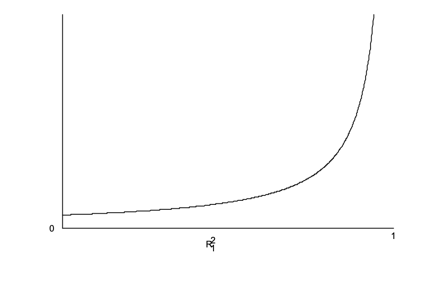
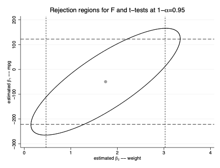

### Homoskedasticity (Assumption 5)
 $Var(u|x_1,x_2,...x_k) = 0$
 
 The variance of y, given x, does not depend on the values of the independent variables.
 
 We are computing the variance conditional on the values of the explanatory variables in the sample, we'll need to understand some things about variance of estimators.
 
 For one, the total variance in $x_j$, which we can get form the total sum of squares (SST).

 $SST_J = \sum^n_{i=1} (x_{ij} - \bar{x}_j)^2$
 
 Secondly, we need to understand the measure or correlation between $X_j$ and other explanatory variables.  That's just the $R^2$.
 We won't ever have an $R^2=1$ because of our perfect collinearity assumption we defined earlier.
 
 From these two things, we can calculate the sampling variance of our Slope Estimators is:
 $Var(\hat{\beta_j}) = \frac{\sigma^2}{SST_j(1-R^2_j)})$

Note that  $R^2_j$ is not the $R^2$ of the regression! It is the $R^2_j$ from regressing $x_j$ on all other independent variables (ie $x_j$ becomes the dependent variable and the other xs are the independent vars) 

So, think about this for a second - what happens to our estimators if we have low or high $R^2$, and what about when we don't have much variance in our $x_j$ (total sum of squares)?
 
So, what impacts our Slope Estimators?

1. As the error variance (in the population), $\sigma^2$, decreases, $Var(\hat{\beta_j})$ decreases. One way to reduce the error variance is to take more stuff out of the error. That is, add more explanatory variables.

We can increase $SST_j$ by increasing the sample size. $SST_j$ is roughly a
linear function of n. Recall: $SST_j / n$, so we can assume $SST_j \approx n\sigma^2$

2. As the total sample variation in $x_j$, $SST_j$, increases, $Var(\hat{\beta_j})$ decreases. As in the simple regression case, it is easier to estimate how $x_j$ affects y if we see more variation in $x_j$.

As $R^2 \rightarrow  1$, $Var(\hat{\beta_j}) \rightarrow \infty$. $R^2_j$ measures how linearly related $x_j$ is to the other explanatory variables. We get the smallest variance for $\hat{\beta_j}$ when $R^2_j=0$.

  - If $x_j$ is unrelated to all other independent variables, it is easier to estimate its ceteris paribus effect on y.
  
- $R^2_j=0$ is very rare. Even small values are not especially common.

- In fact, $R^2_j \approx 1$ is somewhat common, and this can cause problems for getting a sufficiently precise estimate of $\hat{\beta_j}$.



Loosely, $R^2_{j}$  “close” to one is called the “problem” of multicollinearity.

Unfortunately, we cannot define what we mean by “close” that is relevant for all situations. We have ruled out the case of perfect collinearity,$R^2_j=1$.

- Here is an important point: One often hears discussions of multicollinearity as if high correlation among two or more of the $x_j$ is a violation of an assumption we have made. But it does not violate any of the Gauss-Markov assumptions, including MLR.3.

Any claim that the OLS variance formula is “biased” in the presence of multicollinearity is wrong. 

- The formula shows that if $R^2_j$ is “close” to one, $\hat{\beta_j}$ might be very large. 

- If  $R^2_j$  is “close” to one, $x_j$ does not have much sample variation separate from the other explanatory variables. We are trying to estimate the effect of $x_j$ on y, holding all other variables fixed, but the data might not be allowing us to do that very precisely.

- A common measure of MC is the VIF (Variance inflation factor)
$VIF_j = \frac{1}{1-R^2_J}$

VIF tells us how many times larger the variance is than if we had the “ideal”case of no correlation of $x_j$ with our other variables:

$Var(\hat{\beta_j}) = \frac{\sigma^2}{SST_j} \cdot VIF$

- a large VIF can be offset by SST (and this grows with sample size)

 Remember: You;re interest is in the variance of the estimator, so if you have the equation
 $y = \beta_0 +\beta_1x_1 + \beta_2x_2 +\beta_3x_3$ and you're interested in the variance of $\hat{\beta_1}$ then the correlation between x2 and x3 has nothing to do with $Var(\hat{\beta_1})$. It is only correlation of x1 with (x2, x3) that matters.
 
 So, what's a person to do when you've got high $R^2$?
 
- Get more data! (Easier said than done.)

- Some suggest to drop one of the variables. THIS CAN BE DANGEROUS. IF that variable belongs in the model it can lead to bias!

- Change the scope of your question. If you're looking at one type of expenditure and it's impact on class performance in a school, you may want to discuss all related expenditures. Then you can do joint testing and say something about the group of expenditures, for example.

- If they are independent variables that are necessary as controls to prevent bias from your main variable of interest, but your main variable of interest is not highly correlated with either - do nothing. You don't care about those estimates anyways, they exist to ensure you have an unbiased estimate of your main variable.
 
### Estimating the Error Variance

We have an unbiased error variance when:
$\sigma^2 = (n-k-1)^-1 \sum^n_{i=1}\hat{u}^2_i = SSR/df$

This means that, if we divide by n rather than n−k−1, 

the bias is $-\sigma^2{k+1}{n}$

- The bias disappears as n increase

-  Note that SSR falls when a new explanatory variable is added, but df falls, too. 

So $\sigma^2$ can increase or decrease when a new variable is added in multiple regression.

The standard error of $\hat{\beta_j}$ is:

$se(\hat{\beta_j}) = \hat{\sigma}{\sqrt{SST_J(1-R^2_j)}}$

*Technically, the division of n-k-1 comes from the fact that the expected value of the SSSR $(E(SSR) = (n-k-1)\sigma^2)$ But, as we discussed in the simple case, the degrees of freedom adjustment comes from our the 2 conditions from our FOC to derive our estimator.

## Hypothesis Testing

Now, we've got all of the elements to test our hypothesis.

This means we hypothesize that a population parameter is a certain value, then use the data to determine whether the hypothesis is likely to be false.

To test hypotheses about the $\beta_j$ using exact (or “finite sample”) testing procedures, we need to know more than just the mean and variance of the OLS estimators.

We can compute:

- the expected value, and

- the variance

But testing relies on the entire **sampling distribution** $\hat{\beta_j}$. That's right the $\hat{\beta_j}$ has it's own distribution

$\hat{\beta_j} = \beta_j + \sum^n_{i=1}w_{ij}u_i$

where $w_{ij}$ are functions of our independent observations. 

Our sixth assumption lies on requirements of the distribution of our independent variables: Normality

#### Assumption 6: Normality
The population error u is independent of $(x_1,...,x_k)$ and is normally distribution with mean zero and variance $\sigma^2$:
$u ∼ Normal(0,\sigma^2)$
- This imposes independence between u and (x1, x2, . . . , xk) (not
just mean and variance independence), which is where the label of the $x_j$ as “independent variables” originated.

-  The important part of MLR.6 is that we have now made a very specific distributional assumption for u: the familiar bell-shaped curve.

- Normality is by far the most common assumption, but the usual arguments about why normality is a good assumption are not always operative.

Usually, the argument starts with the claim that u is the sum of many independent factors, say $u = a_1 + a_2 + ... + a_m$ for “large” m, and then we can apply the central limit theorem. But what if the factors have very different distributions, or are multiplicative rather than additive?

- Fortunately, this issue isn't super problematic for large samples, but we'll get to that later.

This full set of assumptions is what is called the classic linear assumptions (there are 6 of them)

Also fortunately:
An important fact about independent normal random variables - any linear combination is also normally distributed. Because the $u_i$ are independent and identically distributed (iid) as $u ∼ Normal(0,\sigma^2)$,

Thus, it follows that:

$\hat{\beta_j} ∼Normal[\hat{\beta_j},Var(\hat{\beta_j})]$

and if you remember your t and z-scores, it follows:

$\frac{\hat{\beta_j}- \beta_j}{sd(\hat{\beta_j})} ~ Normal(0,1)$, which is the standardized random variable.

To test the hypothesis about $\beta_j: sd(\hat{\beta_j})$ depends on $\sigma = sd(u)$ - which is unknown. But, we do have an estimate of  $\hat{\sigma^2}$. So, instead, we use the standard error - and that rant about the variance of an estimator and the standard error we just did? Well, that's because if you get a poor estimator of the standard error it will cause all of your inference to be messed up.  You'll end up making bad `decisions' about statistical significance with a poor estimated variance. 

If you recall in your basic stats class - when do we use a t distribution? When we don't know the true standard deviation. The difference between the t and normal distribution is very small after about 120 observations in any case.

When we test our estimators, the null hypothesis is always:
$H_0: \beta_j = 0$
This tests is $x_j$ has no partial effect on y.

If we reject the null, we have enough information to suggest there is an effect. If we fail to reject the null, we do not have enough information to suggest there is an effect.

To test the null, we use a t-statistic (sometimes called the t-ratio).

Recall from above, our standardized random variable. 

The t-test is then:

$t_\hat{\beta_j} = \frac{\hat{\beta_j}}{se(\hat{\beta_j})}$ 

The estimated coefficient divided by the standard error. When we use  $t_\hat{\beta_j}$, we are measuring how far $\hat{\beta_j}$ is from zero relative to its standard error.

Because $se(\hat{\beta_j}) > 0, t_{\hat{\beta_j}}$ always has the same sign as $\hat{\beta_j}$. To use $t_\hat{\beta_j}$ to test $H_0 :\beta_j = 0$, we need to have an alternative.

Some like to define $t_\hat{\beta_j}$ as the absolute value, so it is always positive. This makes it cumbersome to test against one-sided alternatives.

As you may recall, how we test is:

1. Choose a null hypothesis: $H_0 : \beta_j = 0$ (or $H_0 : \beta_j \leq 0$)

2. Choose an alternative hypothesis: $H_1 : \beta_j \neq 0$  (or $H_1 : \beta_j > 0$ )

3. Choose a significance level (or simply level, or size) for the test.
  That is, the probability of rejecting the null hypothesis when it is in fact true. (Type I Error). Suppose we use 5%, so the probability of committing a Type I error is .05.

4. Choose a critical value, c > 0, so that the rejection rule $t_\hat{\beta_j} > c$
leads to a 5% level test.

**Important**

Our hypothesis involve the unknown population values, $\hat{\beta_j}$. If in a our set of data we obtain say, $\hat{\beta_j}$ , we do not write the null hypothesis as $\hat{\beta_j}$ = 2.75 (which is obviously false).

Nor do we write

$H_0: 2.75=0$

$H_0 : \hat{\beta_j} = 0$ 
(which is also false except in the very rare case that our estimate is exactly zero).

We do not test hypotheses about the estimate! We know what it is once we collect the sample. We hypothesize about the **unknown population value**, $\beta_j$.
 
- When we reject$H_0: \beta_j = 0$ against $H_1: \beta_j \neq 0$, we often say that $\beta_j$ is statistically different from zero and usually mention a significance level. For example, if we can reject at the 1% level, we say that. If we can reject a the 10% level but not the 5%, we say that.

-  We can also say $\beta_j$ is “statistically significant” when we can reject $H_0:\beta_j =0$.

- If we do not reject H0 (against any alternative), it is better to say “we fail to reject H0” as opposed to “we accept H0,” which is somewhat common. 

    - The reason is that many null hypotheses cannot be rejected in any application. For example, if I have $\beta_j = .75$ and $se(\beta_j) = .25$, I do not say that I “accept $H_0 : \beta_j = 1$” I fail to reject because the t statistic is (.75 − 1)/.25 = −1. But the t statistic for $H_0 : \beta_j = .5$ is (.75 − .5)/.25 = 1, so I cannot reject $H_0 : \beta_j = .5$, either.

In cases where you want to do some other type of testing other than zero, a useful general expression for general t testing:

$t = \frac{(estimate − hypothesized value)}{standard error}$

You can choose whatever value you are interested in, but the language must be modified.

If, for example, $H_0 :\beta_j = 1$
$H_1 : \beta_j \neq1$
is rejected at the 5% level, we say “$\beta_j$ is statistically different from one at the 5% level.” Otherwise,$\beta_j$ is “not statistically different from one.” If the alternative is H1 : $\beta_j$ > 1, then “\beta_j is statistically greater than one at the 5% level.”


####  Computing p-values for t-tests

The p-value is a probability, so it is between zero and one.

Perhaps the best way to think about p-values: it is the probability of observing a statistic as extreme as we did if the null hypothesis is true.

So smaller p-values provide more are evidence against the null. For example, if p-value = .50, then there is a 50% chance of observing a t as large as we did (in absolute value). This is not enough evidence against H0.

If p-value = .001, then the chance of seeing a t statistic as extreme as we did is .1%. We can conclude that we got a very rare sample – which is not helpful – or that the null hypothesis is very likely false.

The p-value perfectly maps t-scores. 

When we choose a critical value, it is directly speaking about the liklihood of a type 1 (false positive) or type 2 error (false negative). 

Classic example that we are experiencing is the design of covid tests.

- Type 1 error is if your result says you have covid, but you don't
- Type 2 error is if your results says you don't have covid, but you do

What kind of error would you prefer to make in this situation?

The higher critical t value that we choose is direct relationship with a reduction of type 2 error at the cost of higher type 1 errors. 

A critical p-value of "six sigma" is common among engineers because we want to reduce the risk of a bridge collapsing at any moment.

A critical p-value of 2 sigmas is reasonable in social sciences because the consequences of being wrong are not as detrimental.

The FDA sets standards of this risk when introducing a new drug, test, etc. Not published medical journals. 


**VERY Important** 

t testing is purely about statistical significance. It does not directly speak to the issue of whether a variable has a practically, or economically, large effect.
Practical (Economic) Significance depends on the size (and sign) of $\beta_j$. Statistical Significance depends on $t_{\beta_j}$ .

- It is possible estimate practically large effects but have the estimates so imprecise that they are statistically insignificant. This is especially an issue with small data sets (but not only small data sets).

- Even more importantly, it is possible to get estimates that are statistically significant (and close to 0) – often with very small p-values – but are not practically large. This can happen with very large data sets.

#### Confidence Intervals

Loosely, the CI is supposed to give a “likely” range of values for the corresponding population parameter.

We will only consider CIs of the form:

$\hat{β_j} ±c·se(\hat{β_j})$

where c > 0 is chosen based on the confidence level.

We will use a 95% confidence level, in which case c comes from the 97.5 percentile in the $t_df$ distribution. In other words, c is the 5% critical value against a two-sided alternative.

A simple rule-of-thumb is useful for constructing a CI given the estimate and its standard error. 

For, say, df ≥ 60, an approximate 95% CI is:

$\hat{β_j} ± 2se(\hat{\beta_j})$ or $[\hat{β_j}−2se(\hat{\beta_j}), \hat{\beta_j} + 2se(\hat{\beta_j})]$

That is, subtract and add twice the standard error to the estimate. (In the case
of the standard normal, the 2 becomes 1.96.)

*Important*
Properly interpreting a CI is a bit tricky. One often sees statements such as “there is a 95% chance that $\beta$ points is in the interval [.0067,.0661].” This is incorrect. $\beta$ points is some fixed value, and it either is or is not in the interval.

- The correct way to interpret a CI is to remember that the endpoints, $\beta_j − c \cdot se(\beta_j )$ and $\beta_j + c \cdot se(\beta_j)$ ), change with each sample (or at least can change). That is, the endpoints are random outcomes that depend on the data we draw.

- What a 95% CI means is that for 95% of the random samples that we draw from the population, the interval we compute using the rule $\hat{\beta_j} ± c \cdot se(\hat{\beta_j})$  will include the value $\beta_j$. But for a particular sample we do not know whether $β_j$ is in the interval.

- This is similar to the idea that unbiasedness of $\beta_j$ does not means that $\beta_j = \beta_j$ . Most of the time $\beta_j$ is not $\beta_j$ . Unbiasedness means $E(\beta_j ) = \beta_j$.

##### CI and hypothesis testing
If we have constructed a 95% CI for, say, $\beta_j$, we can test any null value against a two-sided alternative, at the 5% level. So

$H_0 : \beta_j = a_j$

$H_1 :\beta_j \neq a_j$

  1. If $a_j$ is in the 95% CI, then we fail to reject H0 at the 5% level.
  2. If $a_j$ is not in the 95% CI then we reject H0 in favor of H1 at the 5% level.


#### Joint Hypothesis Testing

- The t-test allows us to test a single hypothesis, whether it involves one or more than one parameter.
- But we sometimes want to test more than one hypothesis, which then includes multiple parameters.
- Generally, it is not valid to look at individual t-statistics. We need a statistic used to test joint hypotheses.

Let's take an example using MLB data.

We'll estimate: $lsalary = β_0 + β_1years + β_2gamesyr + β_3bavg
+β_4hrunsyr + β_5rbisyr + u$

H0 : Once we control for experience (years) and amount played (gamesyr),
actual performance has no effect on salary.

$H0 :β_3 =0,β_4 =0,_β5 =0$

FYI: an example of exclusion restrictions: The three variables, bavg, hrunsyr, and rbisyr can be excluded from the equation.

```{r}
#install.pacakge(lme4)
#install.packages(wooldridge)

library("Matrix", "lme4", "wooldridge")
data(mlb1)
mlb <-lm(lsalary ~years + gamesyr+bavg + hrunsyr+rbisyr, data = mlb1)
summary(mlb)
```

To test H0, we need a **joint (multiple) hypotheses test**.

- A t statistic can be used for a single exclusion restriction; it does not take a stand on the values of the other parameters.

- In this class, we only consider the alternative 

$H_1 : H_0$ is not true

- So, H1 means at least one of $β_3, β_4, and β_5$ is different from zero.

Question: On the basis of the three insignificant t statistics, should we conclude that none of bavg, hrunsyr, and rbisyr affects baseball player salaries? No. This would be a mistake.

A hint at the problem is severe multicollinearity between hrunsyr and rbisyr: the correlation is about .89. In fact, one cannot hit a home run without getting at least one RBI. Generally, home run hitters also tend to produce lots of RBIs.


Because the individual coefficients, especially on hrunsyr and rbisyr, are imprecisely estimated, we need a joint test.



The original model, containing all variables, is the unrestricted model: 

$lsalary = β_0 + β_1years + β_2gamesyr + _β3bavg +β_4hrunsyr + β_5rbisyr + u$

When we impose $H_0 :β_3 =0, β_4 =0,β_5 =0$ ,we get the restricted model:
$lsalary = β_0 + β_1years + β_2gamesyr + u$


We want to see how the fit deteroriates as we remove the three variables. We use, initially, the sum of squared residuals from the two regressions.

-  Let $SSR_ur$ denote the SSR from the unrestricted model. Note that, in this example, $df_ur$ = 330 − 6 = 324. Let $SSR_r$ be the SSR from the restricted model. So $df_ur$ =330−3=327.

- It is an algebraic fact that the SSR must increase (or, at least, not fall) when explanatory variables are dropped. So $SSR_r ≥ SSR_ur$

The test statistic we use essentially asks: does the SSR increase proportionately by enough to conclude the restrictions under H0 are false?

- In the general model
$y=β_0 +β_1x_1 +...+β_kx_k +u$
we want to test that the last q variables can be excluded: 
$H_0 : β_k−q+1 = 0,...,β_k = 0$

We get SSRur from estimating the full model.

The restricted model we estimate to get $SSR_r$ drops the last q variables (q exclusion restrictions):
$y=β_0 +β_1x_1 +...+β_{k−q}x_{k−q} +u$

The F stat uses a degrees of freedom adjustment:

$F = \frac{SSR_{r}-SSR_{ur}/(df_r -df_{ur})}{SSR_{ur}/df_{ur}} = \frac{(SSR_r -SSR_{ur})/q}{SSR_{ur}/(n-k-1)}$
where q is the number of exclusion restrictions imposed under the null (q = 3 in the MLB case) and k is the number of explanatory variables in the unrestricted model (k = 6 in the MLB case).

q = numerator $df = df_r − df_{ur}$ 

n−k−1=denominator $df =df_ur$

The denominator of the F statistic, $SSR_{ur}/df_{ur}$, is the unbiased estimator of $\sigma^2$ from the unrestricted model.


- Note that F ≥ 0, and F > 0 virtually always holds. 

- sometimes this formula is useful:
$F = \frac{(SSR_r − SSR_{ur})}{SSR_{ur}} · \frac{(n − k − 1)}{q}$
But, we often just use R/Stata.

Using classical testing, the rejection rule is of the form 

$F>c$

where c is an appropriately chosen critical value.

- We obtain c using the (hard to show) fact that, under H_0 (the q exclusion
restrictions)
$F ∼ F_{q,n−k−1}$
That is, an F distribution with (q, n − k − 1) degrees of freedom.
There are tables that show critical values in the book.

For example, if q=3 and n−k−1= dfur =60. Then the 5% cv is 2.76.

In the MLB example with n = 330, k = 5, and q = 3, we have numerator df = 3, denominator df = 324. Because the denominator df is above 120, we use the “$\inf$” entry. The 10% cv is 2.08, the 5% cv is 2.60, and the 1% cv is 3.78.

- As with t testing, it is better to compute a p-value. These are reported by Stata after every test command.

- The F statistic for excluding bavg, hrunsyr, and rbisyr from the model is 8.34. 
This is well above the 1% critical value, so we reject at the 1% level. In fact, to four decimal places, p-value is zero.

We say that bavg, hrunsyr, and rbisyr are jointly statistically significant (or just jointly significant) – in this case, at any small significance level
 we want.
 
 The F statistic does not allow us to tell which of the population coefficients are different from zero. And the t statistics do not help much in this example.

 We have, in effect, set up the problems ourselves by including the two highly correlated variables, hrunsyr, and rbisyr.

Nothing much is lost by dropping one of the two variables. Notice that doing so does not change the fact that bavg is statistically insignificant and its coefficient remains small.

Fun facts:

- The F distribution is equivalent to the $t^2$

- F tests for exclusion restrictions can be computed entirely from the R-squareds for the restricted and unrestricted models.

- The key is that, because the same dependent variable is used in the two regressions:

$SSR_R = (1-R^2)SST$

$SSR_{ur} =(1-R^2_{ur})SST$

We can rewrite this:
F = \frac{R^2_{ur}-R^2_{r}/q}{(1-R^2_{ur})/(n-k-1)}
We know that $R^2_{ur} \geq R^2_r$ which insures that the $F \geq0$


Let's look at MLB data and see if performance indicators are statistically significant (bavg, hrunsyr, rbisyr)

```{r}
mlb <-lm(lsalary ~years + gamesyr+bavg + hrunsyr+rbisyr, data = mlb1)
summary(mlb)
```
Individually, they are not statistically significant. However, this is because the correlation between these three variables is very high. Remember - multicollinearity ONLY affects the standard errors.

We can see that home runs ber year and rbis per year are highly correlated with one another (.89) - this is what is causing the multicollinearity
```{r}
cor(mlb1[,c('bavg', 'hrunsyr', 'rbisyr')], method = "pearson")
```

We could decide to drop either rbisyer or hrunsyr

```{r}
summary(lm(lsalary ~years + gamesyr+bavg +rbisyr, data = mlb1))
```
However, this can cause omitted variable bias. You can see that some of the other coefficients change as a response to dropping a variable. In this case, the OVB is not large, but we have another option instead of dropping a variable that can cause our estimates to be biased.

We can do an F-test! F-tests pull from a different distribution  (the f distribution) and we can compare our unrestricted model to our restricted model. We want to test if all of our performance variables are jointly statistically significant to zero. If any one is not equal to zero - then we fail to reject the null.

```{r}
#install.packages(car)
library(car)

linearHypothesis(mlb, c("bavg=0", "hrunsyr=0", "rbisyr = 0"))
```

We can see that they are statistically significant with an F test. 

The reason for this is that the standard errors are imprecise - the regression can't assign the appropriate amount of variance for each variable. Because of this, our inference tests are problematic. We will have more type 1 or type 2 errors.

With multi-collinearity, we can't fix the estimated standard errors - there is no cure and a VIF test will only tell you that it is present and it's a problem. What is much more preferred is to think about which variables are causing the multi-collinearity and testing jointly to see if they all have an effect. If you believe one variable is a proxy and won't cause OVB if you drop it, that's also an option. 

You should use an F test for a wide variety of applications.

- Interaction terms
- Quadratic terms

Testing for joint hypothesis with non-liner terms

```{r}
mlb_sq <-lm(lsalary ~years + gamesyr+bavg + hrunsyr+rbisyr +hits + c(hits*hits)+ c(hits^3), data = mlb1)
summary(mlb_sq)

```

```{r}
linearHypothesis(mlb_sq, c("hits=0", "c(hits * hits)=0", "c(hits^3) = 0"))
```

We can see that hits has a statistically significant effect on salary.
