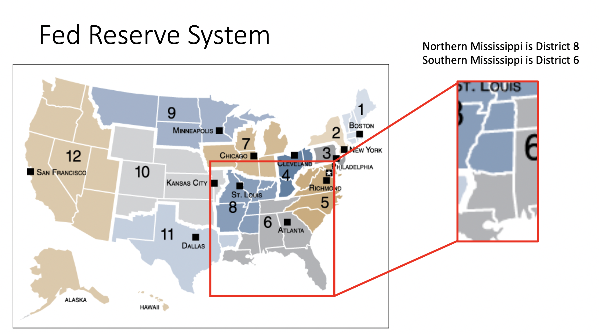
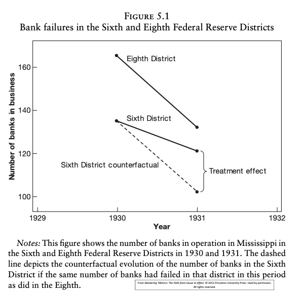
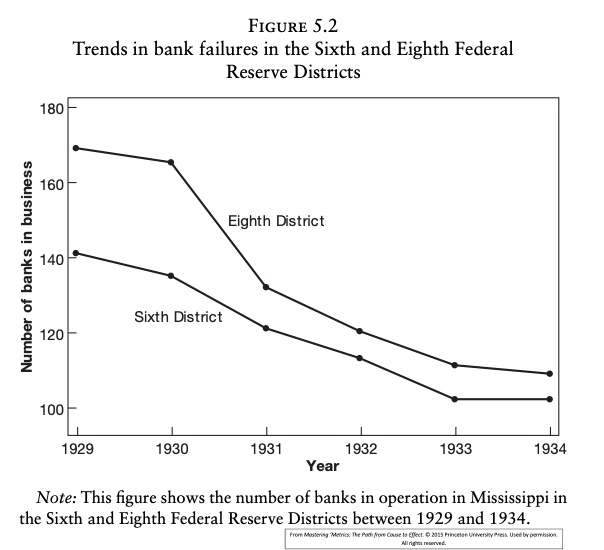
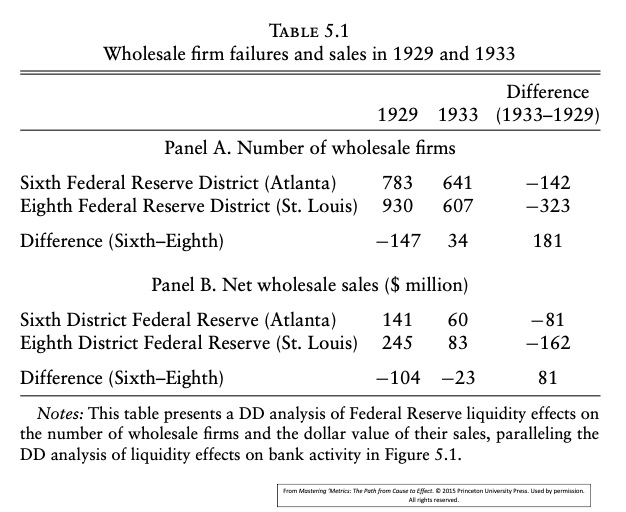
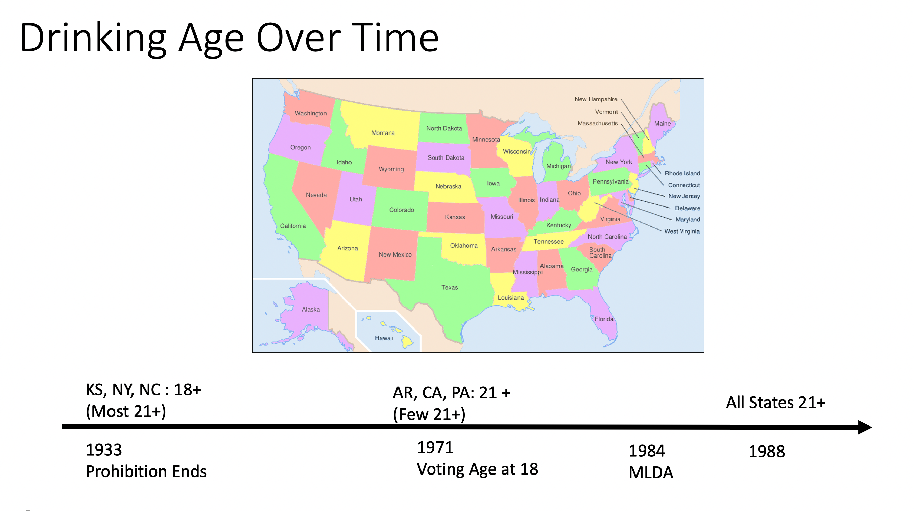
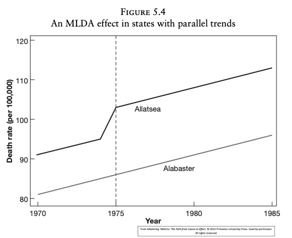
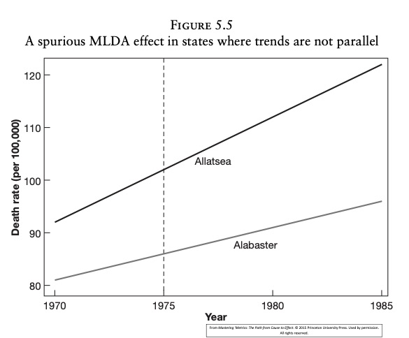
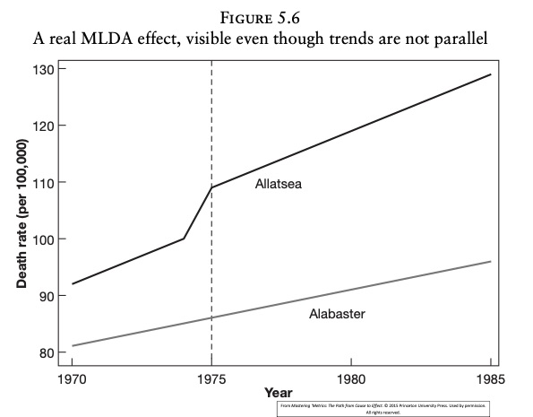
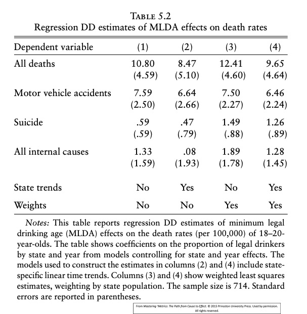

### What is a Panel Data Set?

With a panel data set, the same units are sampled in two or more time periods. For each unit (individual, school, city, and so on) $i$ we have multiple years of data. 

At a minimum, statistical methods must recognize that the outcomes for a unit will be correlated over time. 

Main benefit of panel data: with multiple years of data we can control for unobserved characteristics (ie omitted variables!) that do not change (or change slowly) over time. This is very useful for policy analysis. 


A *balanced panel* is one where we observe the same time periods for each unit. Easier to achieve for larger units (such as schools and cities). At a disaggregated level -- such as individuals and families -- following the same units over time can be challenging. (Attrition can be a serious problem.) Attrition is when you lose individuals over time for non-random reasons.

Notation here assumes a balanced panel. Econometric methods extend to unbalanced panels. But one should ask: Why are some periods missing for some units? (For example, is reporting achievement scores by schools optional or not enforced?) 

The notation we use is the following. For each cross-sectional unit $i$ at time $t$ the response variable is $y_{i t}$. An explanatory variable is $x_{i t}$. With more than one explanatory variable we have $x_{i t 1}$, $x_{i t 2}\text{,}$ ..., $x_{i t k}$. 
  
We will start with the case of two periods, so $t =1$, $2$ and (hopefully) many cross section observations, $i =1 ,2 ,\ldots  ,n$. 

Along with the observed data $(x_{i t 1} ,x_{i t 2} ,\ldots  ,x_{i t k} ,y_{i t})$ we draw unobserved factors. Put these into two categories. 
1. A component that does not change over time, $a_{i}$. Called an *unobserved effect* or *unobserved heterogeneity*. It varies by individual but not by time. 

At the individual level, can think of $a_{i}$ as "ability" -- something innate and not subject to change. Generally, $a_{i}$ contains unobserved ``attributes.''

There are also unobservables that change across time, $u_{i t}$. These are sometimes called ``shocks''; we will call them *idiosyncratic errors*. They are specific to unit $i$ but vary over time, and they affect the outcome, $y_{i t}$.

Note: The best way to store panel data is to stack the time periods for each $i$ on top of each other. Last semester (R \& Python Course), we did some examples of turning data to the "long" format - and this is exactly what panel data must be in. In particular, the time periods for each unit should be adjacent.

### Analysis with Two-Periods of Panel Data

Assume a balanced panel for units $i$. The units can be aggregated (schools or cities) or disagregated (students or teachers). 

We have time periods $t =1$ and $t =2$ for each unit $i$. These periods do not have to be, say, adjacent years. They could be periods far apart in time. Or, they could be close together.

First consider the case with a single explanatory variable, $x_{i t}$.

The equation is 

\begin{equation*}y_{i t} =\beta _{0} +\delta _{0} d 2_{t} +\beta _{1} x_{i t} +a_{i} +u_{i t}\text{,}t =1 ,2.
\end{equation*}

We observe $(x_{i t} ,y_{i t})$ for each of the two time periods. The variable $d 2_{t}$ is a constructed time dummy for the second time period: $d 2_{t} =1$ if $t =2$ and $d 2_{t} =0$ if $t =1$. 

The variable $a_{i}$ is the unobserved unit effect (or heterogeneity). $u_{i t}$ is the unobserved idiosyncratic error. 

We are interested in estimating $\beta _{1}$, the partial effect of $x$ on $y$. Note that the model assumes this effect is constant over time.

\begin{equation*}y_{i t} =\beta _{0} +\delta _{0} d 2_{t} +\beta _{1} x_{i t} +a_{i} +u_{i t}\text{,}t =1 ,2.
\end{equation*}

The intercept in the first (base) period is $\beta _{0}$, and that for the second period is $\beta _{0} +\delta _{0}$. It can be very important to allow changing intercepts to get a good estimate of a causal effect. (For example, a policy, as measured by $x_{i t}$, might be implemented just as the aggregate economy is turning up or down -- as captured by $\delta _{0} d 2_{t}$.) 

For policy analysis, $x_{i t}$ is often a dummy variable. Was zip code $i$ in year $t$ designated an empowerment zone?

Occasionally $x_{i t}$ does not change over time for *any* unit. (Generally, we would expect $x_{i t}$ to be constant across time for *some* units.) For example, $x_{i t}$ could be gender, or years of schooling for people who have completed their schooling. We will be limited in what we can learn in that
case.

How should we estimate the slope $\beta _{1}$ (and $\beta _{0}$, $\delta _{0}$ along with it)? One possibility is to just use a pooled OLS analysis. Effectively, define the *composite error* as

\begin{equation*}v_{i t} =a_{i} +u_{i t}\text{,}t =1 ,2
\end{equation*}

and write 

\begin{equation*}y_{i t} =\beta _{0} +\delta _{0} d 2_{t} +\beta _{1} x_{i t} +v_{i t}\text{,}t =1 ,2.
\end{equation*}

Applying OLS we obtain the **pooled OLS estimator**. We simply regress $y$ on $d 2$ and $x$. 

A few important issues arise with the POLS (Pooled OLS - pooling all information together across years) estimator. 

1. Even if we assume random sampling across $i$ -- which we do -- we cannot reasonably assume the observations for $i$ across $t =1 ,2$ are independent. In fact, 

\begin{gather*}v_{i 1} =a_{i} +u_{i 1} \\
v_{i 2} =a_{i} +u_{i 2}\end{gather*}must be correlated because of the presence of $a_{i}$.

 Correlation of $v_{i 1}$ and $v_{i 2}$ causes the usual OLS standard errors to be invalid. And using heteroskedasticity-robust standard errors does not solve the problem.
This is a problem of **serial correlation** or **cluster correlation**. (Each unit $i$ is a cluster of two time periods.) 

Obtaining ``cluster-robust'' standard errors and test statistics is very easy these days.

2. A more serious issue is that consistency of OLS (as $n$ gets large, as usual) requires that $x_{i t}$ and $v_{i t}$ are uncorrelated. Because $v_{i t} =a_{i} +u_{i t}$, we need 

\begin{gather*}C o v (x_{i t} ,a_{i}) =0 \\
C o v (x_{i t} ,u_{i t}) =0\end{gather*}

Suppose we are willing to assume the second of these. The first might be violated if $x_{i t}$ is determined based on systematic differences in units. For example, if $y_{i t}$ is an employment rate, EZ designation might depend partly on historical economic conditions of an area, captured by $a_{i}$, but not on contemporaneous shocks to employment (in $u_{i t}$).

When $C o v (x_{i t} ,a_{i}) \neq 0$ it is often said that (pooled) OLS suffers from *heterogeneity bias*. 

If the explanatory variable changes over time -- at least for some units in the population -- heterogeneity bias can be solved by
differencing away $a_{i}$.

## Differencing the Two Years

To remove the source of bias in POLS, $a_{i}$, write the time periods in reverse order for any unit $i$: 

\begin{gather*}y_{i 2} =(\beta _{0} +\delta _{0}) +\beta _{1} x_{i 2} +a_{i} +u_{i 2} \\
y_{i 1} =\beta _{0} +\beta _{1} x_{i 1} +a_{i} +u_{i 1}\end{gather*}

Subtract time period one from time period two to get 

\begin{equation*}y_{i 2} -y_{i 1} =\delta _{0} +\beta _{1} (x_{i 2} -x_{i 1}) +(u_{i 2} -u_{i 1})
\end{equation*}\par\pagebreak\relax 

If we define $\Delta y_{i} =y_{i 2} -y_{i 1}$, where $\Delta  =c h a n g e$ -- and similarly for $\Delta y_{i}$ and $\Delta y_{i}$ -- we can write the cross-sectional equation as 

\begin{equation*} \Delta y_{i} =\delta _{0} +\beta _{1}  \Delta x_{i} + \Delta u_{i}
\end{equation*}or 

\begin{equation*}c y_{i} =\delta _{0} +\beta _{1} c x_{i} +c u_{i}
\end{equation*}

Important: $\beta _{1}$ is the original coefficient we are interested in. We have obtained an estimating equation by taking changes or *differencing*

Notice that the intercept in the differenced equation, 

\begin{equation} \Delta y_{i} =\delta _{0} +\beta _{1}  \Delta x_{i} + \Delta u_{i}
\end{equation}is the *change* in the intercept over the two time periods. It is sometimes interesting to study this change. 

Differencing away the unobserved effect, $a_{i}$, is simple but can be very powerful for isolating causal effects. 

If $\Delta x_{i} =0$ for all $i$, or even if $\Delta x_{i}$ is the same nonzero constant, this strategy does not work. We need some variation in $\Delta x_{i}$ across $i$.

The OLS estimator applied to 

\begin{equation} \Delta y_{i} =\delta _{0} +\beta _{1}  \Delta x_{i} + \Delta u_{i}
\end{equation}

is often called the *first-difference estimator*. (With more than two time periods, other orders of differencing are possible; hence the qualifier ``first''.) We will refer to the *FD estimator*. 

##### Example: Effects of City Unemployment Rates on Crime Rates 

$n =46$ cities over the two years 1982 and 1987. No city identifier, so cannot ``cluster'' the standard errors.

$crmrte$ is the number of crimes per 1,000 people. $unem$ is the unemployment rate, in **percent**.

$d87$ is a binary variable where d87 =1 if 1987 and d87 = 0 if 1982

The following is a pooled OLS model (where we just have a binary variable to indicate a time period)
```{r}
#If you want to remove everything from memory
rm(list = ls())

library(wooldridge)
data(crime2)

summary(lm(crmrte ~ d87 + unem, crime2))

```

First-Difference regression
```{r}
library(tidyverse)
library(AER)

crime2 =  crime2 %>% group_by(d87) %>% mutate(crmrte_diff = crmrte - lag(crmrte), cunem_diff = cunem - lag(cunem))

first_diff1 <-lm(crmrte_diff ~ cunem_diff, data = crime2)
summary(first_diff1)
# Here, we are calculating the difference in crimerate by "hand"
crmrte_diff = crime2$crmrte[crime2$d87==0] - crime2$crmrte[crime2$d87 == 1]
# Here, we are calculating the difference in unemployment rate by "hand"
cunem_diff = crime2$unem[crime2$d87==0] - crime2$unem[crime2$d87 == 1]


#let's run the simple regression of the differences between the two time periods on unem on crimerate
first_diff <-lm(crmrte_diff ~ cunem_diff)
summary(first_diff)


```
* The intercept means that, if the unemployment rate did not change, the crime rate would be predicted to increase by about 15 crimes per 1,000 people.
* The coefficient on cunem is statistically significant and of the sign we might expect: a one percentage point increase in the unemployment rate increases the crime rate by about 2.2 crimes per 1,000 people.
* Making standard errors robust to heteroskedasticity does not change much.

The same differencing strategy works if $x_{i t}$ is a binary program indicator. The differenced equation is the same: 

\begin{equation*} \Delta y_{i} =\delta _{0} +\beta _{1}  \Delta x_{i} + \Delta u_{i}
\end{equation*}

In particular, differencing a dummy variable is fine. We interpret the model as if we have estimated it in levels and controlled for $a_{i}$. 

In many program evaluation settings no units are treated at $t =1$ and some are treated at $t =2$, in which case $\Delta x_{i} =x_{i 2} -x_{i 1} =x_{i 2}$, so putting in $\Delta x_{i}$ is the same as putting in the treatment dummy for the second time period.


#### Example Effects of Job Training Grant on Scrap Rates 

Let's use a differencing strategy. The years we use are 1987 and 1988. 

\begin{gather*}l s c r a p_{i t} =\beta _{0} +\delta _{0} d 88_{t} +\beta _{1} g r a n t_{i t} +a_{i} +u_{i t} \\
 \Delta l s c r a p_{i} =\delta _{0} +\beta _{1}  \Delta g r a n t_{i} + \Delta u_{i} \\
 =\delta _{0} +\beta _{1} g r a n t_{i ,1988} + \Delta u_{i}\end{gather*}


Let's see POLS

```{r}
data("jtrain")
#I'm subselecting so that we only look at data that is before 1989
jtrain_88 <- jtrain[jtrain$year < 1989 ,]

pols_lscrap <- lm(lscrap ~grant +  d88, jtrain_88)
summary(pols_lscrap)
```
POLS gives essentially a zero effect. Sign is actually positive.


Let's correct the standard errors for clustering and heteroskedasticity. Sad news, this is harder in R than stata. 
```{r}
library(plm)

lm(lscrap ~d88+grant, jtrain_88)

#There is a slight issue in R that it doesn't do the correct degrees of freedom adjustment for the number of groups. So, we can do this ourselves.
# compute df-adjustment
G <- length(unique(jtrain_88$fcode))
N <- length(jtrain_88$fcode)
dfa <- (G/(G - 1)) * (N - 1)/pols_lscrap$df.residual
 
# display with cluster VCE and df-adjustment
firm_c_vcov <- dfa * vcovHC(pols_lscrap, type = "HC0", cluster = "group", adjust = T)

coeftest(pols_lscrap, vcov = firm_c_vcov)
```
 Correcting the standard errors for clustering and heteroskedasticity changes nothing.


Now let's use first differences:

```{r}

lscrap_diff = jtrain_88$lscrap[jtrain_88$year==1988] - jtrain_88$lscrap[jtrain_88$year == 1987]

grant_diff = jtrain_88$grant[jtrain_88$year==1988] - jtrain_88$grant[jtrain_88$year == 1987]

first_diff_grant <-lm(lscrap_diff ~ grant_diff)
summary(first_diff_grant)

#robust standard errors (not clustered)
coeftest(first_diff_grant, vcov = vcovHC, type = "HC1")

```
Not a lot has changed.

In applications where $x_{i t}$ is a dummy variable with no assignment in the first period, the FD estimator has a simple interpretation. It is the same as applying OLS.

\begin{equation*} \Delta y_{i} =\delta _{0} +\beta _{1} x_{i 2} + \Delta u_{i}
\end{equation*}
where $x_{i 2}$ is the second-period program participation (zero or one). 

Regression on a single dummy variable is easy to characterize: the estimate of $\beta _{1}$ is just the difference in means between the ``treated'' group and the control
group: 

\begin{equation*}\hat{\beta }_{F D} =\overline{ \Delta y}_{t r e a t} -\overline{ \Delta y}_{c o n t r o l}\text{.}
\end{equation*}

This is also known as Difference-in-Difference model and it is the same thing as a simple first difference model where there are only two time periods. And that's what the above equation is - the differences are within the same unit. 

The FD estimator is useful when treatment assignment depends on $a_{i}$. If we think assignment in period two (still taking $x_{i 1} =0$ for all $i$) is determined largely by $y_{i 1}$ (first-period response), it is common to add $y_{i 1}$ as a regressor: 

\begin{equation*} \Delta y_{i} =\delta _{0} +\beta _{1} x_{i 2} +\rho  y_{i 1} +e_{i 1} \end{equation*}and use OLS. (This is the same as regressing $y_{i 2}$ on $x_{i 2}$ and $y_{i 1}$.)

Adding $y_{i 1}$ seems more general, but it can actually cause inconsistency if $x_{i 2}$ is determined by $a_{i}$, not $y_{i 1}$. The argument is somewhat subtle. 


#### More Details: The Strict Exogeneity Assumption

Recall that the estimating equation in changes or differences is 

\begin{equation*}y_{i 2} -y_{i 1} =\delta _{0} +\beta _{1} (x_{i 2} -x_{i 1}) +(u_{i 2} -u_{i 1})
\end{equation*}

We emphasized that this equation is free of $a_{i}$. But we still need the error in this equation to be uncorrelated with the explanatory variable for OLS\ to
be consistent: 

\begin{equation*}C o v (x_{i 2} -x_{i 1} ,u_{i 2} -u_{i 1}) =C o v ( \Delta x_{i} , \Delta u_{i}) =0.
\end{equation*}

When does this condition hold?

Algebra gives 

\begin{gather*}C o v (x_{i 2} -x_{i 1} ,u_{i 2} -u_{i 1}) =C o v (x_{i 2} ,u_{i 2}) -C o v (x_{i 1} ,u_{i 2}) \\
 -C o v (x_{i 2} ,u_{i 1}) +C o v (x_{i 1} ,u_{i 2})\end{gather*}

Except by fluke, we need the explanatory variable in *both* time periods to be uncorrelated with the error in *both* time periods: 

\begin{equation*}C o v (x_{i s} ,u_{i t}) =0\text{,}s ,t =1 ,2.
\end{equation*}

Note that it is not enough to just assume 

\begin{equation}C o v (x_{i 1} ,u_{i 1}) =C o v (x_{i 2} ,u_{i 2}) =0 \end{equation} or 

\begin{equation}C o v (x_{i t} ,u_{i t}) =0\text{,}t =1 ,2\text{,}
\end{equation}which is known as *contemporaneous exogeneity*.

The `stronger assumption'

\begin{equation}C o v (x_{i s} ,u_{i t}) =0\text{,}s ,t =1 ,2.
\end{equation} 
is known as *strict exogeneity*. It requires that there are no lagged effects of $x$, and it rules out feedback from $u_{i 1}$ to $x_{i 2}$.

Remember, if we difference we do not have to worry about $C o v (x_{i t} ,a_{i}) \neq 0$. But if $x_{i t}$ is changing over time -- as it must to apply the differencing solution -- we should ask why. Might $x_{i t}$ be chosen in part based on past shocks? 

EXAMPLE:Test Sores and Class Size 

\begin{equation*}s c o r e_{i t} =\beta _{0} +\delta _{0} d 2_{t} +\beta _{1} s i z e_{i t} +a_{i} +u_{i t}
\end{equation*}

 A bad shock to the student score at $t -1$ -- negative $u_{i ,t -1}$ -- might lead a principle to put the student in a smaller class the next year. Then $u_{i ,t -1}$ and $s i z e_{i t}$ would be positively correlated, violating strict exogeneity. 

Might class size have a lasting effect? If so, last years size, $s i z e_{i ,t -1}$ is incorrectly omitted from the equation -- also a violation of strict exogeneity. (With two years of data, not much we can do about that.)

Hard to solve violations of strict exogeneity; at a minimum, need more than two time periods. 

For policy analysis, hope that designation does not react to shocks. Designation largely depends on historical factors in $a_{i}$, and those get differenced away.

#### Multiple Explanatory Variables

Having more than one explanatory variable causes no problems. A general two-period model is 

\begin{equation}y_{i t} =\beta _{0} +\delta _{0} d 2_{t} +\beta _{1} x_{i t 1} +\beta _{2} x_{i t 2} +\ldots  +\beta _{k} x_{i t k} +a_{i} +u_{i t}\text{,}t =1 ,2\text{,}
\end{equation} Now the first-difference equation looks like 

\begin{equation} \Delta y_{i} =\delta _{0} +\beta _{1}  \Delta x_{i 1} +\beta _{2}  \Delta x_{i 2} +\ldots  +\beta _{k}  \Delta x_{i k} + \Delta u_{i}\text{,}
\end{equation}and we just estimate this by OLS. We might use heteroskedasticity-robust inference.

We want to interpret the $\beta _{j}$ as in the original equation: What is the effect of changing $x_{j}$ on $y$, holding fixed the other explanatory variables *and* the unobserved heterogeneity. 

All explanatory variables get differenced, whether they are dummy variables, squares, interactions, and so on. The FD equation is an estimating equation.

##### EXAMPLE: In-Season GPA Effects on Student-Athletes

Two terms of data, fall and spring. Some sports are entirely in the fall, others entirely in the spring, others spill over into both. 

The key variable, $s e a s o n$, is binary. But it can be switched on in either the fall or spring or both. 

Without differencing, it makes sense to control for time-constant variables, such as SAT score and high school percentile.

The equation we start with is 

\begin{gather*}t r m g p a_{i t} =\beta _{0} +\delta _{0} s p r i n g_{t} +\beta _{1} s e a s o n_{i t} +\beta _{2} c r s g p a_{i t} +\beta _{2} s a t_{i} \\
 +\beta _{4} h s p e r c_{i} +a_{i} +u_{i t}\end{gather*}for $t =f a l l$, $s p r i n g$. 

$s a t_{i}$ and $h s p e r c_{i}$ are recorded in high school. Like $a_{i}$, they get differenced away: 

\begin{equation} \Delta t r m g p a_{i} =\delta _{0} +\beta _{1}  \Delta s e a s o n_{i} +\beta _{2}  \Delta c r s g p a_{i} + \Delta u_{i} \end{equation}

Note that the variable measuring difficulty of the course load, $c r s g p a_{i t}$, varies across semester.

```{r}
data("gpa3")

lm(trmgpa~ spring+season+crsgpa+sat+hsperc, gpa3)

# we will use the package plm for panel data
plm(trmgpa~ spring+season+crsgpa+sat+hsperc, data = gpa3, index = c("id", "term"), model = "pooling")

#notice that when we use the pooled ols model, the results are the same as using lm()

```
The in-season effect from pooled OLS is actually positive and almost statistically significant. 

Might this just be picking up that certain sports (such as football) are played in one season (fall), and football players are different academically from other athletes?

Let's try the differencing model:
```{r}

trmgpa_diff = gpa3$trmgpa[gpa3$term==2] - gpa3$trmgpa[gpa3$term == 1]

season_diff = gpa3$season[gpa3$term==2] - gpa3$season[gpa3$term == 1]

crsgpa_diff = gpa3$crsgpa[gpa3$term==2] - gpa3$crsgpa[gpa3$term == 1]

studentatheletes <- lm(trmgpa_diff~season_diff+crsgpa_diff)

coeftest(studentatheletes, vcov = vcovHC, type = "HC1")


#an easier way to do this is to use the first difference estimator in plm!

plm(trmgpa~ season+ crsgpa, data = gpa3, index = c("id", "term"), model= "fd")

```
Differencing away the student "ability" gives a negative effect, and close to statistical significance.

In cases where a policy variable is of interest, it is important **not** to include regressors that are themselves influenced by the policy intervention! This can lead to ``overcontrolling.''

For example, in studying the effects of class size (say, small or large) on math performance, one would not include a science test score among the explanatory variables (unless it is from a previous year).


### Diff-in-Diff Models

Ok, so first differencing with an interaction is just diff-diff. But, now we are going to apply all that "treatment" language to frame our understanding of difference - in - difference models.

We went into the details of ATE vs. ATT last class. A nice explainer can be found by [Newey, W. 2007 explainer](https://ocw.mit.edu/courses/economics/14-386-new-econometric-methods-spring-2007/readings/treatment_effect.pdf)


Recall that we care about the assignment mechanism. The treatment effects literature is more about adding observed controls to make *assignment exogenous* and prefers to add $y_{i1}$. The unobserved effects approach is used more by economists but the treatment effects approach is gaining. 

It is not always possible (nor necessary) to ``equalize'' the participants and non-participants (aka PSM). Using a **difference-in-differences** approach, we can account for differences between participants and non-participants.

**Advantages**

- Control for **unobserved heterogeneity** (just like in first differencing!)
Selection bias is often caused by unobserved characteristics - whereas in PSM, we can only control for *observed* characteristics

RECALL that **only time-invariant unobserved heterogeneity** can be accounted for. Anything that is time-varying and unobserved will cause endogeneity.

- Relaxes the assumption of conditional exogeneity or, differently said, selection on observed characteristics

**Disadvantages**

- The assumption of a time-invariant selection can often be implausible
    - Behavior and choices of treated units might change over time
    - Units respond dynamically to the policy intervention
    - Panel data is less often available as compared to a cross-section (without panel, PSM or IV is your best bet)


Let's go to the A&P Mastering Metrics examples.

##### Example 1

The RQ: What’s the impact of the monetary policy of providing liquidity/credit to banks after the great depression?

Some discussion among economists on whether it is better to provide liquidity to banks so that they prevent bank closures
 OR
to restrict or keep credit the same to avert a moral hazard (with the aim that the most fit banks survive)

Re-living that debate in 2020/2021  (moved onto inflation debate in 2022)

- Why did they choose Mississipi?



|    | District 8 St. Louis (control) | District 6 Atlanta (treatment)   |  Difference |
|-----------------------------|--------------------|---------------------|-------------|
| Policy|Restrict lending     | Increase lending   |                     |             |
| July 1, 1931 (after crisis) | 132                | 121                 | 11          |
| July 1, 1930 (before crisis)| 165                | 135                 | 20          |
| Difference                  | -33                | 14                  | -19          |

Hence - Difference-in-Difference

Compare N banks open after Policy in both districts: 
$$\delta = (Y_{6, 1931}-Y_{6, 1930})-(Y_{8, 1931}-Y_{8, 1930})$$ (ie columns)
                                                     $$\delta  = -33 - 14$$
Compare Change in N banks between the 2 districts: 
$$\delta = (Y_{6, 1931}-Y_{8, 1930})-(Y_{6, 1931}-Y_{8, 1930}) $$ (ie rows)
                                                    $$\delta  = 11 - 20$$

* Comparing changes instead of levels adjusts for the fact that district 8 had more banks open in the 6th district


Counterfactual: What would have happened without the policy?



- We use information about the 8th district (control group) to inform what would have happened in the 6th district.

- We assume that the trend in the 8th district is what we should have seen in the 6th district.

We can compare these as long as we meet the **common trends assumption**.



- This assumption is why we must check for **pre-treatment trends** prior to when the policy was applied.
- The trends can verify if we can make the common trends assumption in our model.
      - You want to ensure that the difference between the two points is relatively similar in your pre-treatment trend.
      - It’s fine if they both increase or decrease, but the pre-treatment years have to move together.
      - Ideally, you would want to collect around 5 years of data prior to the time your treatment went into effect


- We take information about the pre-treatment trends and create a counterfactual of what would have happened should the same trends would have continued.

 - Essentially, you keep the distance between the two points constant over the future years.

- While the districts have differences in the total number of banks that they manage, the trend of those differences are assumed to be the same in the counterfactual


The regression:
$$Y_{dt} =\beta_0 + \beta_1 Treat_{d} + \beta_2Post_t +\beta_{DD}(Treat_d*Post_t)+u_{it}$$
Treat is a dummy variable on whether the district is the treatment or control

Post is a dummy  for the periods when the treatment occurred

The interaction of these dummy variables is the causal effect estimate
	- What does this binary interaction term mean in the monetary policy example?
	- What sign would you expect the interaction to have in this example?

The interaction essentially estimate the difference between the counterfactual and what actually happened. This is the policy effect of providing credit liquidity to banks.

Ok, so how is this first differencing?  Because we are looking at two time periods and seeing if the treatment (some policy change) has impacted 

Recall:
$$\hat{\beta }_{F D} =\overline{ \Delta y}_{t r e a t} -\overline{ \Delta y}_{c o n t r o l} $$
Which is also (in this case):
Compare N banks open after Policy in both districts: $\delta = (Y_{6, 1931}-Y_{6, 1930})-(Y_{8, 1931}-Y_{8, 1930})$ (ie columns)



Similar Diff-in-Diff quick tables suggest some evidence that more firms were active after in the 6th district. Therefore, there is some evidence (though not conclusive) that providing liquidity in the market allowed banks to keep businesses afloat.

Let's run a regression with this data to get something a bit more conclusive.


```{r}
banks <-read.csv('banks_clean.csv')

bank_reg <- lm( lbib ~ treat + postd + treat*postd, data = banks)
summary(bank_reg)

```
It really is just that easy!

But, well, what about this parallel trends, you say?

```{r}
library(tidyverse)

ggplot(banks, aes(x = year)) +
  geom_line(aes(x= year, y = bib8, colour = "eigth districht")) + 
  geom_line(aes(x= year, y = bib6, colour = "sixth district")) +
    geom_vline(xintercept = 1930) +
    theme_minimal()

```


Ok, let's take this simple model and spice it up with some changing policies over time and space! 

#### Example 2


 
In this paper, they use the state and time variation of changing minimum age requirement laws to their advantage.

The simplest comparison is Alabama (Age 19 in 1975) vs. Arkansas (Remained Age 21):

$$Y_{st} = \beta_1Treat_s + \beta_2Post_t +\beta_{DD}(Treat_s * post_t) + u_{st}$$

Where the treated group is Alabama and we compare time periods before and after 1975

However, there are many experiments that occurred beyond these 2 states

What to do?

**Time Fixed Effects**

- Create multiple time dummies! (Instead of just one post dummy)
- Timing of the changed age requirements varied across states

The idea is to control for changing trends over time. In this case, death rates could be continually decreasing over time, but we don’t want to capture the overall death rate decrease - we want to isolate changes related to death rates caused by policy changes.

Remember these are a set of dummies and one dummy must be left out to prevent perfect multicollinearity

**State Fixed Effects ** 

- Create multiple state dummies! 
- There are many states which changed laws (not just AR vs AL)

This allows for each state to have differing death rates. Some states may have varying death rates unrelated to changes in the MLDA laws. 

Remember these are a set of dummies and one dummy must be left out to prevent perfect multicollinearity


$$Y{st}= \beta_0 + \beta_{DD}Legal_{st}+ \sum^s_{k=1}\beta_kState_{ks}+\sum^j_{j=1}\beta_jYear_{jt}+u_{st}$$

The summations allow us to keep track of the dummy variables

We have a group of dummy variables for states and another group of dummy variables for year

It’ll be a matrix of 1s and 0s – switching on 1 when the dummy variable is relevant for the data point.

State fixed effects control for differences between states (more fatal car accidents may occur in Texas compared to NJ because in TX there are more rural high speed roads)

Time fixed effects control for differences that are common across states, but move together over time. For example, the number of fatal car accidents could decrease over time due to improvement in airbags or seatbelt technology. This effects all states, but changes over time.

“Fixed Effects” typically refers to a set of dummies that you are applying – the prefix of time or state refers to what aspect you are ‘holding constant’

You can interpret the dummy variable individually, but remember, it is always in reference to the dummy you left out.

**Rethinking Treatment Groups**

Previously, we thought of treatment vs. control groups of a policy that occurred in a location or not (a binary variable)

However, the policy changes varied in the age (some required 18, others 19 and other 21+) and over time

This makes assignment a treatment more difficult than a binary variable.

- To deal with the problem, they created a variable called Legal that would be the proportion of 18-20 years allowed to drink in that state and year
- This new variable allows us to capture differences over state and time, but also identifies which states are our treatments vs. control groups (rather than an interaction between year and treatment)

An example:

|State | Year |Age | Legal |
|------|------|----|-------|
| KS   |1975  |18  |1      |
| AL   |1975  |19  |.6     |
| PA   |1975  |20  |.3     |
| CA   |1975  |21  |0      |


**What about the Parallel Trends Assumption?**
We can “relax” this assumption slightly.

We allow for some nonparallel trend to occur between states without a treatment effect, but we need to include state specific trends to do so.

In the model this is captured by $\theta_k$ - state specific trends - which is the interaction between the state and year fixed effects:

$$Y{st}= \beta_0 + \beta_{DD}Legal_{st}+ \sum^s_{k=1}\beta_kState_{ks}+\sum^j_{j=1}\beta_jYear_{jt}+\sum^s_{k=1}\theta_k(State_{ks}*Year_{jk})+u_{st}$$




* Using the state parameter allows us to capture 5.6; allowing for non-parallel trends, but where there is a jump after policy is applied




Important side note: In recent years (2018,2019,2020), there have been advances on time varying treatment effects. 

- Goodman-Bacon (2019) came out with one way to deal with weighting and bias effect in a TWFE model with time varying treatments. 
- Callaway and Sant'Anna (2018) introduce a staggered DiD method (two step estimation technique) - they have an updated version to deal with time varying treatment effects [Callaway and Sant'Anna (2020)](https://arxiv.org/abs/1803.09015) *and* an R package called did `install.packages(did)`.
- Imai and Kim (2019) suggest a solution where units can switch in and out of different periods of treatment. 
- Our favorite econometrician, [Wooldridge (2021)](https://economics.princeton.edu/wp-content/uploads/2021/08/two_way_mundlak-Wooldridge.pdf) uses a Two way Mundlak device that allows for heterogeneity in treatment effects across treatment intensity, calendar time, and covariates and can relax the common trends assumption. 

A quick summary of some of theses technique can be found [here](https://andrewcbaker.netlify.app/2019/09/25/difference-in-differences-methodology/). A thorough review can be found [here](https://jonathandroth.github.io/assets/files/DiD_Review_Paper.pdf).

Back to A&P:

The final comparison check in table 5.2 is the application of weighted least squares. Yay!!!!  A diff-in-diff model that is estimated with Weighted Least Squares - the culmination of so many things we learned in this class!

Here, they include weights and run a weighted least squares regression.They will weight each term of the residual sum of squares by the population.

Thus the causal effect of Texas will be weighted more than the causal effects of North Dakota.

Ideally, you don’t want the weighted regression to change your main results by much, 

Given this change, the standard errors will also change – they often become more precise (which we want), but only under some conditions.

In the final regression in the table (regression 4), we can see that on average, there are 9.6 more deaths in states that have lower age requirements and 6.46 of those are related to car accidents


Let's use their data to see the full model 
```{r, results='asis'}
library("stargazer", "sandwich")
#Without trends
deaths <- read.csv("drivingdeaths.csv")

deaths_all <- deaths[deaths$dtype =='all',]
deaths_all_83 <- deaths_all[deaths_all$year <=1983,]
deaths_all_83 <- deaths_all_83[deaths_all_83$agegr == '18-20 yrs',]


# state and time fixed effects - no trends, no weights, no beertax
diff_mult <- lm(mrate ~ legal+factor(state)+factor(year), data = deaths_all_83)

#state and time fixed effects with beertax  - no trends, no weights

diff_mult_cov<- lm(mrate ~ legal+beertaxa+factor(state)+factor(year), data = deaths_all_83)

#state and time fixed effects with weights - no trends, no beertax
w = deaths_all_83$pop
diff_mult_wls <- lm(mrate ~ legal+factor(state)+factor(year), data = deaths_all_83, weights = w)

#state and time fixed effect with trends - no beertax, no weights
diff_mult_trends <- lm(mrate ~ legal+factor(state):year+factor(year)+factor(state), data = deaths_all_83)

#state and time fixed effect with trends - no beertax
diff_mult_trends_weight <- lm(mrate ~ legal+factor(state):year+factor(year)+factor(state), data = deaths_all_83, weights =w)

#state and time fixed effect with trends, weights and beertax
diff_mult_all <- lm(mrate ~ legal+beertaxa+factor(state):year+factor(year)+factor(state), data = deaths_all_83, weights =w)


rob_se <- list(sqrt(diag(vcovHC(diff_mult, type = "HC1"))), sqrt(diag(vcovHC(diff_mult_cov, type = "HC1"))), sqrt(diag(vcovHC(diff_mult_wls, type = "HC1"))), sqrt(diag(vcovHC(diff_mult_trends, type = "HC1"))), sqrt(diag(vcovHC(diff_mult_trends_weight, type = "HC1"))), sqrt(diag(vcovHC(diff_mult_all, type = "HC1"))))

stargazer(diff_mult, diff_mult_cov,diff_mult_wls, diff_mult_trends, diff_mult_trends_weight,diff_mult_all,
          digits = 3,
          header = FALSE,
          type = "html", 
          se = rob_se,
          title = "Diff-Diff MLDA law regression",
          model.numbers = FALSE,
          omit = c("year", "state"),
          column.labels = c("(1)","(2)","(3)","(4)","(5)","(6)"),
          add.lines = list(
          c("State Trends", "No", "No", "No", "Yes","Yes"),
          c("Weights", "No", "No","Yes", "No", "No")))
```
##### PSM with Diff-in-diff

Diff-in-diff controls *unobserved* hetergeneity. 

Perhaps, you want the option to control for **observed** heterogeneity. You can use PSM wit Diff-in-diff
 
1.  Use propensity scores to ensure control group is similar to treatment group
2.  Matching control and participant units ex-ante on pre-program characteristics results in more reliable outcomes 

Still, propensity scores only make the groups comparable in terms of **observable characteristics** But, you can use diff-in-diff to handle the unobserved heterogeneity that may still exist. This is particularly important if you believe selection bias is present in identifying treatment/control grups.


#### Differencing with More than Two Years of Data
So, we kind of already had this example a minute ago, but let's get into the details!

First Differencing can be used with more than two years of panel data, but we must be careful to account for serial correlation (and, as usual, possibly heteroskedasticity) in the FD equation. This is because the FD equation is no longer just a single cross section. 

Generally, we should also include a full set of time dummies for a convincing analysis.

 With $T$ time periods, where now $T \geq 2$, we can write 

\begin{equation*}y_{i t} =\delta _{1} +\delta _{2} d 2_{t} +\ldots  +\delta _{T} d T_{t} +\beta _{1} x_{i t 1} +\beta _{2} x_{i t 2} +\ldots  +\beta _{k} x_{i t k} +a_{i} +u_{i t}
\end{equation*}where now $\delta _{1}$ 
denotes the intercept in the first year and $\delta _{t}$, $t \geq 2$, is the difference between the intercept in period $t$ and period $1$. 

The model still contains an unobserved effect, $a_{i}$, and idiosyncratic error, $u_{i t}$.

When we difference we lose the first time period, as before, but we are left with a panel data set if we start with $T \geq 3$: 

\begin{equation} \Delta y_{i t} =\delta _{2}  \Delta d 2_{t} +\ldots  +\delta _{T}  \Delta d T_{t} +\beta _{1}  \Delta x_{i t 1} +\beta _{2}  \Delta x_{i t 2} +\ldots  +\beta _{k}  \Delta x_{i t k} + \Delta u_{i t}
\end{equation}for $t =2 ,3 ,\ldots  ,T$. 

With $T \geq 3$, the changes in the time dummies consists of the values $\{ -1 ,0 ,1\}$. For example, with $T =3$, $\Delta d 2_{2} =1$, $\Delta d 2_{3} = -1$, $\Delta d 3_{2} =0$, $\Delta d 3_{3} =1$.

Unless we are interested in the original $\delta _{t}$, it is easier to include an overall intercept and not difference the time dummies. We lose a time dummy because we lose the first time
period: 

\begin{equation} \Delta y_{i t} =\alpha _{0} +\alpha _{3} d 3_{t} +\ldots  +\alpha _{T} d T_{t} +\beta _{1}  \Delta x_{i t 1} +\beta _{2}  \Delta x_{i t 2} +\ldots  +\beta _{k}  \Delta x_{i t k} + \Delta u_{i t}
\end{equation}

Now we just use POLS on the changes for $t =2 ,\ldots  ,T$, and we can use the usual and adjusted $R$-squareds as goodness-of-fit in the FD equation. 

Except for changing how we allow for different time intercepts, this is the same model as before. Estimates of the $\beta _{j}$ are identical.

As before, we have eliminated $a_{i}$ -- which we think is the main source of correlation between the $x_{i t j}$ and the composite error $v_{i t} =a_{i} +u_{i t}$. But we can see we need 

\begin{equation*}C o v ( \Delta x_{i t j} , \Delta u_{i t}) =0\text{,}j =1 ,\ldots  ,k
\end{equation*}and this is a strict exogeneity assumption. Sufficient is for each $j$, 

\begin{equation*}C o v (x_{i s j} ,u_{i t}) =0\text{, all}s ,t =1 ,\ldots  ,T
\end{equation*}\par\pagebreak\relax 

If we write the FD equation as 

\begin{equation*} \Delta y_{i t} =\alpha _{0} +\alpha _{3} d 3_{t} +\ldots  +\alpha _{T} d T_{t} +\beta _{1}  \Delta x_{i t 1} +\beta _{2}  \Delta x_{i t 2} +\ldots  +\beta _{k}  \Delta x_{i t k} +e_{i t}
\end{equation*}with errors 

\begin{equation*}e_{i t} = \Delta u_{i t}\text{,}t =2 ,3 ,\ldots  T\text{,}
\end{equation*}then, in general, the $e_{i t}$ will be correlated across time (relevant only when $T >2$)$\text{.}$ 

 In fact, if the original errors $\{u_{i t}\}$ are uncorrelated with constant variance $\sigma _{u}^{2}$, it can be shown that 

\begin{equation*}C o r r (e_{i t} ,e_{i ,t +1}) = -1/2
\end{equation*}

Generally, we should expect complicated serial correlation in $\{u_{i t}\}$, which results in a complicated pattern for $\{e_{i t}\}$. With a large cross-sectional sample size $N$, and assuming $T$ is not larger than $N$, we can use clustering. 

Reminder: In using FD methods, it is important to remember that an equation such as 
\begin{equation*} \Delta y_{i t} =\alpha _{0} +\alpha _{3} d 3_{t} +\ldots  +\alpha _{T} d T_{t} +\beta _{1}  \Delta x_{i t 1} +\beta _{2}  \Delta x_{i t 2} +\ldots  +\beta _{k}  \Delta x_{i t k} + \Delta u_{i t}
\end{equation*}is an \textit{estimating} equation used to get rid of $a_{i}$. The estimates should be interpreted in the context of the original ``levels'' equation


\begin{equation*}y_{i t} =\delta _{1} +\delta _{2} d 2_{t} +\ldots  +\delta _{T} d T_{t} +\beta _{1} x_{i t 1} +\beta _{2} x_{i t 2} +\ldots  +\beta _{k} x_{i t k} +a_{i} +u_{i t}
\end{equation*}

With the levels equation as the starting point, it is easy to choose explanatory variables for policy evaluation that allow, say, lagged effects. We can also add quadratics, interactions, and so on. These are constructed before applying differencing.

Example: Suppose that students are tested in 3rd, 4th, and 5th grades, and $y_{i t}$ is the score of student $i$ in grade $t$. Let $w_{i t}$ be a binary variable equal to one if student $i$ in grade $t$ was in a "small" class, and zero otherwise. Suppose we think current class size and previous number of years in a small class matters. Let $n_{i ,t -1}$ be the number of grades in a small class up through the previous grade.

Letting $\mathbf{r}_{i t}$ be a vector of other time-varying controls, a suitable model is 

\begin{equation*}y_{i t} =\delta _{t} +\beta _{1} w_{i t} +\beta _{2} n_{i ,t -1} +\mathbf{r}_{i t} \mathbf{\gamma } +c_{i} +u_{i t} ,\text{}t =1 ,2 ,3
\end{equation*}and the FD estimating equation is 

\begin{equation*} \Delta y_{i t} =\eta _{t} +\beta _{1}  \Delta w_{i t} +\beta _{2}  \Delta n_{i ,t -1} + \Delta \mathbf{r}_{i t} \mathbf{\gamma } + \Delta u_{i t} ,\text{}t =2 ,3
\end{equation*}\par\pagebreak\relax 

Everything gets differenced in the estimating equation, even policy dummy variables. 

Note that the new intercepts, $\eta _{t}$, are $\eta _{t} =\delta _{t} -\delta _{t -1}$. If we don't care about the $\delta _{t}$, just include a full set of time dummies in the FD equation (one fewer than levels equation). 

If, say, we interact $w_{i t}$ and a variable $r_{i t}$, we construct $w_{i t} r_{i t}$ and then difference it. 

#### Lags of Treatment Variables
We need to be careful if the policy variable $w_{i t}$ reacts to past shocks.  

For example, if $y_{i t}$ is the poverty rate and $w_{i t}$ is some measure of government assistance, then it is possible that $C o v (u_{i t} ,w_{i t +1}) \neq 0$. 

In other words, a large shock to the poverty rate in year t could prompt an increase in government assitance the following year. If we have at least three time periods, we can test for feedback  

Estimate the following model with FE:
\begin{equation*}y_{i t} =\eta _{1} +\alpha _{2} d 2_{t} +\ldots  +\alpha _{T -1} d (T -1)_{t} +\beta  w_{i t} +\delta  w_{i ,t +1} +\boldsymbol{x}_{\mathbf{i} \mathbf{t}} \mathbf{\psi } +a_{i} +u_{i t}
\end{equation*}

Compute a cluster robust t-statistic for $\hat{\delta }$ 

This is known as a \textit{falsification test} and rejecting $H_{0} :\delta  =0$ suggests that there is feedback from the error term to the policy variable. 

Another issue is if trends are unique across individual observations. 

A potential solution is the heterogeneous trend model
\begin{equation*}y_{i t} =\eta _{1} +\alpha _{2} d 2_{t} +\ldots  +\alpha _{T} d T_{t} +\beta  w_{i t} +\boldsymbol{x}_{\mathbf{i} \mathbf{t}} \mathbf{\psi } +a_{i} +g_{i} t +u_{i t}
\end{equation*} 

The new term $g_{i} t$ is a unit-specific time trend. 
 
This allows the policy intervention to not only be correlated with level differences among units (captured by $a_{i}$), but also by trend differences. We can estimate this model by taking first differences 
\begin{equation*} \Delta y_{i t} =\alpha _{2}  \Delta d 2_{t} +\ldots  +\alpha _{T}  \Delta d T_{t} +\beta   \Delta w_{i t} + \Delta \boldsymbol{x}_{\mathbf{i} \mathbf{t}} \mathbf{\psi } +g_{i} + \Delta u_{i t}
\end{equation*}*This equation can then be estimated by FE., though we need to ensure we have $T \geq 3$ 

##### EXAMPLE: Effects of Job Training Grants in Michigan 

Includes three years of data, 1987, 1988, and 1989. No grants in 1987, if got a grant in 1988, could not get one in 1989.

Job training in a previous year could have an effect on this year's productivity. Omitting the previous year's grant indicator could be a serious misspecification.

We already saw what happens when using just 1987 and 1988 for a two-period panel diff-of-diffs. 

Remember that response is $l s c r a p =\log  (s c r a p)$, where $s c r a p$ is the number of items out of 100 that must be discarded. 

If the training grant improved productivity, $l s c r a p$ should fall, on average.

Since we know that $g r a n t$ was zero prior to 1987, we have three years of data to add a lagged effect: 

\begin{equation*}l s c r a p_{i t} =\alpha _{0} +\alpha _{1} d 88_{t} +\alpha _{2} d 89_{t} +\beta _{1} g r a n t_{i t} +\beta _{2} g r a n t_{i ,t -1} +a_{i} +u_{i t}\text{,}t =1 ,2 ,3
\end{equation*}If job training affects persist for at least a year, $\beta _{2} <0$. 

Can estimate the above equation by pooled OLS if grant designation is uncorrelated with $a_{i}$ (and $u_{i t}$).

The differenced equation (where the "$c$"\ stands for "change" -- "$d$" can be confused with ``dummy variable'') is 

\begin{equation*}c l s c r a p_{i t} =\beta _{1} c g r a n t_{i t} +\beta _{2} c g r a n t_{i ,t -1} +\alpha _{1} c d 88_{t} +\alpha _{2} c d 89_{t} +c u_{i t}\text{,}t =2 ,3
\end{equation*}

Estimate by pooled OLS (using two years). The firm effect $a_{i}$ has been removed. 

Only keep firms where scrap is not missing for all three years:

```{r}
library(dplyr)
library(wooldridge)

data(jtrain)

#create new variable  if lscrap is missing
jtrain <-mutate(jtrain, nonmiss = ifelse(!is.na(lscrap), 1,0))
# sum up missing values by firm. If =3, no missing values of lscrap for all three years
jtrain <- jtrain %>% group_by(fcode)%>% mutate(n = sum(nonmiss))

jtrain_3 <- filter(jtrain, n==3,)

pols_jtrain3 <-lm(lscrap ~ grant + grant_1 +d88 +d89, jtrain_3)

G <- length(unique(jtrain_3$fcode))
N <- length(jtrain_3$fcode)
dfa <- (G/(G - 1)) * (N - 1)/pols_jtrain3$df.residual
 
# display with cluster VCE and df-adjustment
pols_jtrain3_cse <- dfa * vcovHC(pols_jtrain3, type = "HC0", cluster = "group", adjust = T)

coeftest(pols_jtrain3, vcov = pols_jtrain3_cse)

```
pooled OLS actually shows a positive (but insignificant) effect.

```{r}

lscrap_diff3 <- lm(clscrap~cgrant+cgrant_1+d88+d89, jtrain_3)

# display with cluster VCE and df-adjustment
lscrap_diff3_cse <- dfa * vcovHC(lscrap_diff3, type = "HC0", cluster = "group", adjust = T)

coeftest(lscrap_diff3, vcov = lscrap_diff3_cse)

```
Differencing gives much stronger results, but statistical signif. is marginal (small sample size).

```{r}

lscrap_diff3 <- lm(clscrap~cgrant+ d89+, jtrain_3)

# display with cluster VCE and df-adjustment
lscrap_diff3_cse <- dfa * vcovHC(lscrap_diff3, type = "HC0", cluster = "group", adjust = T)

coeftest(lscrap_diff3, vcov = lscrap_diff3_cse)

```
If we forget the lag, we get a much smaller effect of contemporaneous grant because grant and grant_1 are negatively correlated


##### General Policy Analysis with Panel Data

The two-period, before-after setting is a special case of a more general policy analysis framework when $T \geq 2$. 

\begin{equation*}y_{i t} =\eta _{1} +\alpha _{2} d 2_{t} +\ldots  +\alpha _{T} d T_{t} +\beta  w_{i t} +\boldsymbol{x}_{\mathbf{i} \mathbf{t}} \mathbf{\psi } +a_{i} +u_{i t} ,t =1 ,\ldots  ,T
\end{equation*}

$w_{i t}$ is the binary intervention indicator and $\beta$ estimates the average treatment effect of the policy 
$d T_{t}$ is the binary variable if the observation is in that time,t
$d 2_{t}$ is the binary variable if the observation is in that is the other time period, 2


To allow $w_{i t}$ to be systematically related to the unobserved fixed effect $a_{i}$, we estimate the regression with either First Differencing or Fixed Effects, using cluster-robust standard errors. 
We can also include lags of the policy intervention $w_{i t -1} ,w_{i ,t -2 ,\ldots }$ 

## Fixed Effects Estimation
Differencing is one method of eliminating $a_{i}$ (which itself is sometimes called a *fixed effect*). 

Alternatively, can use the "fixed effects" or "within" transformation:
remove the within $i$ time averages. 

In the simple model with only $x_{i t}$: 

\begin{equation*}y_{i t} =\beta _{0} +\beta _{1} x_{i t} +a_{i} +u_{i t}
\end{equation*}

Average this equation across $t$ to get 

\begin{equation*}\bar{y}_{i} =\beta _{0} +\beta _{1} \bar{x}_{i} +a_{i} +\bar{u}_{i}
\end{equation*}where $\bar{y}_{i} =T^{ -1} \sum _{t =1}^{T}y_{i t}$ is a "time average" for unit $i$. Similarly for $\bar{x}_{i}$ and $\bar{u}_{i}$.

Subtract the time-averaged equation -- sometimes called the "between equation" --
from other time periods: 

\begin{equation*}y_{i t} -\bar{y}_{i} =\beta _{1} (x_{i t} -\bar{x}_{i}) +(u_{i t} -\bar{u}_{i})
\end{equation*}As with the FD equation, this equation is free of $a_{i}$.

We view this "time-demeaned" (or "within") equation as
an estimating equation. As with FD, we interpret $\beta _{1}$ in the levels equation 

\begin{equation*}y_{i t} =\beta _{0} +\beta _{1} x_{i t} +a_{i} +u_{i t}
\end{equation*}

 We can use pooled OLS on the deviations from time averages to estimate $\beta _{1}$. Called the "fixed effects" (FE) estimator or the "within estimator."

There is yet another way to compute $\hat{\beta }_{1}$. Keep the original data, $y_{i t}$ and $x_{i t}$, and run a regression of $y_{i t}$ on $N$ dummy variables (one for each $i$) and $x_{i t}$. Called the "dummy variable" regression. Often not practical when $N$ is large. 

Stata reports a "constant," or "intercept," with
FE estimation. But $\beta_{0}$ gets eliminated by the FE transformation, so what is the estimated intercept? It is the average of the $N$ coefficients on the dummy variables (rarely of interest).

Like FD, FE can be applied with $T \geq 2$. An interesting algebraic fact is that FD and FD are numerically identical when $T =2$. For $T >2$, they are different. Typically find larger differences for larger $T$. 

Like FD, FE allows arbitrary correlation between $x_{i t}$ and $a_{i}$, but it requires a strict exogeneity assumption with respect to $\{u_{i t}\}$. As with FD, a sufficient condition is 

\begin{equation*}C o v (x_{i s} ,u_{i t}) =0\text{,}s ,t =1 ,\ldots  ,T\text{.}
\end{equation*}

 FE has an advantage over FD when strict exogeneity fails: under reasonable assumptions with large $T$, FE tends to have less bias.

Because $a_{i}$ is removed using the FE transformation, it cannot be a source of serial correlation. But the $u_{i t}$ might have serial correlation (and heteroskedasticity), and so use "cluster robust" inference.
(Using "robust" by itself is never a good idea with FE.) 

 
 As in other situations, it is easy to include a full set of year dummies and many explanatory variables. 

Computing pooled OLS, FD, and FE estimators can be informative and should be done in applications. If FD and FE are very different, it is a sign that strict exogeneity fails. If POLS is different from FE (say), it indicates explanatory variables correlated with $a_{i}$.

Do not worry too much about goodness-of-fit with FE. The "within" $R$-squared is probably most informative (based on time-demeaned equation) 

Let's do POLS
```{r}

lscrap_pols <- lm(lscrap~ grant+grant_1+d88+d89, jtrain)

G <- length(unique(jtrain$fcode))
N <- length(jtrain$fcode)
dfa <- (G/(G - 1)) * (N - 1)/lscrap_pols$df.residual
 
# display with cluster VCE and df-adjustment
lscrap_pols_cse <- dfa * vcovHC(lscrap_pols, type = "HC0", cluster = "group", adjust = T)

coeftest(lscrap_pols, vcov = lscrap_pols_cse)

```

```{r}
lscrap_fe <- plm(lscrap ~ grant+grant_1+d88+d89, 
                    data = jtrain,
                    index = c("fcode", "year"), 
                    model = "within")

#without clustered standard errors
summary(lscrap_fe)

lscrap_fe_cse <- dfa * vcovHC(lscrap_fe, type = "HC0", cluster = "group", adjust = T)
coeftest(lscrap_fe, vcov = lscrap_fe_cse)
#with clustered standard errors
```
Very similar to FD estimates

 In order not to count the firm fixed effects in the explanatory power, it is better to use the $R$-squared from the within (time-demeaned) equation. That is about $.201$, not $.928$. 
 The $F$ statistic reported  (but only when "cluster"''\" is not used) is a test of whether the $N$ intercepts are all the same. So it is testing $N -1$ restrictions (53 in JTRAIN example). Its outcome is usually known ahead of time: a strong rejection is expected in most cases because unobserved heterogeneity is usually important.

#### Random Effects Estimation
Suppose we start with the same equation as before, written in shorthand for a unit $i$: 

\begin{equation*}y_{i t} =\delta _{t} +\mathbf{x}_{i t} \mathbf{\beta } +a_{i} +u_{i t}\text{,}t =1 ,2 ,\ldots  ,T
\end{equation*}where $\mathbf{x}_{i t} \mathbf{\beta } =\beta _{1} x_{i t 1} +\beta _{2} x_{i t 2} +\ldots  +\beta _{k} x_{i t k}$. The $\delta _{t}$ represent different time intercepts. In some of what follows we drop them for simplicity.

Unlike FD and FE, Random Effects (RE) estimation leaves $a_{i}$ in the error term, and then accounts for the serial correlation over time in $v_{i t} =a_{i} +u_{i t}$ via a *generalized least squares* (GLS) procedure. 

RE estimation allows time-constant explanatory variables in $\mathbf{x}_{i t}$, and this is often important in RE applications. (With FD and FE, we can think of all time-constant variables as being captured by
$a_{i}$.)

How come RE can include time-constant variables (such as gender)? Like pooled OLS, RE estimation maintains 

\begin{equation*}C o v (x_{i t j} ,a_{i}) =0\text{,}j =1 ,\ldots  ,k
\end{equation*}and also strict exogeneity with respect to $\{u_{i t}\}$: 

\begin{equation*}C o v (x_{i s j} ,u_{i t}) =0\text{,}s ,t =1 ,\ldots  ,T
\end{equation*}

For consistency, RE maintains that the composite error term, $v_{i t} =a_{i} +u_{i t}$, is uncorrelated with the explanatory variables in all time periods.

For policy analysis, RE is typically less convincing than FD or FE: we want participation to be correlated with the time-constant factors in $a_{i}$. 

However, with good time-constant controls, RE may be convincing. This is because more is taken out of $a_{i}$ as we add time-constant variables. 

When it is consistent, RE is typically more efficient -- sometimes much more efficient -- than FD or FE.

The "standard" RE assumptions also include that 


\begin{gather*}C o v (a_{i} ,u_{i t}) =0\text{ (not especially controversial)} \\
V a r (u_{i t}) =\sigma _{u}^{2}\text{for all}t\text{ (constant variance over time)} \\
C o v (u_{i s} ,u_{i t}) =0\text{,}t \neq s\text{ (no serial correlation)}\end{gather*}

These are assumed to hold for random draws $i$ from the population. 

The first is "uncontroversial" because we are just separating the time-constant and time-varying unobservables. 

There are good reasons why the second and third of these fail, and empirically they often do. Fortunately, the RE estimator does not rely on any of these assumptions for consistency. But if they fail, we must use cluster-robust inference.

The GLS procedure uses properties of the composite error, $v_{i t} =a_{i} +u_{i t}$ Under the "standard" RE assumptions, 


\begin{gather*}V a r (v_{i t}) =\sigma _{a}^{2} +\sigma _{u}^{2} \\
C o v (v_{i t} ,v_{i s}) =V a r (a_{i}) =\sigma _{a}^{2}\end{gather*}where the first follows from $C o v (a_{i} ,u_{i t}) =0$ and the last follows from $C o v (u_{i t} ,u_{i s}) =0$, $t \neq s$. 

Using these two equations, the serial correlation in $\{v_{i t}\}$ is easy to characterize: 
\begin{equation*}C o r r (v_{i t} ,v_{i s}) =\frac{\sigma _{a}^{2}}{\sigma _{a}^{2} +\sigma _{u}^{2}} \equiv \rho 
\end{equation*}

is the share of the total variance, $\sigma _{a}^{2} +\sigma _{u}^{2}$, due to the variance in $a_{i}$, the unobserved effect, $\sigma _{a}^{2}$. 

Note that the correlation is the same no matter how far apart $t$ and $s$ are. Can be unrealistic. 

In estimation, RE acts as if there is a single correlation parameter, $\rho$. 

Full treatment of RE as GLS difficult, but it is not hard to describe RE and relate it to POLS (on the levels) and FE.

A very useful characterization of RE is in terms of a "partially" time demeaned equation. Define a parameter, $\theta$, that is between zero and one as 

\begin{equation*}\theta  =1 -\genfrac{[}{]}{}{}{1}{1 +T (\sigma _{a}^{2}/\sigma _{u}^{2})}^{1/2}\text{.}
\end{equation*}

The variances $\sigma _{a}^{2}$ and $\sigma _{u}^{2}$ can be estimated after POLS (or FE) estimation, which then allows us to estimate $\theta$ by $\hat{\theta }$. Then RE estimate can be obtained from the pooled OLS regression 

\begin{equation*}y_{i t} -\hat{\theta } \bar{y}_{i}\text{on}\mathbf{x}_{i t} -\hat{\theta } \bar{\mathbf{x}}_{i} ,t =1 ,\ldots  ,T ;i =1 ,\ldots  ,N\text{.}
\end{equation*}

Call $y_{i t} -\hat{\theta } \bar{y}_{i}$ a "partially-time-demeaned" variable: only a fraction of the mean is removed.

Same with the $k$ elements of $\mathbf{x}_{i t} -\hat{\theta } \bar{\mathbf{x}}_{i}\text{.}$ 

It is easy to see that 

\begin{gather*}\hat{\theta } \approx 0 \Rightarrow \hat{\mathbf{\beta }}_{R E} \approx \hat{\mathbf{\beta }}_{P O L S} \\
\hat{\theta } \approx 1 \Rightarrow \hat{\mathbf{\beta }}_{R E} \approx \hat{\mathbf{\beta }}_{F E}\end{gather*}

When is $\theta$ close to one? 
(i) $\sigma _{a}^{2}/\sigma _{u}^{2}$ is "large" or 
(ii) $T$ is large. 
With large $T$, FE and RE can be similar. 

If $\mathbf{x}_{i t}$ includes time-constant variables $\mathbf{z}_{i}$, then $(1 -\hat{\theta }) \mathbf{z}_{i}$ appears as a regressor in the RE estimation. If $\hat{\theta } =1$ (FE) are they eliminated.

##### Example: Return to Union Membership Using Panel Data

Working men from 1980 to 1987, so eight years. $N =545$. Use $l w a g e$ as the dependent variable and standard panel data methods. 

Union status and marital status change over time. Education does not. Experience does, but if we know the experience in 1980 we know
it in any other year (increases by one each year). 

Might be worried about strict exogeneity: Why are union status and marital status changing over time? Do shocks to wages contribute?

```{r}
data(wagepan)

reg_tfe <- lm(lwage ~ educ+exper+union+married+d81+d82+d83+d85+d85+d86, wagepan)

summary(reg_tfe)

#clustered se
G <- length(unique(wagepan$nr))
N <- length(wagepan$nr)
dfa <- (G/(G - 1)) * (N - 1)/reg_tfe$df.residual
 

reg_tfe_cse <- dfa * vcovHC(reg_tfe, type = "HC0", cluster = "group", adjust = T)

coeftest(reg_tfe, vcov = reg_tfe_cse)


```
* Robust SEs quite a bit larger, but everything is statistically significant.
* Return to schooling is about 10.3%, union wage premium is about 17.2%.
* Marriage premium about 12.7%. Is this causal, or is their a matching story?


Now, let's do the Random Effects:

```{r}

random_wage <- plm(lwage~educ+exper+union+married+d81+d82+d83+d85+d85+d86, data = wagepan, index = c("nr", "year"), model = "random")

#clustered se
G <- length(unique(wagepan$nr))
N <- length(wagepan$nr)
dfa <- (G/(G - 1)) * (N - 1)/random_wage$df.residual
 

random_wage_cse <- dfa * vcovHC(random_wage, type = "HC0", cluster = "group", adjust = T)

coeftest(random_wage, vcov = random_wage_cse)

```
* RE estimates of return to schooling, experience are similar to POLS.
* But union and marriage premiums are much smaller. Robust SEs somewhat larger than nonrobust ones.
* Valid to compare POLS robust SEs and RE robust SEs. The latter are smaller on union and married, so RE appears to be more precise.


Let's try Fixed Effects

```{r}
# so, here, we are doing a two-way fixed effects model using the option "twoways"
fixed_wage <- plm(lwage~educ+exper+union+married, 
               data = wagepan, 
               index = c("nr", "year"), 
               model = "within", 
               effect = "twoways")

#clustered se
G <- length(unique(wagepan$nr))
N <- length(wagepan$nr)
dfa <- (G/(G - 1)) * (N - 1)/fixed_wage$df.residual
 

fixed_wage_cse <- dfa * vcovHC(fixed_wage, type = "HC0", cluster = "group", adjust = T)

coeftest(fixed_wage, vcov = fixed_wage_cse)

```
Two variables are dropped: educ does not change over time for anyone in the sample. exper must also be dropped because it increases by one for every year in the sample. The starting points for exper are different across people but not distinguishable from the fixed effect.
Union and marriage premiums drop even further. FE probably the most reliable estimates.

### Choosing Among POLS, FD, FE, and RE
We have covered four estimators: 

1. POLS, which is on the levels. 

2. FD, which is POLS but on the differences (changes) 

3. FE, which is POLS on the time-demeaned variables 

4. RE, which is POLS on the partially time-demeaned variables

POLS on the levels is usually deficient, unless we include things like lagged $y$ (not allowed in the other methods). With good controls and lags of $y$, we might be able to make a convincing analysis. But many economists prefer unobserved effects models. 

In general, we would prefer RE to POLS because:

* RE removes the fraction $\theta$ of $a_{i}$ from the error term, so it likely has less bias (inconsistency) than POLS  

* RE tends to produce more efficient estimators than POLS as it removes at least some, if not all, of the serial correlation in the error term. 

##### FD versus FE

If FD and FE are different in important ways, the strict exogeneity assumption may be violated. 

shows how to test whether shocks $u_{i t}$ at time $t$ are correlated with future explanatory variables. 

We need $T \geq 3$ time periods for this test.

Suppose $w_{i t}$ is the key policy variable. Consider the expanded equation 

\begin{equation*}y_{i t} =\delta _{t} +\beta  w_{i t} +\mathbf{x}_{i t} \mathbf{\gamma } +\psi  w_{i ,t +1} +a_{i} +u_{i t}\text{.}
\end{equation*}If there is no feedback we should have $\psi  =0$. We can test this using FE estimation on time periods $t =1 ,2 ,\ldots  ,T -1$. 

This is not an equation that can be used to estimate the cause effect of $w_{i t}$. It is just used for testing. (An example later.)

##### FD versus FE with unbalanced panels
FE will preserve more data than FD when we have unbalanced panels, since FD requires that each observation have data available for
both $t$ and $t -1$. 
For example, consider a scenario in which we have seven years of data, but data is missing for all even numbered years. Thus, we
observe $t =1 ,3 ,5 ,7$. 

FE will use time periods 1,3,5,7 

FD will lose all observations. 

With unbalanced panels, we will drop units that only have only one time period of data 

Dropping units with only one time period does not cause bias or inconsistency 

Those units for which $T_{i} =1$ contribute nothing to learning about $\beta _{j}$ in an FE environment, so dropping them does not affect our estimates. 

##### RE versus FE

Time-constant variables drop out of FE estimation and the estimates may be imprecise. 

On the time-varying covariates, are FE and RE so different after all? Define the parameter 

\begin{equation*}\theta  =1 -\genfrac{[}{]}{}{}{1}{1 +T (\sigma _{c}^{2}/\sigma _{u}^{2})}^{1/2}\text{,}
\end{equation*}which is consistently estimated (for fixed $T$) by $\hat{\theta }$. The RE estimate can be obtained from the pooled OLS regression 

\begin{equation*}y_{i t} -\hat{\theta } \bar{y}_{i}\text{on}\mathbf{x}_{i t} -\hat{\theta } \bar{\mathbf{x}}_{i} ,t =1 ,\ldots  ,T ;i =1 ,\ldots  ,N\text{.}
\end{equation*}

Call $y_{i t} -\hat{\theta } \bar{y}_{i}$ a "quasi-time-demeaned" variable: only a fraction of the mean is removed.


\begin{gather*}\hat{\theta } \approx 0 \Rightarrow \hat{\mathbf{\beta }}_{R E} \approx \hat{\mathbf{\beta }}_{P O L S} \\
\hat{\theta } \approx 1 \Rightarrow \hat{\mathbf{\beta }}_{R E} \approx \hat{\mathbf{\beta }}_{F E}\end{gather*}$\theta $ increases to unity as (i) $\sigma _{c}^{2}/\sigma _{u}^{2}$ increases or (ii) $T$ increases. With large $T$, FE and RE are often similar. 

If $\mathbf{x}_{i t}$ includes time-constant variables $\mathbf{z}_{i}$, then $(1 -\hat{\theta }) \mathbf{z}_{i}$ appears as a regressor.

Recall the key RE assumption is $C o v (\mathbf{x}_{i t} ,a_{i}) =0$. With lots of good time-constant controls ("observed heterogeneity," such as industry dummies) might be able to make this condition roughly true. 

The Hausman test basically tests whether the error term ($u_i$)  is correlated with the regressors ($x_i$). The null hypothesis is they are not correlated (and hence, do not break an assumption of a Random Effects model).

But if RE and FE give estimates that differ in economically important ways, we want evidence that RE should be rejected in favor of FE. (RE usually gives smaller standard errors; sometimes much smaller. So we would use it if we can.)

There is a way to directly compare the RE and FE estimators on explanatory variables that change across $i$ and $t$. Called the *Hausman Test*. 

There are 3 caveats to this test:

1. First, strict exogeneity, is maintained under the null and the alternative. Correlation between $x_i$
and $u_{it}$causes both FE and RE to be inconsistent, and generally  will differ. In order to view the Hausman test as a test of $C o v (\mathbf{x}_{i t} ,a_{i}) =0$ we must maintain strict exogeneity. 

So, think through on whether this exogeneity condition is maintained $E[x_{it}|u_{it}]=0$.  

2. The test is usually implemented assuming that 
$E(u_{it}|X_i, a_i ) = 0$ holds under the null. This is a stronger because it assumes that the conditional variances are constant and the conditional covariances are zero. This test setup implies that the RE estimator is more effcient than the FE estimator, and it simplifies computation of the test statistic. But we must emphasize that $E(u_{it}|X_i, a_i ) = 0$ is an auxiliary assumption, and it is **not** being tested by the Hausman statistic: the Hausman test has no systematic power against the alternative that Assumption $E[x_{it}|u_{it}]=0$ is true but $E(u_{it}|X_i, a_i ) = 0$ is false. 

3. A third caveat concerns the set of parameters that we can compare. Because the FE approach only identifies coefficients on time-varying explanatory variables, we clearly cannot compare FE and RE coefficients on time-constant variables. But there is a more subtle issue: we cannot include in our comparison coefficients on aggregate time effects—that is, variables that change only across t. As with the case of comparing FE and FD estimates, the problem with comparing coefficients on aggregate time effects is not one of identification; we know RE and FE both allow inclusion of a full set of time period dummies.


We can estimate models that include aggregate time effects, time-constant variables, and regressors that change across both i and t, by RE and FE estimation. But no matter how we compute a test statistic, we can only compare the coefficients on the regressors that change across both i and t. 

A variable addition test is easier and can be made robust. 

\begin{equation*}y_{i t} =\mathbf{g}_{t} \mathbf{\eta } +\mathbf{z}_{i} \mathbf{\delta } +\mathbf{w}_{i t} \mathbf{\gamma } +a_{i} +u_{i t}
\end{equation*}where usually $\mathbf{g}_{t}$ is a set of time dummies. 

Let $\bar{\mathbf{w}}_{i}$ contain the time averages on the variables that change across $i$ and $t$. We compute them for each $i$. To test whether $a_{i}$ is correlated with $\bar{\mathbf{w}}_{i}$ we add $\bar{\mathbf{w}}_{i}$ as a set of regressors: 

\begin{equation*}y_{i t} =\mathbf{g}_{t} \mathbf{\theta } +\mathbf{z}_{i} \mathbf{\delta } +\mathbf{w}_{i t} \mathbf{\gamma } +\psi  +\bar{\mathbf{w}}_{i} \mathbf{\xi } +r_{i} +u_{i t}
\end{equation*}
where $r_{i}$ is a new unobserved effect: $a_{i} =\psi  +\bar{\mathbf{w}}_{i} \mathbf{\xi } +r_{i}$.

The expanded equation can be estimated by RE and we can test $\mathbf{\xi } =\mathbf{0}$. The estimates of $\mathbf{\gamma}$ are the FE estimates! (A useful check on the procedure.) Including $\bar{\mathbf{w}}_{i}$ effectively proxies for $a_{i}$ (even though $r_{i}$ is still in error term). 

If we find the $\bar{\mathbf{w}}_{i}$ are jointly significant -- use a cluster-robust test! -- then we abandon RE in favor of FE.

```{r}
random_wage <- plm(lwage~union+married+d81:d87, data = wagepan, index = c("nr", "year"), model = "random")

fixed_wage <- plm(lwage~educ+exper+union+married, 
               data = wagepan, 
               index = c("nr", "year"), 
               model = "within", 
               effect = "twoways")

#the hausman test
phtest(random_wage, fixed_wage)


# the robust test with additional parameters is:
phtest(lwage~educ+exper+union+married, data = wagepan, method = "aux",
  vcov = function(x) vcovHC(x, method="white2", type="HC3"))


```
In the above case, the p-value is low, so we reject the null of a Random Effects Model and therefore use a Fixed Effects model. This is true even in the more robust hausman test.


When FE and RE are similar, it does not really matter which we choose (although statistical significance can be an issue, in which case we typically go with RE). When they differ by a lot and in a statistically significant way, RE is likely to be inappropriate. Harder is when they differ by a lot practically but are not statistically different. Should we really use RE?

EXAMPLE: Does Higher Concentration on U.S. Airline Routes Lead to Higher Air Fares? 


```{r}
data("airfare")

airfare_tfe <- lm(lfare~concen+ldist+ldistsq+y98+y99+y00, data = airfare)

summary(airfare_tfe)

#clustered se
G <- length(unique(airfare$id))
N <- length(airfare$id)
dfa <- (G/(G - 1)) * (N - 1)/airfare_tfe$df.residual
 

airfare_tfe_cse <- dfa * vcovHC(airfare_tfe, type = "HC0", cluster = "group", adjust = T)

coeftest(airfare_tfe, vcov = airfare_tfe_cse)
```
* If concen increases by .1 --- a 10 percentage point increase -- lfare goes up by .036. So a 3.6% increase in fares, holding route distance (and year) fixed.
* As usual, the SEs cannot be trusted until we cluster.

```{r}


random_air <- plm(lfare~concen+ldist+ldistsq, 
               data =airfare, 
               index = c("id", "year"), 
               model = "random", 
               effect = "twoways")

#clustered se
G <- length(unique(airfare$id))
N <- length(airfare$id)
dfa <- (G/(G - 1)) * (N - 1)/random_air$df.residual
 

random_air_cse <- dfa * vcovHC(random_air, type = "HC0", cluster = "group", adjust = T)

coeftest(random_air, vcov = random_air_cse)

summary(random_air)
```

* The coefficient on the time-varying variable concen drops quite a bit.
* Notice that the RE and POLS coefficients on the time-constant distance variables are pretty similar, something that often occurs.


What if we do not control for distance in RE? Should control for important time-constant variables in RE!

```{r}
random_air <- plm(lfare~concen , 
               data =airfare, 
               index = c("id", "year"), 
               model = "random", 
               effect = "twoways")

#clustered se
G <- length(unique(airfare$id))
N <- length(airfare$id)
dfa <- (G/(G - 1)) * (N - 1)/random_air$df.residual
 

random_air_cse <- dfa * vcovHC(random_air, type = "HC0", cluster = "group", adjust = T)

summary(random_air)
coeftest(random_air, vcov = random_air_cse)

```
* The RE estimate on concen is now much smaller than when ldist and ldistsq are controlled for, and much smaller than the FE estimate.

* Thus, it can be very harmful to omit time-constant variables in RE estimation.

*Notice how the standard errors are larger when we cluster (always cluster!)

Let's See what happens if we leave the distance variables in FE:
```{r}
fixed_air <- plm(lfare~concen+ ldist +ldistsq , 
               data =airfare, 
               index = c("id", "year"), 
               model = "within", 
               effect = "twoways")

#clustered se
G <- length(unique(airfare$id))
N <- length(airfare$id)
dfa <- (G/(G - 1)) * (N - 1)/fixed_air$df.residual
 

fixed_air_cse <- dfa * vcovHC(fixed_air, type = "HC0", cluster = "group", adjust = T)

summary(fixed_air)
coeftest(fixed_air, vcov = fixed_air_cse)
```


* The FE effect of concen (.169) is less than half of the POLS effect (.360).

* The FE estimate is still statistically significant with fully robust SE.
Why does dist drop out? It's not time varying! 

* RE and FE are not too far apart, but are they statistically different?

We need the time average of concen
```{r}
# calculate that average of conce across time
airfare <- airfare %>% group_by(id)%>% mutate(concenbar = mean(concen))

random_air <- plm(lfare~concen+concenbar+ldist+ldistsq , 
               data =airfare, 
               index = c("id", "year"), 
               model = "random", 
               effect = "twoways")

#clustered se
G <- length(unique(airfare$id))
N <- length(airfare$id)
dfa <- (G/(G - 1)) * (N - 1)/random_air$df.residual
 

random_air_cse <- dfa * vcovHC(random_air, type = "HC0", cluster = "group", adjust = T)

summary(random_air)
coeftest(random_air, vcov = random_air_cse)
```

* So the robust t statistic is 2.62 --- a rejection of RE.

* Coefficient on concenbar is larger than that on concen. Is this picking up persistent effects?


##### Correlated Random Effects
Another method of choosing between FE and RE is to estimate a Correlated Random Effects (CRE) model \\\relax
\begin{equation*}y_{i t} =\alpha _{1} +\alpha _{2} d 2_{t} +\ldots  +\alpha _{T} d T_{t} +\beta _{1} x_{i t 1} +\ldots  +\beta _{k} x_{i t k} +\gamma _{1} \bar{x}_{i 1} +\ldots  +\gamma _{k} \bar{x}_{i k} +\delta _{1} z_{i 1} +\ldots  +\delta _{m} z_{i m} +r_{i} +u_{i t}
\end{equation*}

Here, we are including time averages of all time-varying explanatory variables AND all time-constant variables that appear in the RE estimation 

Estimating this equation by RE (or even just pooled OLS) yields: 
\begin{gather*}\hat{\beta }_{C R E ,j} =\hat{\beta }_{F E ,j} ,j =1 ,\ldots  ,k \\
\hat{\alpha }_{C R E ,t} =\hat{\alpha }_{F E ,t} ,t =1 ,\ldots  ,T\end{gather*}

The null hypothesis is that RE is sufficient.  

This is implemented as $H_{0} :\gamma _{1} =\ldots  =\gamma _{k} =0$

Rejecting this suggests that FE is preferred.  An advantage of CRE is that it allows for estimation of the effects of time-constant explanatory variables, not possible using FE. 

