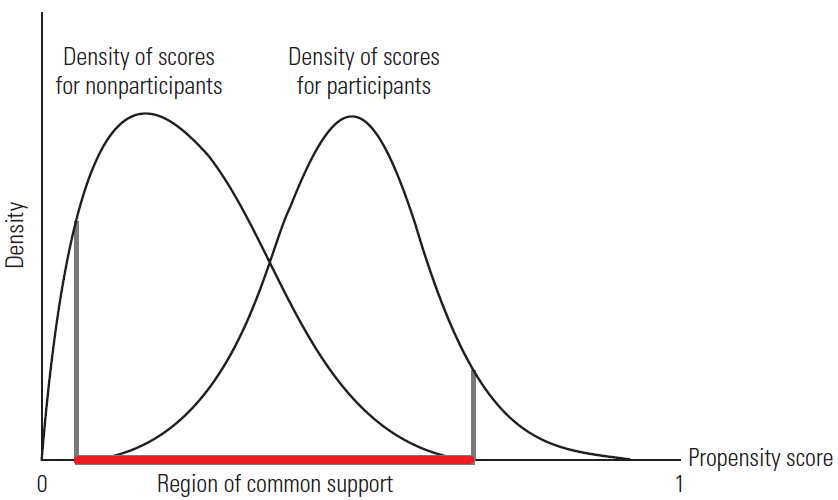
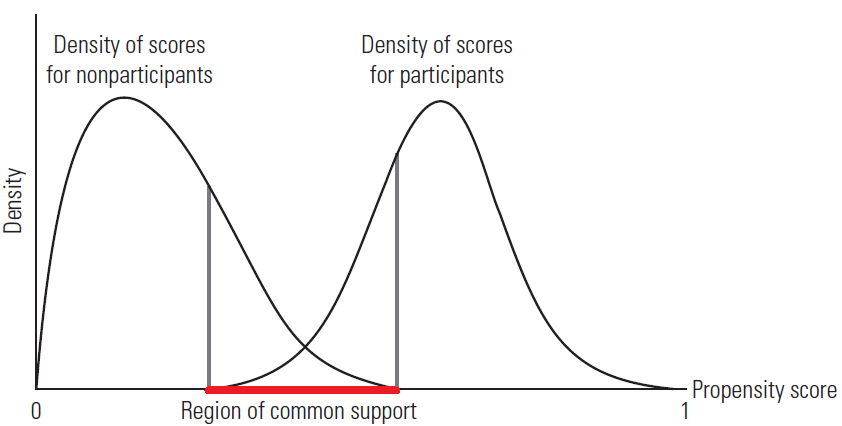
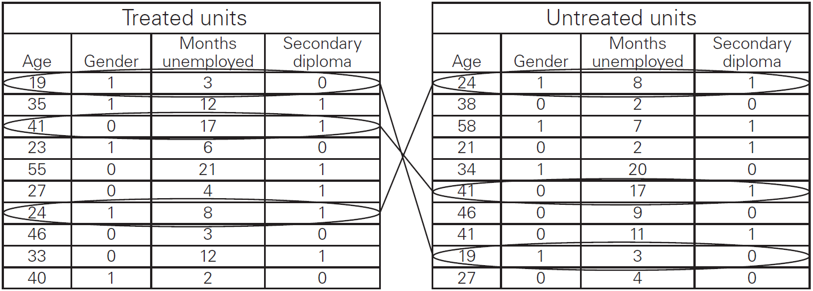

The goal of policy analysis (a subsect of this is sometimes called program evaluation) is to assess the causal effect of public policy interventions. 

Examples include effects of:

- Job training programs on earnings and employment
- Class size on test scores
- Minimum wage on employment
- Military service on earnings and employment
- Tax-deferred saving programs on savings accumulation
- Health insurance on health outcomes
- Effects of individual choices like college attendance

In addition, we may be interested in the effect of variables that do not represent public policy interventions. Examples:

- Interest rate on credit card usage
- Incentive scheme on employer productivity
- Terrorist risk on economic behavior

For a moment, think about causal effects.

Often, you want to evaluate a policy or intervention that has two states in the world. In data terms, it's a binary terms. In real world terms, one group was exposed the the intervention (this is called the *treatment* group) and the other group was not exposed (this is called the *control* group). Language is important as we will return to using the term treatment group very frequently. 

We know the *outcome* of these states - that somebody has either been part of the policy group or not. 

For example, they received free health insurance or they did not. 

The treatment effect is simple
$$te = y(1) - y(0)$$

$y(1)$ being that they got the treatment and $y(0)$ that they did not.  You should be asking yourself, but wait - they only participated in one option. They can't do both, so how can you subtract the different between participating and not participating of the same person?!

We need to rely on counterfactuals. Holding everything constant, what is the effect of health if they receive free health care. HOlding everything constant, what is the effect of health if they don't receive the benefit?  These are the potential outcomes (or counterfactual outcomes)

So, we often can't estimate each person's treatment effect. INSTEAD, we estimate the **average treatment effect (ATE henceforth)** This is the average of the treatment effects across the entire population.

$$\tau_{ATE} = E[te_i] = E[y_i(1)-y(0_i)]$$
And because of the linearity of the expected value this is equal to:
$$= E[y_i(1)]-E[y_i(0)]$$

The observed outcome of $y_i$ can be

$$y_i= (1-x_i)y_i(0)+x_iy_i(1)$$
Where $y_i = y_i(0)$ if $x_i = 0$ and $y_i = y_i(1)$ if $x_i=1$

You can also think about the Average Treatment effect on the Treated  (TOT in A\&P or sometimes seen as ATET)

$$E[ Y_i(1) - Y_i(0)|x_i=1] = E[Y_i(1)|x_i=1]-E[Y_i(0)|x_i=1] $$

Which we can't observe (well components of it). This illustrated the counterfactual nature of the causal effect: the average outcome of the treated minus the average outcome of the treated *if they hadn't been treated* - this last part we can't observe and is the counterfactual. 

We can rearrange our ATE:

multiply out  $y_i = y_i(0)+y_i(0)x_i+x_iy_i(1)$ 

rearrange and get:  $$y_i = y_i(0) + [y_i(1) - y_i(0)]x_i$$

Now impose a pretty unrealistic assumption of constant treatment effects for all i

$y_i(1)=\tau +y_i(0)$  which is also $\tau = y_i(1)-y_i(0)$

Plug that into our equation of $y_i$ and it simplifies to:
$y_i = y_i(0) + \tau x_i$

If we define $y_i(0) = \alpha_0 +u_i(0)$ (and recall that $\alpha_0 = E[y_i(0)]$ and as usual, the error term is expected value is zero $E[u_i(0)=0$]). Plug this into our equation for $y_i$ (replace $y_i(0)$):

$y_i = \alpha_0 + \tau_ix_i + u_i(0)$

If we define $\beta_0 = \alpha_0, \beta_1 = \tau$ and $u_i = u_i(0)$, we get the usual:

$$y_i = \beta_0 + \beta_1x_i + u_i$$
The above equation is the result of a RCT (randomized control trial) - IF there is random assignment.

$\beta_1$ is just the treatment or causal effect.  This is often called the difference in means estimator and is the unbiased treatment effect $\tau$. If $x_i$ is independent of $u_i(0)$ then we know $E(u_i(0)|x_i] = 0$). This is the same as saying $x_i$ is independent of $y_i(0)$. This assumption is guaranteed **only** under *random assignment*.   This means that the treatment must be assigned randomly.

The simple difference in means estimator for $\hat{y}_1 and \hat{y}_0n$ is unbiased for $\tau$

Suppose we relax the assumption of constant treatment effect. We can write the individual treatment effect as
$$te_i = y_i(1)-y_i(0)=\tau_{ATE}+[u_i(1)- u_i(0)]$$
recall where $y_i(1) = \alpha_1+u_i(1)$ and $\tau_{ATE} = \alpha_1 -\alpha_0$ \

$\tau_{ATE}$ is the average across the entire population and $u_i(1) - u_i(0)$ is the deviation from the population average for unit i.

Plug $te_i = y_i(1)-y_i(0)=\tau_{ATE}+[u_i(1)- u_i(0)]$ into 
$y_i = y_i(0) + [y_i(1) - y_i(0)]x_i$ and get:

$$y_i = \alpha_0 + \tau_{ATE}x_i + u_i(0)+[u_i(1)-u_i(0)]x_i = \alpha_0 + \tau_{ATE}x_i+u_i$$

and the error term is $u_i(0)+[u_i(1)-u_i(0)]$


$$E(u_i|x_i) = E[u_i(0)|x_i] + E[u_i(1)-u_i(0)|x_i]x_i$$
*note that the error term is not independent of $x_i$, but this isn't a problem for showing our unbiased estimator.  This makes sense because the variance should change depending if you were treated or untreated. Again, these results only hold because of random assignment.


Let's see what happens when we don't have random assignment (as it's very hard to have this situation without doing an experiment). Instead, let's imagine if we can have control variables that help predict the potential outcomes and determine the assignment in the treatment and control group - let's call this group of controls x.

To reduce confusion we will rewrite $y_i= (1-x_i)y_i(0)+x_iy_i(1)$ as 

$$y_i= (1-w_i)y_i(0)+w_iy_i(1)$$
Then we can have the assumption that 
$w$ is independent of $[y(0),y(1)]$ *conditional* on x

This is called **conditional independence** where the variables in x are in the conditioning set. This is also called **unconfounded assignment** or **ignorable assignment**

Let's see this difference in an example of job training - you'll see this example at various points in the course.
```{r}
library(wooldridge)
data("jtrain98")

simplediff <- lm(earn98 ~ train, data = jtrain98)
summary(simplediff)

conditionalx<- lm(earn98 ~ train+earn96+educ+age+married, data = jtrain98)
 
 summary(conditionalx)

```

We can see that the effect of job training actually increases when we control for other factors. Without controls, the job training program  decreases income by \$2,005, but when we add controls we can see that the job training programs increase by \$2,410 The controls serve to create a kind of random assignment. As long as we include all of the variables that could effect assignment of job training. 

So, when we think of control variables, what we want to do is to be able to explain all reasons as to why some people received the treatment and why other people didn't. 

Another way to think about this is that we are trying to create an experiment where one group received treatment and the other didn't. But, the two groups are identical.  The controls are ensuring that the treatment effect is unbiased, ceteris paribus - holding all other factors constant. If we hold all factors that differentiate the two groups constant, we can say something about the treatment effect. 


### The Self-Selection Problem

Consider the following model:
$$E (y\vert w ,\boldsymbol{x}) =\alpha  +\tau  w +\gamma _{1} x_{1} +\ldots  +\gamma _{k} x_{k} \\
y =(1 -w) y (0) +w y (1)$$

We include $x_{j}$ to account for the possibility that program participation ($w$) is not randomly assigned.

Participation decisions may differ systematically by individual characteristics - this is the *self-selection problem*

For example, children eligible for programs like Head Start participate largely based on parental decisions. These parental decisions depend on characteristics like family background and structure which also tend to predict child outcomes. Thus, we need to control for these characteristics to get closer to random assignment 

Another example could be looking at the effect of drug use on unemployment status. We need to account for any systematic differences
between those who use drugs and those who do not. Drug use may be correlated with a number of factors that also influence unemployment. If we do not control for these factors, then we cannot identify the causal effect of drug use on unemployment status.

Or it can be at the aggregate level - city or state decisions on laws, let's say gun violence, may be implemented systematically related to other factors that affect violent crime. 

 By regressing $y_{i}$ on $w_{i} ,x_{1 i} ,\ldots  ,x_{k i}$, we are engaging in regression adjustment and the coefficient on $w_{i}$ is $\hat{\tau }_{i}$ is the regression adjusted estimator. 

**We can relax the assumption of a constant treatment effect.**

Recall that unconfoundedness or the ignorability assumption is that we have sufficient explanatory variables (these are called *covariates* - factors that can vary with participation decisions and potential outcomes) so that conditional on those variables, program participation is as good as random.

We still assume unconfoundedness such that $w$ is independent of $[y(0) ,y (1)]$, conditional on $x_{1} ,\ldots  ,x_{k}$ 

Assume linear conditional means, but allow for separate equations for $y (0)$ and $y (1)$

$$y (0) =\psi _{0} + (x -\eta)\gamma _{0}  +u (0)$$

$$y(1) =\psi _{1} + (x -\eta)\gamma _{1}  +u (1)$$

$$ \eta _{j} =E (x_{j})\text{,}\psi _{0} =E[y(0)]\text{, and } \psi _{1} =E[y(1)]$$

We center the covariates $(x_{j})$ around their means so that the intercepts $\psi _{0}$ and $\psi _{1}$ are the expected values of the two potential outcomes \

ie $\eta_j$ is the population mean of $x_j$, $\psi_{0} = E[y(0)]$  and $\psi_{1} = E[y(1)]$


$$te_i = y_i(1) - y_i(0)$$
$$ = \psi_1 + (x-\eta)\gamma_1 + u_1 - \psi_0 + (x-\eta)\gamma_0 +u_0$$
Gather like terms....
$$ = (\psi_1 - \psi_0) + (x-\eta)(\gamma_1-\gamma_0) +[u_i(1)-u_i(0)] $$
$$ = \tau + 0 \times (\gamma_1 - \gamma_0)+0 = \tau$$
Where $(x-\eta)$ is zero by construction (recall $\eta = E(x))$ and $[u_i(1)-u_i(0)]$ is zero due to the zero conditional expectation.

The observed outcome $y_i = y(0)+w_i[y_i(1)-y_i(0)]$ can be written. We know $y(0) =\psi_{0} + (x -\eta)\gamma _{0}  +u(0)$:

$$y_i = \psi_0+w_i\tau+(x-\eta)(\gamma_0) + w_i(x_i-\eta)\delta + u_i(0)+w_i[u_i(1)-u_i(0)]$$ where $\delta = (\gamma_1-\gamma_0)$

if we define $u_i = u_i(0)+w_i[u_i(1)-u_i(0)]$

unconfoundedness implies:

$$E(u_i|w_i,x_i) = E[u_i(0)|w_i,x_i]+w_iE\{[u_i(1) -u_i(0)]|w_i,x_i\}$$
$$ = E[u_i(0)|x_i]+w_iE\{[u_i(1) -u_i(0)]|,x_i\} =0$$

 Thus, we can regress $y$ on $w$, all controls, and interactions between the policy variable and the demeaned controls.
 
We do not have to demean the controls when they appear by themselves, as failing to do so only changes the overall intercept. 

We do, however, have to demean the interaction terms in order to obtain the average treatment effect as the coefficient on $w_{i}$ 

We regress $y_{i}$ on $w_{i} ,x_{i 1} ,\ldots  ,x_{i k} ,w_{i} (x_{i 1} -\bar{x}_{1}) ,\ldots  ,w_{i} (x_{i k} -\bar{x}_{k})$ using all $n$ observations 

The coefficient $\tau$ on $w_{i}$ will be the average treatment effect. 

This regression is an unrestricted regression adjustment (URA) that allows the individual treatment effects to vary. 

By contrast, a restricted regression adjustment (RRA) forces the treatment effect to be identical across all individuals. 


```{r}
data("jtrain98")

#I'm going to create all my controls to be demeaned with mutate
earn98demean <-mutate(jtrain98, mean_earn96_adj  = earn96-mean(jtrain98$earn96), mean_educ_adj = educ-mean(jtrain98$edu), mean_age_adj = age-mean(jtrain98$age), mean_marr_adj = married-mean(jtrain98$married))

#interact treatment with my controls
vary_treatment<- lm(earn98 ~ train+ train*mean_educ_adj+train*mean_age_adj+train*mean_marr_adj+train*mean_earn96_adj, data = earn98demean)
 
 summary(vary_treatment)

```

#### An alternative method of obtaining the URA ATE
The average treatment effect (ATE) from the unrestricted regression adjustment (URA) can also be obtained by running two separate regressions: 

For the control group, use $n_{0}$ observations with $w_{i} =0$ and regress $y_{i}$ on $x_{i 1} ,\ldots  ,x_{i k}$ to obtain the intercept $\hat{\alpha }_{0}$ and slope estimates $\hat{\gamma }_{0 ,1} ,\ldots  ,\hat{\gamma }_{0 ,k}$ 

Do the same thing for the $n_{1}$ observations in the treatment group with $w_{i} =1$ to obtain the intercept $\hat{\alpha }_{1}$ and slope estimates $\hat{\gamma }_{1 ,1} ,\ldots  ,\hat{\gamma }_{1 ,k}$ 

For every unit $i$ in the sample, predict $y_{i} (0)$ and $y_{i} (1)$ regardless of whether the unit was in the control or treatment group
\begin{gather*}\hat{y}_{i}^{(0)} =\hat{\alpha }_{0} +\hat{\gamma }_{0 ,1} x_{i ,1} +\ldots  +\hat{\gamma }_{0 ,k} x_{i ,k} \\
\hat{y}_{i}^{(1)} =\hat{\alpha }_{1} +\hat{\gamma }_{1 ,1} x_{i ,1} +\ldots  +\hat{\gamma }_{1 ,k} x_{i ,k}\end{gather*}

The average treatment effect is then $n^{ -1} \sum _{i =1}^{n}\left [\hat{y}_{i}^{(1)} -\hat{y}_{i}^{(0)}\right ]$ 

Though this will yield the same ATE as running the regression with interaction terms, computing a standard error by hand can be tricky. Thus, the regression with interaction terms on the full sample is generally preferred. 

We can reproduce the treatment effect from the URA when we used interactions, but doing this alternative estimation:

```{r}

train_1 <- lm(earn98 ~ earn96+educ+age+married, data = subset(jtrain98, train ==1))
train_0 <- lm(earn98 ~ earn96+educ+age+married, data = subset(jtrain98, train ==0))

train_1y_hat<-predict(train_1, jtrain98)
train_0y_hat<-predict(train_0, jtrain98)
mean(train_1y_hat-train_0y_hat)
```
And here, we have the same coefficient! But, no standard error. We'd have to calculate that in a different way - rather have R do the heavy lifting by estimating the demeaned interactions. 


### Assignment Mechanism
An important part to thinking about policy analysis is the assignment mechanism.

Assignment mechanism is the procedure that determines which units are selected for treatment intake. 

Examples include:

- random assignment

- selection on observables

- selection on unobservables

Typically, treatment effects models attain identification by restricting the assignment mechanism in some way. 

Estimation of causal effects of a treatment (usually) starts with studying the assignment mechanism

Think about: How were treatments assigned?

**Best case**: Randomized Experiment: Random assignment

**Next best case** Better Observational Study: Assignment is not random, but assignment mechanism is clearly described. Try to find “natural experiments”, where assignment is “as good as
random”

**Worse case** Poorer Observational Study: No attention given to the assignment mechanism

**Recall**

- Causality is defined by potential outcomes, not by realized (observed) outcomes

- Observed association is neither necessary nor sufficient for causation

- Randomization is called the “gold standard” for causal
inference, because it balances observed and unobserved
confounders

However, cannot always randomize so we do observational studies, where we can directly adjust for the observed variables and use indirect methods to adjust for unobserved variables

We want to design observational studies that approximate
experiments. Always go back to this - if I were to design an experiment for my research question, what would that look like?

### Treatments, Covariates, Outcomes
It is important to distinguish between:

**Covariates**: Pre-treatment variables, potential confounders

Definition:

Variable X is predetermined with respect to the treatment D (also called “pre-treatment”) if for each individual i , $X_{0i} = X_{1i}$ , ie. the value of $X_i$ does not depend on the value of $w_i$. Such characteristics are called covariates.

**Does not imply that X and $W_i$ are independent**

Predetermined variables are often time invariant (sex, race, etc.), but time invariance is not necessary

**Outcomes**: Variables potentially affected by the treatment

Definition:

Those variables, Y , that are (possibly) not predetermined are called outcomes (for some individual i , $Y_{0i} ̸= Y_{1i}$) In general, one **should not condition on outcomes**, because this may induce bias.

    *Randomized Experiment: Well-defined treatment, clear distinction between covariates and outcomes

    *Better Observational Study: Well-defined treatment, clear distinction between covariates and outcomes

    *Poorer Observational Study: Hard to say when treatment began or what the treatment really is. Distinction between covariates and outcomes is blurred. No baseline survey.

**Before** running a regression, spend time thinking about:

- *Are treated and controls comparable?*

    * Randomized Experiment: Balance table for observables.

    * Better Observational Study: Balance table for observables. Ideally sensitivity analysis for unobservables.

    * Poorer Observational Study: No direct assessment of comparability is presented


- *Study Protocol*
        
    * Randomized Experiment: Before the experiment starts, a protocol describes the design, outcomes, type of analysis, etc

    * Better Observational Study: Before the analysis of the data starts, a protocol describes the design, outcomes, type of analysis, etc

    * Poorer Observational Study: If we run many regressions, something publishable will turn up sooner or later 

...this last one is pervasive in your work. Do NOT have this mentality. It is not about statistical significance. This is NOT the point. Do not p-hack your way to get the results you want. That is not science, that is statistical manipulation.

I do not care if it is statistically significant if you can't explain your methodology or interpret a coefficient. If you only tell me statistical significance and not much else, you *will* fail the course.

- *Design features we can use to handle unobservables*

    * design comparisons so that unobservables are likely to be balanced (e.g. “homogeneous” sub-samples, groups where treatment assignment was “accidental”)

    * Difference-in-differences: unobservables may differ, but their effect may not change much in time

    * Instrumental variables: find variables that “randomize” some people into treatment

Sensitivity analysis and bounds

- *Eliminating plausible alternatives to treatment effects*

    * Randomized Experiment: List plausible alternatives and experimental design includes features that shed light on these alternatives (e.g. placebos). Report on potential attrition and non-compliance <- will discuss this later.

    * Better Observational Study: List plausible alternatives and study design includes features that shed light on these alternatives (e.g. multiple control groups, data on potential confounders, etc.)

    * Poorer Observational Study: Alternatives are mentioned in the discussion section
    
# Matching

Recall that assignment mechanism is a key component to establish causality. One way to rectify a situation where we don't have random assignment is through matching.

If the program assignment was not randomized, we can try to ``mimic'' a comparison group 
 
$\rightarrow$ In other words, we try to select a group of non-participants which is as similar as possible to the group of participants 

If we select a group that is as similar as possible, then we get a control group that is practically analogue to a randomized control group - and this is matching.

Matching is essentially covariate-specific treatment-control comparisons, weighted together to produce a single overall average treatment effect

Matching *and* regression are both control strategies. Matching is similar to regression in that it is motivated by the assumption that the only source of omitted variables or selection bias is the set of observed covariates, $X_i$.

So, this begs the question, why choose matching over regression?

When matching, treatment effects are constructed by matching individuals with the same covariates instead of through a linear model for the effect of covariates. The key identifying assumption is also weaker, in that the effect of covariates on $Y0_i$ need not be linear. 

For the regression estimand, it is usually a vector of population regression coefficients

For the matching estimand, it is the weighted average of covariates or comparisons across cells defined by covariates.

Recall:
$$E (y\vert w ,\boldsymbol{x}) =\alpha  +\tau  w +\gamma _{1} x_{1} +\ldots  +\gamma _{k} x_{k} \\
y =(1 -w) y (0) +w y (1)$$

Here, $\tau$ is the difference in mean earnings by the program participant at each value of $X_i$.

The matching estimator replaces $\tau$ estimator by the sample of program participant-program non-participant outcome differences for each combination of covariates and then combines these in a weighted average using the empirical distribution of covariates among participants.

The weights used are proportional to the probability of the treatment at each value of the covariates

However, there is an important assumption applied in *both* regression and matching: Identification. This includes conditional independence (selection on observables) and common support, which means that results are limited to covariate values where both treated and control observations are found.

Selection on observables is that $Y_i(0)$ (and hence $Y_i(1)$, given the constant-effects assumption) is mean-independent of $w_i$ conditional on $X_i$. 

Written another way:
$$(Y_1, Y_0) \bot w_i | X_i$$ (selection on observables/unconfoundedness (as discussed earlier))

$\bot$ means orthagonal (linear algebra term) - it is basically that $(Y_1, Y_0)$ is independent of $w_i$ conditional on $X_i$

Common support is that you have enough "similar" treated observations and control observations. In practice, to do this sufficiently you need a relatively large number of observations.

Formally this is:

$$0 < Pr(w_i = 1|X ) < 1$$ with probability one (common support or overlap condition)
That there is a probability between zero and 1 that there is $w_i = 1$ conditional on X.

We can see the common support condition applied in ATE:
$$\tau = E(Y_1 - Y_0) = \int E[Y_1-Y_0|X]dP(X) $$
$$= \int (E[Y|X, w=1]- E[Y|X, w=0])dP(X)$$
We can see the same above visually:



If you don't have enough common support, it'll look something like this:



The common support condition applied in **ATET**:
$$\tau_{ATET} = E(Y_1 - Y_0|w_i=1) = \int E[Y_1-Y_0|X]dP(X) $$
$$= \int (E[Y|X, w=1]- E[Y|X, w=0])dP(X|w_i = 1)$$

We use matching to construct a statistical comparison group, which also allows for flexibility in linearity.

We can construct ATET or ATE by averaging X-specific treatment-control contrasts, and then reweighting these X-specific contrasts using the distribution of $X_i$ for the treated (for ATET) or using the marginal distribution of $X_i$ (for ATE). Since these expressions involve observable quantities, it is straightforward to construct consistent estimators from their sample analogs.

From a group of non-participants, we select individuals (or other units) that are similar to the participants using their observed characteristics.

**However**: using many characteristics makes it difficult to find non-participants that are exactly similar or very similar to the participants - this is called the **dimensionality problem of Curse of Dimensionality**

#### Subclassifciation estimator

Let's say X takes on k different cells ${X^1, \dots ,X^k}$, then the estimators you'd get are:
$$\tau  = \sum^k_{i=1}(\bar{Y}^k_1-\bar{Y}^k_0) \times (\frac{N_k}{N})$$
Where $N_k$ is the number of observations
$\bar{Y}^k_1$ is the mean outcome for the treated in cell k
$\bar{Y}^k_0$ is the mean outcome for the untreated in cell k

The dimensionality issue can be see in an example:

- Assume we have k covariates and divide each of them into 3 coarse categories (e.g., age could be “young”, “middle age” or “old”, and income could be “low”, “medium” or “high”).

The number of subclassification cells is 3k. For k = 10, we obtain $3^10 = 59049$

- Many cells may contain only treated or untreated observations, so we cannot use subclassification

- Subclassification is also problematic if the cells are “too coarse”. But using “finer” cells worsens the curse of dimensionality problem: e.g., using 10 variables and 5 categories for each variable we obtain $5^10 = 9765625$

If all matches are perfect (no matching discrepancies) the resulting estimator is identical to the subclassification estimator.

For example:


You can see how one needs to get pretty lucky in able to match exactly - and the more covariates, the more difficult it can be.

So, when perfect matching fails (in fact, it often does), what's a person to do?

We could use a "close match" by imputing.

If observation i is treated, we impute $Y(0)_i$ using untreated matches, $Y_{j1(i)}, . . . , Y_{jM(i)$
If observation i is untreated, we impute Y1i using treated matches, $Y_{j1(i)}, . . . , Y_{jM (i)$

We can also use the average for M closest matches where estimator is:
$$\tau = \frac{1}{N}\sum^N_{i=1}(2w_i-1) \{Y_i-(\frac{1}{M}\sum^M_{i=1}Y_{j_m(i)})\}$$

There are a variety ways of matching covariates using a distance measure:

- Euclidean distance
    $$||X_i - X_j|| = \sqrt{\sum^k_{n=1}(X_{ni}-X_{nj})^2} $$
- normalize Euclidean distance
    $$||X_i - X_j|| = \sqrt{\sum^k_{n=1}\frac{(X_{ni}-X_{nj})^2}{\hat{\sigma_n}^2}}$$
- Mahalanobis distance
$$||X_i - X_j|| = \sqrt{\sum^k_{n=1}\nu_n \times  (X_{ni}-X_{nj})^2} $$ 
where $\nu_n$ is some weight > 0 

Propensity matching is useful because it reduces the burdensome dimensionality problem while maintaining identification (selection on unobservables and common support).

The propensity score is defined as the selection probability conditional on the confounding variables: $p(X) = P(D = 1|X)$

Rosenbaum and Rubin (1983) proved that selection on observables implies:
$$(Y1, Y0)⊥D | p(X )$$
- conditioning on the propensity score is enough to have independence between the treatment indicator and the potential outcomes
- AND substantial dimension reduction in the matching variables!

Proof:
Assume that $(Y1 , Y0 )⊥D | X$

Then:
$$ P(D = 1|Y1,Y0,p(X)) = E[D|Y1,Y0,p(X)]$$
$$ = E [E[D|Y1,Y0,X]|Y1,Y0,p(X)]$$
$$ = E [E[D|X]|Y1,Y0,p(X)] $$
$$ = E [p(X )|Y1, Y0, p(X )]$$
$$= p(X)$$
Using a similar argument, we obtain

$$P(D = 1|p(X)) = E[D|p(X)] = E[E[D|X]|p(X)]$$
$$= E[p(X)|p(X)] = p(X)$$

$$P(D = 1|Y1,Y0,p(X)) = P(D = 1|p(X))$$
$$(Y1, Y0)⊥D | p(X )$$

Because of the Rosenbaum-Rubin result, if $(Y1,Y0)⊥D|X$, then 
$$E[Y1 −Y0|p(X)]=E[Y|D =1,p(X)]−E[Y|D =0,p(X)]$$
This motivates a two step procedure to estimate causal effects under selection on observables:

1. estimate the propensity score $p(X) = P(D = 1|X)$ (e.g., using logit or probit regression)
2. do matching or subclassification on the estimated propensity score

Because the propensity score, $p(X)$ is a function of X: 

$$Pr(D = 1|X,p(X)) = Pr(D = 1|X)$$
$$= p(X)$$
- conditional on $p(X)$, the probability that D = 1 does not depend on X.
- D and X are independent conditional on $p(X)$
$$D⊥X |p(X)$$

So we obtain the **balancing property** of the propensity score: 
$$P(X|D = 1,p(X)) = P(X|D = 0,p(X))$$
- conditional on the propensity score, the distribution of the covariates is the same for treated and non-treated.

We can use this to check if our estimated propensity score actually produces balance:
$$P(X|D = 1,p(X)) = P(X|D = 0,p(X))$$

##### Weighting

Weighting estimators that use the propensity score are based on the following result: If $Y_1,Y_0⊥D|X$, then:
$$\tau = E[Y \frac{D-p(X)}{p(x)(1-p(x))}] $$
$$\tau_{ATET} = \frac{1}{P(D=1)}E[Y \frac{D-p(X)}{(1-p(x))}] $$

We can prove this:
$$E[Y \frac{D-p(X)}{p(X)(1-p(X))}|X] = E[\frac{Y}{p(X)}|X,D=1]p(X) + E[\frac{-Y}{1-p(X)}|X,D=0](1-p(X)) $$
$$=E[Y|X, D=1]-E[Y|X,D=0]$$
And the results follow from integration over $P(X)$ and $P(X|D = 1)$.

The analogy principle suggests a two step estimator: 

1. Estimate the propensity score: $\hat{p}(X)$
2. Use estimated score to produce analog estimators:
$$\tau =  \frac{1}{N}\sum^N_{i=1}Y_i\frac{D_i-\hat{p}(X_i)}{\hat{p}(X_i)(1-\hat{p}(X_i))}$$
$$\tau_{ATET} =  \frac{1}{N(1)}\sum^N_{i=1}Y_i\frac{D_i-\hat{p}(X_i)}{(1-\hat{p}(X_i))}$$
Standard errors:
- We need to adjust the s.e.’s for first-step estimation of $p(X)$
- Parametric first-step: Newey & McFadden (1994) Non-parametric first-step: Newey (1994)
- Or bootstrap the entire two-step procedure

For now, just now you'd have to adjust standard errors in the first step.

#### PSM in Practice
So, in practice, what are we really doing?

1. Estimate a binary model of program participation
2. Define the region of common support
3. Match participants and non-participants

##### Step 1: estimate a model of program participation

The dependent variable is program participation
- Therefore this variable can take only two values (0 or 1)

With a binary dependent variable, \textbf{logit} or \textbf{probit} models are commonly used.

It is important: 

-  To ensure that variables determining program participation are included in this equation 
(otherwise PSM estimates will be biased)
-  To use the same data source for both treatment and control group  
(variables for both groups are measured equally and reflect the same concepts)
- To avoid over-specification 
    *be careful not to include too many predictors  (this can lead to high standard errors and/or perfectly predicted participation for many units ($\hat{P}(X)=1$))


##### Step 2: define the region of common support
 
The region of common support is defined as the overlap between the distributions of the propensity scores of participants and non-participants

At this stage of the analysis we have to perform a **balancing test** 

Formally we need to check: $\hat{P}(X|T = 1) =  \hat{P}(X|T = 0)$ 

For PSM to work, the treatment and control groups must be balanced: similar propensity scores are based on similar observed $X$ 

- Don't forget that sampling bias might still occur if dropped non-participants observations are systematically different from the retained non-participants

##### Step 3: matching participants and non-participants}

Different matching techniques exist to assign participants to non-participants on the basis of the propensity scores 

- Each technique assigns a different weight to each matched set 
- Using a different matching technique may thus result in a different estimate

As a **robustness check** you can compare the results obtained with different methods 

Ideally, there should not be large variations 


###### Different matching techniques

- **Nearest-neighbour matching (NN)** chooses the observation with the closest propensity score (frequently used) 
    - it is possible to match a certain number of $n$ nearest neighbors
- **Caliper or radius matching** a threshold for the difference in the propensity scores is established beyond which matching cannot be allowed
- **Stratification or interval matching** the area of common support is split into intervals, and the program effect computed for each interval
    - a weighted mean of the impact estimates for each interval is computed as the overall program effect
- **Kernel and local linear matching (LLM)** matches are constructed based on a weighted average of non-participants 
- **Difference-in-difference matching** can be applied with panel data and also accounts for differences resulting from unobservable characteristics (if they are time-invariant)


##### Example

Let's do an example that include PSM and all of the pre-treatment analysis necessary.

We want to estimate the effect of going to Catholic school, as opposed to public school, on student achievement. 

Since students who attend Catholic school on average are different from students who attend public school (aka selection bias), we will use propensity score matching to get more credible causal estimates of Catholic schooling.

We'll estimate:

$$score = \beta_0 + \beta_1 Catholic + \beta_2Race + \beta_3momage + \beta_4income + \beta_5move + \beta_6momeduc$$
Even with these controls, we're concerned about selection bias of catholic attendees. 

Quick codebook:

- race_white: Is the student white (1) or not (0)?
- p5hmage: Mother’s age
- w3income: Family income
- p5numpla: Number of places the student has lived for at least 4 months
- w3momed_hsb: Is the mother’s education level high-school or below (1) or some college or more (0)?
- c5r2mtsc_std: standardized math score – with a mean of 0 and standard deviation of 1 – this is the var we will use for score

So, we're interested in seeing if catholic schools impact your math scores and hence, educational achievement.

###### Prelim stuff

We'll need some libraries
```{r}
library(tidyverse)
library(MatchIt) #This one helps, well, do the matching.
#don't forget to install it!!
```


Import the data
```{r}
ecls <- read.csv("ecls.csv")
```

Some general stats by treatment group (ie catholic school or)

```{r}
ecls %>%
  group_by(catholic) %>%
  summarise(n_students = n(),
            mean_math = mean(c5r2mtsc_std),
            std_error = sd(c5r2mtsc_std) / sqrt(n_students))
```


We can do a test between the difference in means of the two samples (go back to your basic probability class to recall how to do this pen and paper)
```{r}
with(ecls, t.test(c5r2mtsc_std ~ catholic))
```


Let's see difference in means for our different covariates
```{r}
ecls_cov <- c('race_white', 'p5hmage', 'w3income', 'p5numpla', 'w3momed_hsb')

ecls %>%
  group_by(catholic) %>%
  select(one_of(ecls_cov)) %>%
  summarise_all(funs(mean(., na.rm = T)))
```


```{r}
with(ecls, t.test(race_white ~ catholic)) #(repeat for each covariate)
with(ecls, t.test(p5hmage ~ catholic)) 
with(ecls, t.test(w3income ~ catholic)) 
with(ecls, t.test(p5numpla ~ catholic)) 
with(ecls, t.test(w3momed_hsb ~ catholic)) 

```

Advanced treatment that does the same as above but in a for loop
Just an FYI for the interested:
```{r}
lapply(ecls_cov, function(v) {
    t.test(ecls[, v] ~ ecls[, 'catholic'])
})
```

Ok, let's do the PSM

###### PSM applicaiton


Run the logit/probit model!

This part is important to think about thoroughly before you rush off and hit run. The biggest mistake I see students make is that they "just want the results" and will run anything before thinking thoroughly about the model. This is not the way to do research.

You need to think about the assignment mechanism - what impacts selection into going to catholic school. Let's think about this now and make suggestions on what could be included.
- whether they are catholic (religion)
- income
- quality of schools in school zone
      - property taxes?
      - charter/other private
- reputation (homophily)
- other (older) siblings/cousins in catholic school
- Parent is alum of catholic school
- crime rate in area
- political ideology 
- access to catholic school
- MS/HS prospects (feeder schools)  (K-12)
- access to sports amenities
- consideration all girls/all boys schools


Here, we're going to run the logit model to *predict* the liklihood of being in a catholic school or not.  glm is the function for logit (note binomial denotes it to be logit model)

```{r}
ecls <- ecls %>% mutate(w3income_1k = w3income / 1000)
#we'll divide income by 1000 to have "lower numbers", just remember this in the interpretation. It helps deal with potential heteroskedasticity issues.
m_ps <- glm(catholic ~ race_white + log(w3income_1k) +   + p5hmage + p5numpla + w3momed_hsb,
            family = binomial(), data = ecls)
summary(m_ps)
```


Now - we calculate the propensity score for each student. That's just the predicted probability of being treated from our  logit model. We use predict() to help use with this.

```{r}
prs_df <- data.frame(pr_score = predict(m_ps, type = "response"),
                     catholic = m_ps$model$catholic)
head(prs_df)
```


Ok, no is this reasonable? We need to see if the common support assumption is applicable in our case. In other words, do we have enough common support.

```{r}
labs <- paste("Actual school type attended:", c("Catholic", "Public"))
prs_df %>%
  mutate(catholic = ifelse(catholic == 1, labs[1], labs[2])) %>%
  ggplot(aes(x = pr_score)) +
  geom_histogram(color = "white") +
  facet_wrap(~catholic) +
  xlab("Probability of going to Catholic school") +
  theme_bw()
```


What we got to do is find pairs of observations that have similar propensity scores, but only differ in their treatment status. In other words, match pairs. We'll use the function MatchIt to do this.

In this case, we are using nearest neighbor to match it (see method in the function)
```{r}
ecls_nomiss <- ecls %>%  # MatchIt does not allow missing values
  select(c5r2mtsc_std, catholic, one_of(ecls_cov)) %>%
  na.omit()

mod_match <- matchit(catholic ~ race_white + log(w3income) + p5hmage + p5numpla + w3momed_hsb, method = "nearest", data = ecls_nomiss)
```


Just include the matched data: 
```{r}
dta_m <- match.data(mod_match)
dim(dta_m)

```


Let's see if our matched sample is balanced.

We can check difference in means

```{r}
dta_m %>%
  group_by(catholic) %>%
  select(one_of(ecls_cov)) %>%
  summarise_all(funs(mean))
```

To all covariates:
```{r}
lapply(ecls_cov, function(v) {
    t.test(dta_m[, v] ~ dta_m$catholic)
})
```


And FINALLY, we can estimate the treatment effects with OLS and our covariates:

```{r}
lm_treat2 <- lm(c5r2mtsc_std ~ catholic + race_white + p5hmage +
                  I(w3income / 10^3) + p5numpla + w3momed_hsb, data = dta_m)
summary(lm_treat2)
```

