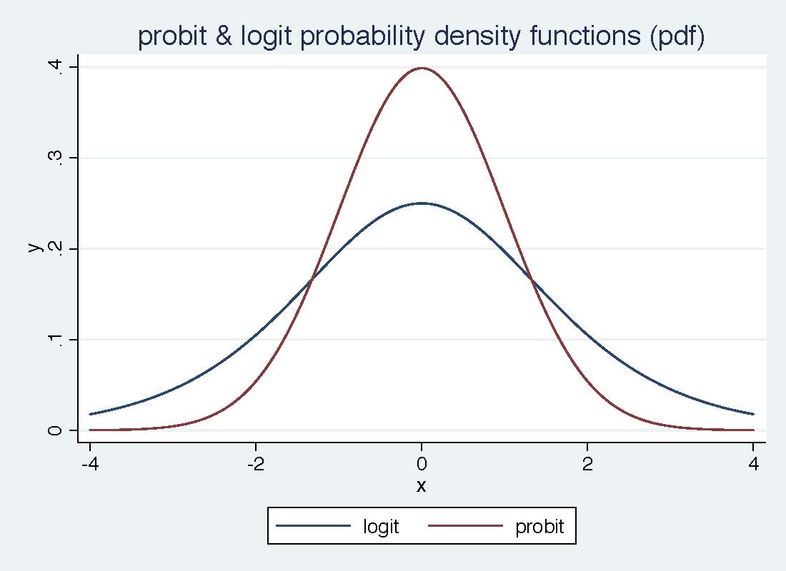
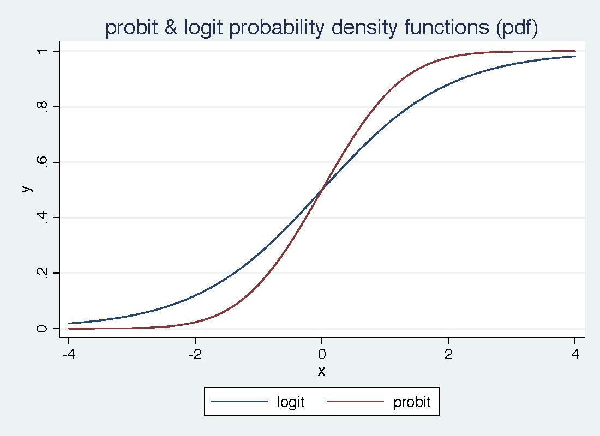

```{r}
#devtools::install_github("strengejacke/strengejacke")
```
So... you've got a binary dependent variable. 

We've talked about LPM in our OLS discussion. So, I won't review it here, but I will say that LPM can be a great model to use - so logit/probit doesn't have to be your default. What's better is to show the LPM model along with logit probit. And frankly, I always do LPM first to get an intuitive basic understanding of what's going on. 

### Pros/Cons LPM
Pro: Using a linear model for a binary outcome is convenient because estimation is easy and so is interpretation. 

Cons:

1. The fitted values from an OLS regression are never guaranteed to be between zero and one, yet these fitted values are estimated probabilities. 

    -  This can be slightly embarassing but is rarely a big deal. We usually use the LPM to estimate partial effects, not to make predictions.

    - Further, a natural predictor  is not sensitive to negative fitted values or fitted values above one.

2. The estimated partial effects are constant throughout the range of the explanatory variables, possibly leading to silly estimated effects for large changes.

    - This is related to predicted probabilities possibly being negative or greater than one.

This is more of a problem because we know that, say, a variable with a positive effect on $P (y =1\vert \mathbf{x})$ must eventually have a diminishing effect. But the linear model implies a constant effect (when the variable appears by itself).

3. Because $y$ is binary -- and this really has nothing to do with the LPM per se -- the LPM must
exhibit heteroskedasticity except in the one case where no $x_{j}$ affects $P (y =1\vert \mathbf{x})$. This follows because for a binary variable, 

\begin{equation}V a r (y\vert \mathbf{x}) =p (\mathbf{x})[1 -p(\mathbf{x})]
\end{equation}where $p (\mathbf{x}) =\beta _{0} +\beta _{1} x_{1} +\beta _{2} x_{2} +\ldots  +\beta _{k} x_{k}$ is the linear response probability. 

This is a case where we **know** MLR.5 must fail, and we know how. So, currently, we treat the usual $t$ and $F$ tests with suspicion, and the confidence intervals. (Turns out they are often pretty reliable in LPMs.)

# Logit/Probit

A general model that ensures probabilities are between zero and one has the form
\begin{equation*}P (y =1\vert \mathbf{x}) =G (\beta _{0} +\beta _{1} x_{1} +\beta _{2} x_{2} +\ldots  +\beta _{k} x_{k})
\end{equation*}for some function $G$ that takes values between zero and one. 

In most cases, $G ( \cdot )$ is actually a cumulative distribution function (cdf) for a continuous random variable with probability density function $g ( \cdot )$. Then, $G ( \cdot )$ is strictly increasing, and the estimates are easier to interpret.

The leading cases are 

\begin{gather*}G (z) =\Lambda  (z) =\frac{\exp  (z)}{[1 +\exp (z)]}\text{\ \ (logit)} \\
G (z) =\Phi  (z) =\int _{ -\infty }^{z}\frac{1}{\sqrt{2 \pi }} \exp  ( -u^{2}/2) d u\text{\ \ (probit)}\end{gather*}

These functions have similar shapes but the logistic is more spread out.




The estimation method for the $\beta _{j}$ is maximum likelihood. 

(Asymptotic) standard errors are reported, as are $t$ statistics and confidence intervals. 

T-tests and F-tests work the same.

### MLE Theory (again!)

  * ML maximises a measure of the likeliness of the sample outcomes called the likelihood function.
  * ML picks the values of the parameters that best describe the distribution of the observed data.
  * The sample mean is a ML estimator (MLE).
  * Other estimation methods exist, but if the assumptions are satisfied, then the MLE has the smallest variance (most efficient, no other estimator is better). 
  * We maximize the (log) likelihood function or minimize the negative log likelihood. Probabilities are very small numbers! Logs of probabilities are large negative numbers!
  * Parameter values are typically found using iterative Newton-Raphson steps based on numerical derivatives.

Given an independent and identically distributed (i.i.d.) sample, the joint density function is
$$f(Y_{1\ldots N} | \boldsymbol\beta, \mathbf{X}_{1\ldots N}) = f(Y_1|\boldsymbol\beta, \mathbf{X}_1)\times f(Y_2|\boldsymbol\beta, \mathbf{X}_2) \times \cdots \times  f(Y_N|\boldsymbol\beta, \mathbf{X}_N)$$
where $\boldsymbol\beta=(\beta_0, \beta_1, \ldots, \beta_K)'$ and $\mathbf{X}_i = (X_{i1}, X_{i2}, \ldots, X_{iK})$.

Likelihood theory turns things around, we find $\boldsymbol\beta$ given the data
$$\mathcal{L}(\boldsymbol\beta|  Y_{1 \ldots N},  \mathbf{X}_{1\ldots K})  =f(Y_{1\ldots N} | \boldsymbol\beta, \mathbf{X}_{1\ldots N})  =\prod_i^N f(Y_i|\boldsymbol\beta,\mathbf{X}_i)$$
All results are asymptotic:
    * Consistency of $\hat{\boldsymbol\beta}$ is only guaranteed with $N \rightarrow \infty$. 
    * $E[\hat{\boldsymbol\beta}] = \boldsymbol\beta$ may not be true for finite $N$.
    * $var(\hat{\boldsymbol\beta})$ is asymptotic. May be biased in small samples.
    
#### Maximization with gradient methods
R uses Newton-Graphson optimization technique - but, you can use other methods that you might want to impose when your model can't converge. Entire classes can be devoted to proper maximization techniques, which are incredibly important for non-linear in parameter estimation techniques (what we are doing now). 


Basically, it works like this:
1. If the slope of the function is positive, increase more
2. If the slope is negative, "back up" to decrease likelihood
3. R does NR, which also looks at rate of change of the slope

### Measures of Fit

##### Pseudo-$R^2$

In ML theory most interesting statistics are based on comparing likelihoods. 

The Pseudo-$R^2$ of MacFadden is: $$R^2 \equiv 1 - \frac{l(\hat{\boldsymbol\beta})}{l_0(\bar{y})} \in [0,1]$$
where $l(\hat{\boldsymbol\beta})$ is the maximized log-likelihood and $l_0(\bar{y})$ is the constant only log-likelihood -- the likelihood of the sample average. 

We still use t-tests and F-tests (Wald tests), but they are essentially quadratic approximations of the curvature of the likelihood. 

Likelihood ratio tests are more precise.

##### Liklihood ratio     


### Estimating Partial Effects
What do we do with the estimates? Let $x_{j}$ be continuous. 

In general, we can use the finite difference approach:
$$ME(X_i^b, X_i^a) = F(X_i^a) - F(X_i^b)$$ 
where $b$ and $a$ stand for before and after a change in $X_i$. In linear models, $F(\cdot)$ is by definition linear, so the outcome of $\Delta X_i = 1$ will be the slope or difference in means. With squares and interactions we need to be careful to change $X_i$ in more than one place, as a result $ME(X_i^b, X_i^a)$ will be non-constant.

Derivatives also give the partial effects (of a single regressor): 
$$ME(X_i) = \frac{\partial}{\partial X_i} F(\beta_0 + \beta_1 X_1 + \beta_2 X_2 + \dots + \beta_K X_K)$$

which in OLS is (usually) just $\beta_k$ so we didn't make a point of it. Not true if $F(\cdot)$ is non-linear.

Then the partial effect is 

\begin{equation*}\frac{ \partial p (\mathbf{x})}{ \partial x_{j}} =\beta _{j} g (\mathbf{x} \mathbf{\beta })
\end{equation*}

where 

$$ g (z) =\exp  (z)/[1 +\exp (z)]^{2}$$ for logit

and, because $g (z) >0$, $\beta _{j}$ gives the direction of the partial effect. But its magnitude depends on $g (\mathbf{x} \mathbf{\beta })\text{.}$ 

For probit, the largest value of the scale factor is about $.4 =g (0)$. For logit, it is $g (0) =.25$.


 
The $g ( \cdot )$ functions both have a bell shape and are maximized at zero. As $z \rightarrow \infty$, $g (z) \rightarrow 0$, which ensures that the partial effects head to zero for any $x_{j}$ with $\beta _{j} >0$. 

For two continous covariates, the ratio of the coefficients give the ratio of the partial effects, independent of $\mathbf{x}$. 

\begin{equation*}\frac{ \partial p (\mathbf{x})/ \partial x_{j}}{ \partial p (\mathbf{x})/ \partial x_{h}} =\frac{\beta _{j} g (\mathbf{x} \mathbf{\beta })}{\beta _{h} g (\mathbf{x} \mathbf{\beta })} =\beta _{j}/\beta _{h}\text{.}
\end{equation*}

No simple relationship exists for discrete variables or changes. 

In any case, we would like the magnitude of the effect.


 Since these partial effects wrap a linear function, we use the chain rule ($\frac{dy}{dx} = \frac{dy}{du} \frac{du}{dx}$). 

**Simple Probit**: $E[Y|X]= \text{Pr}(Y=1|X) = \Phi(\beta_0 + \beta_1 X_i)$ \\
The marginal effect is $ME(X_i) = \beta_1 \times \phi(\beta_0 + \beta_1 X_i)$ and thus clearly varies with every $X_i$.

Note that the derivative of the normal cdf is $\Phi'(u) = \phi(u)$

**Simple Logit**: $E[Y|X]= \text{Pr}(Y=1|X) = \Lambda(\beta_0 + \beta_1 X_i)$ \\
The marginal effect is $ME(X_i) = \beta_1 \times [\Lambda(\beta_0 + \beta_1 X_i)\Lambda(-\beta_0 - \beta_1 X_i)]$ or $ME(X_i) = \beta_1 \times [\Lambda(\beta_0 + \beta_1 X_i) - (1 - \Lambda(\beta_0 + \beta_1 X_i))]$  and thus clearly varies with every $X_i$.

Note that the derivative of the logistic cdf ($\Lambda(u)=1/(1+\exp(-u))$ is $\Lambda'(u) = \Lambda(u)\times (1 - \Lambda(u))$ but by symmetry of the cdf: $1 - \Lambda(u) = \Lambda(-u)$. 

Since $ME(X_i)$ depends on the realization of $X$, we can easily envision two useful quantities: the estimated PEAs and APEs. 

The estimated PEA for a continuous variable is:

\begin{equation*}\widehat{P E A}_{j} =\hat{\beta }_{j} g (\bar{\mathbf{x}} \hat{\mathbf{\beta }})
\end{equation*}

As discussed earlier, putting in averages for discrete covariates might not be especially interesting. 

When $\mathbf{x}$ includes nonlinear functions, such as $a g e^{2}$, probably makes more sense to use $(\overline{a g e})^{2}$ rather than average $a g e_{i}^{2}$. 

The APE has more appeal, as we are averaging partial effects for actual units: 

\begin{equation*}\widehat{A P E}_{j} =\hat{\beta }_{j} \left [N^{ -1} \sum _{i =1}^{N}g (\mathbf{x}_{i} \hat{\mathbf{\beta }})\right ]
\end{equation*}

To use the delta method, must account for randomness in $\mathbf{x}_{i}$, too. Bootstrap makes that easy. 
Whether we use the PEA or APE, the scale factor multiplying $\hat{\beta }_{j}$ is below one, and sometimes well below one.

It makes no sense to compare magnitudes of coefficients across probit, logit, LPM. Comparing APEs is preferred. 

In particular, if $\hat{\gamma }_{j}$ is the linear regression coefficient on $x_{j}$ from estimating an LPM, it can be compared with $\widehat{A P E}_{j}$ (provided no other function of $x_{j}$ appears in the regressors).

Suppose $x_{K}$ is a binary variable. Then its APE is estimated as 

\begin{equation*}\widehat{A P E}_{K} =N^{ -1} \sum _{i =1}^{N}[G(\mathbf{x}_{i (K)} \hat{\mathbf{\beta }}_{(K)} +\hat{\beta }_{K}) -G (\mathbf{x}_{i (K)} \hat{\mathbf{\beta }}_{(K)})]\text{,}
\end{equation*}where $\mathbf{x}_{i (K)}$ is $\mathbf{x}_{i}$ but without $x_{i K}$. 

The APE has a nice counterfactual interpretation that is especially useful in policy analysis - the *average treatment effect (ATE)* in the treatment effect literature with a binary outcome. (The "treatment", $x_{K}$, is binary.) ... we've heard about that.

Can average the individual treatment effects across subgroups, too, or insert fixed values for some of the other covariates.


Because logit and probit use different probability functions, the coefficients (0,1) are different in the two models. 

However, as suggested by the closeness of the graphs of the two CDFs, predicted probabilities will be very similar.

* Logit is relatively easy to calculate since it comes with an explicit, closed-form expression for the probability function.
* In probit, you have to numerically approximate an integral, which is much more arduous and used to be
computationally expensive. This explains the historical popularity of the logit model. Computational ease is less important nowadays.
* There is a rough but good rule of thumb to predict the relative magnitudes of LPM, probit and logit coefficient estimates:

$$\beta_{Logit} \approx 1.6*\beta_{probit} \approx 4* \beta_{LPM}$$

This is no magic, but the consequence of the different scalings implicit in the three models.

### Relating Average Partial Effects to Counterfactual Outcomes when $x_{k}$ is Binary

The APE estimates measures the difference in outcome probabilities for each person in both states (defined by $x_{k}$) of the world 

For example, let $y$ be an employment indicator and $x_{k}$ be participation in a job training program. 

With a Probit or Logit model, we are estimating the employment probability for each individual in both states of the world, regardless of whether the individual actually participated in the training program. 

Averaging the difference in estimated probabilities across individuals gives us the average treatment effect.  

How it works: 

We first estimate a logit or probit model that includes whether the individual recieved a grant along with controls 

We then for each individual compute the estimated difference in probabilities of being employed uner the two scenarios that the person received a job training grant or did not.

Taking the average across each of these estimated difference gives us an estimate of the average treatment effect. 

Including control variables like income, wealth, credit rating, age, etc. will hopefully control for all of the reasons that someone may or may not be approved for a loan that could also be related to race. 

For a discrete $x_{K}$, the estimated PEA is 

\begin{equation*}\widehat{P E A}_{K} =G (\bar{\mathbf{x}}_{(K)} \hat{\mathbf{\beta }}_{(K)} +\hat{\beta }_{K}) -G (\bar{\mathbf{x}}_{(K)} \hat{\mathbf{\beta }}_{(K)})
\end{equation*}

Again, this might correspond to a weird population unit, or might not be representative of the population - so, generally, not very well advised. 

Average treatment effect is much more useful (and is the same as the averate partial effect)


##### Reporting the Results
* Start with an LPM and report the coefficients along with robust standard errors. 

* With logit and probit, one typically reports the estimated coefficients along with standard errors. The value of the log likelihood is sometimes reported, too (as it can be used to compute tests of exclusion restrictions). 

* It is important to report APEs and their standard errors for logit and probit (maybe even in place of coefficients). Sometimes a key policy variable is of interest, and it is important to estimate the magnitude of the effect.

* If the variable of interest is continuous, or at least takes on lots of values, might compute the partial effects at different values (and average out the other explanatory variables). 
        
        - For example, in estimating the effects of young children on married women's labor force participation, we can estimate the partial effect in going from 0 to 1 and 1 to 2 children. 

* Goodness-of-fit is not as important, but the percent correctly predicted for each outcome, and overall, is of some interest. Use $Pseudo-R^2$ or liklihood ratio.


Let's try it.


Married Women's Labor Force Participation (MROZ.DTA)

The variable $i n l f$ is one if a woman worked for a wage during a certain year, and zero if not. We estimate a linear probability model to see the effects of variables on the probability of being in the labor force.

The package we are using is called glm.

As a reminder - we did this last semester in R and Python.

Let's start with lpm
```{r}
library(wooldridge)
data("mroz")
library(car)
library(AER)

#recall this is just your ordinary ols estimation
lpm <- lm(inlf ~nwifeinc +educ+ exper+ I(exper*exper)+age+kidslt6+kidsge6, data =mroz )

lpm_robust <-coeftest(lpm, vcov = vcovHC, type = "HC0")
lpm_robust

```
Compare to Probit
```{r}

probit <- glm(inlf ~nwifeinc +educ+ exper+ I(exper*exper)+age+kidslt6+kidsge6, data =mroz, family = binomial(link = "probit"))

probit_robust <- coeftest(probit, vcov = vcovHC, type = "HC0")
probit_robust
```
And we need to get the marginal effects!

Logit:
```{r}
logit <- glm(inlf ~nwifeinc +educ+ exper+ I(exper*exper)+age+kidslt6+kidsge6, data =mroz , family = "binomial")

logit_robust <- coeftest(logit, vcov = vcovHC, type = "HC0")
logit_robust
```

Let's check out the PEA and APE

```{r}
library(margins)

lpm_robust

#calculate average marginal effects
logit_m <-margins(logit)
summary(logit_m)

probit_m <-margins(probit)
summary(probit_m)

```


```{r}
#calculate PEA

lpm_robust

margins(logit, at = list(educ = c(mean(mroz$educ, na.rm=TRUE))), variables = "educ")

margins(probit, at = list(educ = c(mean(mroz$educ, na.rm=TRUE))), variables = "educ")

```


```{r}
library(sjPlot)
library(ggplot2)

#here's age
plot_model(logit, type = "pred", terms = "educ")
plot_model(probit, type = "pred", terms = "educ")

#here's experience (and note that this is a squared term)
plot_model(logit, type = "pred", terms = "exper")
```


We can also do Logit and Probit in a panel data setting. 
```{r}
library(foreign) #this let's you import stata data directly into R

union <- read.dta("http://data.princeton.edu/wws509/datasets/union.dta")
fe <- clogit(union ~ age + grade + not_smsa + south + southXt + strata(idcode), data = union)


```


And for fun, enjoy this meme:


